
SANKIRNA JOSHI

[//]: # ()

# Data science portfolio by Sankirna Joshi

#### This portfolio is a compilation of mostly notebooks which I created for data analysis or for exploration of machine learning algorithms. A separate category is for separate projects.

* [Section 1](#1): Stand-alone projects
* [Section 2](#2): Kaggle competitions
* [Section 3](#3): Classification problems
* [Section 4](#4): Regression problems
* [Section 5](#5): Natural language processing
* [Section 6](#6): Clustering
* [Section 7](#7): Neural Networks - Computer Vision

---

## Stand-alone projects.

### Sentiment Analysis Web Application

[Code](https://github.com/sankirnajoshi/sentiment-app)
&nbsp; &nbsp; &nbsp; &nbsp;
[Model Training Notebook](https://github.com/sankirnajoshi/sentiment-app/blob/master/sentiment_app_training.ipynb)

This is a NLP web application that I built from scratch to perform sentiment analysis. I develop and train a Long-Short-Term-Memory Model (LSTM) to classify user sentiments into one of five classes: `Very Positive`, `Positive`, `Neutral`, `Negative`, `Very Negative`. Then I deploy the code to a Flask server using the Dash framework. The web application takes in user inputs and performs sentiment analysis in real-time as the text is entered. The data for the code can be found [here](https://nlp.stanford.edu/sentiment/). This model trains fast and achieves around 65% test set accuracy. It may not seem much at first but given the ambiguity associated with neutral sentiments and the multi class nature of the problem, this is a decent score and the model performs very well in practice on polarized sentiments. The GIF below shows a demo of the web app with real-time user inputs.

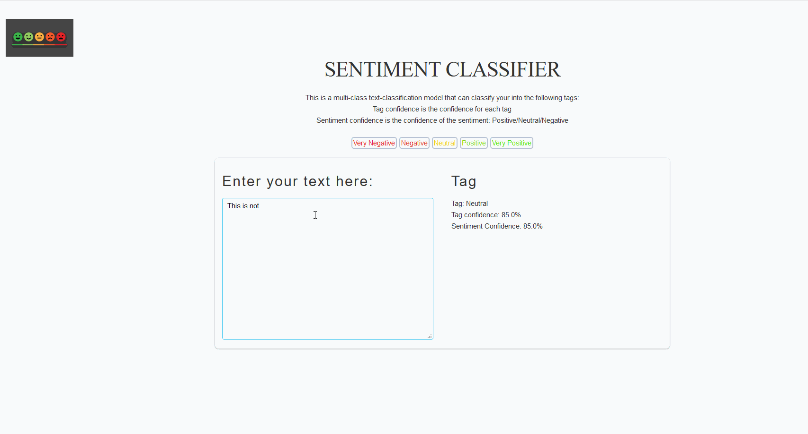

### Unsupervised learning on the FIFA 20 players

[Code](https://www.kaggle.com/damnation/pca-and-clustering-fifa-20-players)
&nbsp; &nbsp; &nbsp; &nbsp;
[Report](reports/Fifa_20_clustering_analysis.pdf)

FIFA 20 is a soccer video game and has a rich assortment of players with hundreds of attributes per player. My goal was to develop and understand if the players form any interesting clusters through visualization. I performed dimensionality reduction using Feature Selection and PCA and was able to reduce the dimensionality from over a hundred variables to just two Principal Components. These two PCs captured about 70% of the variation in the data. On this low dimensional data, by applying KMeans clustering, we're able to visualize the clusters that the data forms. Based on the silhouette analysis, we end up with three clusters. The three clusters that formed are interestingly and obviously the three main playing positions in Soccer: Forwards, Midfielders, Backwards. The report I made for school is available [here](reports/Fifa_20_clustering_analysis.pdf) and the code is available as a Kaggle Kernel [here](https://www.kaggle.com/damnation/pca-and-clustering-fifa-20-players).

  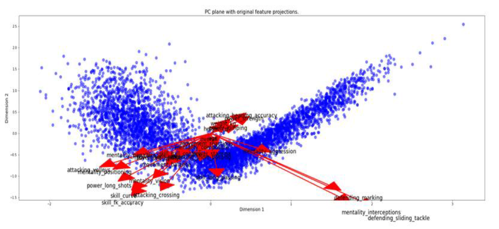
  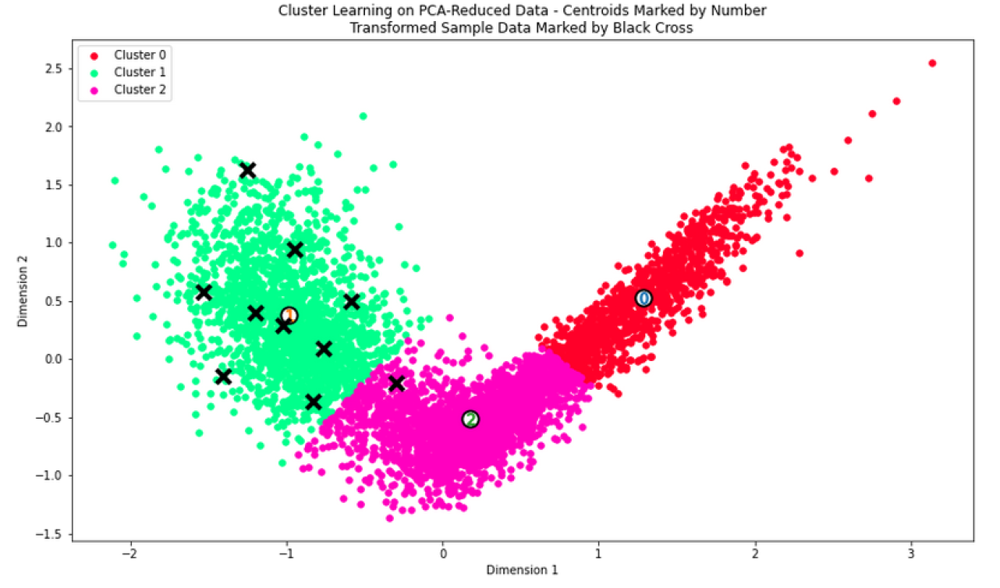

### Iris exploratory dataset analysis

[Webpage](markdowns/Iris_EDA.md)
&nbsp; &nbsp; &nbsp; &nbsp; &nbsp;
[Notebook](https://github.com/sankirnajoshi/sankirnajoshi.github.io/blob/master/notebooks/Iris_EDA.ipynb)

IRIS is one of the most popular dataset in machine learning, the data is clean, its straightforward to apply ML models, and some results are so unambiguous (thanks Setosa). Its just good to see ML work so well :) In this project we perform EDA through visualizations and statistical measures. Next, a vanilla classification model using KNNs and test performance on the test set. Finally, we apply KMeans clustering using sci-kit learn to understand if our model can differentiate between the classes of Iris... And it does pretty well as expected ;) The analysis is available as a notebook  and its rendered markdown webpage.

<a href="#top"><small>Go to top</small></a>

---

## Kaggle Competitions.

### Carvana Image Masking Challenge

[Webpage](markdowns/Carvana.md)
&nbsp; &nbsp; &nbsp; &nbsp; &nbsp;
[Notebook](https://github.com/sankirnajoshi/sankirnajoshi.github.io/blob/master/notebooks/Carvana.ipynb)
&nbsp; &nbsp; &nbsp; &nbsp; &nbsp; 
[Report](reports/carvana_report.pdf)

[Carvana Image Masking Challenge](https://www.kaggle.com/c/carvana-image-masking-challenge) was a Kaggle competition sponsored by Carvana - A online car buying platform. Its the first Kaggle experience I've had and was pretty challenging. We were tasked to remove background from car images and create a masking image for the cars. The goal was to enable Carvana to then take any car image, and place it on the foreground of any other image. Somewhat like Photoshop, but without human intervention and much much faster.
This problem falls under the category of image segmentation, where we try to identify and locate objects in an image. In this particular problem, our job was to classify each pixel in the image into 2 classes : Foreground and Background. For modeling this problem, I chose to implement the Tiramisu model from [this](https://arxiv.org/abs/1611.09326) research paper. Its a 100 layer deep neural network model that was made to tackle image segmentation tasks. Due to limited compute power, I had to train on down scaled images and when we resize to the original dimension, we average out a lot of pixels. Nonetheless, it achieved a Dice score of around 0.994 on the original size test images. Didn't get the best Kaggle score, but had a great learning experience!

 
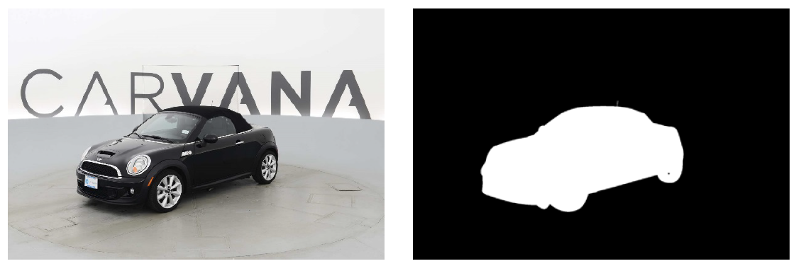

<a href="#top"><small>Go to top</small></a>

---

## Classification problems.

### Logistic Regression from scratch using numpy

[Notebook](https://github.com/sankirnajoshi/sankirnajoshi.github.io/blob/master/notebooks/week01_pa.ipynb)
&nbsp; &nbsp; &nbsp; &nbsp; &nbsp;
[Webpage](markdowns/week01_pa.md)

Developed a simple logistic regression model in Python from scratch using numpy and trained it by developing Stochastic gradient descent variations like Mini-Batch SGD, RMS Prop, SGD with momentum. Code was developed as part of HSE's Coursera course 1 on the Advanced Machine Learning Specialization. 

### Titanic: Machine Learning from Disaster

[Notebook](https://github.com/sankirnajoshi/sankirnajoshi.github.io/blob/master/notebooks/titanic_survival_exploration.ipynb) 
&nbsp; &nbsp; &nbsp; &nbsp; &nbsp;
[Webpage](markdowns/titanic_survival_exploration.md)

Titanic: Survival Exploration. In 1912, the ship RMS Titanic struck an iceberg on its maiden voyage and sank, resulting in the deaths of most of its passengers and crew. We will explore a subset of RMS Titanic passenger manifest to determine which features best predict whether someone survived or did not survive. Thus, this is a binary classification problem: based on the available information, we predict whether the passengers survived or not.

  
  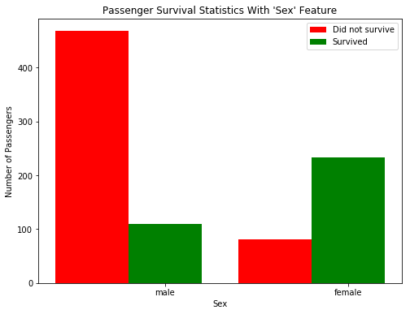

### Finding donors for CharityML

[Notebook](https://github.com/sankirnajoshi/sankirnajoshi.github.io/blob/master/notebooks/finding_donors.ipynb) 
&nbsp; &nbsp; &nbsp; &nbsp; &nbsp;
[Webpage](markdowns/finding_donors.md)

In Finding donors for CharityML, we take on the data collected from the 1994 U.S. Census. Our goal is to construct a model that accurately predicts whether an individual makes more than $50,000. Thus, making it a supervised classification problem.

### Bankruptcy Prediction

Developed a bankruptcy prediction model using R. The dataset contains the firm level data from the intersection of COMPUSTAT NORTH AMERICA –annual data and CRSP-daily stock data between 1985 and 2006. We start with an EDA on the entire dataset, then perform the train-test split and fit a logistic regression model on the train dataset. We investigate the model performance using BIC, ROC curve and come up with a cost function to identify the ideal probability at which to predict the response variable as either 0 or 1. Further, we study the generalized linear (logistic) regression, classification tree, generalized additive models,
and neural networks on the data set. Lastly, we check the model’s out-of-sample performance on the test set.

### German Credit Scoring data

[R Markdown](markdowns/german.html)

The German credit scoring data is a dataset that has extensive information about 1000 individuals from Germany, on the basis of which they have been classified as risky or not. The variable response in the dataset corresponds to the risk label, 1 has been classified as bad and 2 has been classified as good. We explore the model and build a baseline Logistic Regression Model performing variable selection using AIC, and BIC metrics. We then explore tree models such as CART, Bagging, and Random Forests.

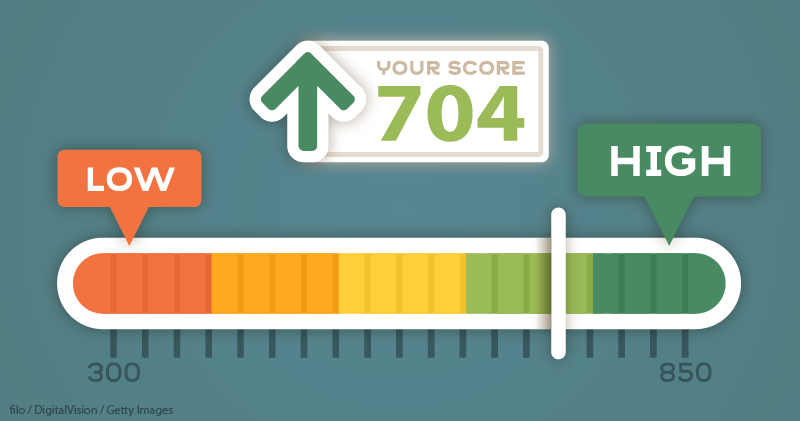

<a href="#top"><small>Go to top</small></a>

---

## Regression problems.

## Boston Housing Price prediction

[Notebook](https://github.com/sankirnajoshi/sankirnajoshi.github.io/blob/master/notebooks/boston_housing.ipynb)
&nbsp; &nbsp; &nbsp; &nbsp; &nbsp;
[Webpage](markdowns/boston_housing.md)
&nbsp; &nbsp; &nbsp; &nbsp; &nbsp;
[R Markdown](markdowns/boston_housing_1.html)

The Boston housing data was collected in 1978 and each of the 506 entries represent aggregated data about 14 features for homes from various suburbs in Boston, Massachusetts. We develop a regression model to predict housing prices for new houses in a similar locality. Being able to predict the prices of houses could be invaluable information for someone like a real estate agent. 

The code in the Python `Notebook` and `Webpage` approaches the problem in a Machine learning setting. I have performed a more statistical study on this problem in the `R Markdown` file above. 

  
  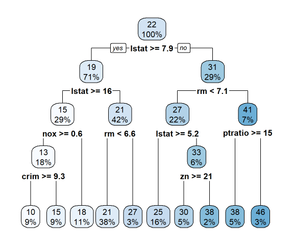

<a href="#top"><small>Go to top</small></a>

---

## Natural language processing.

### NLP Sentiment Analysis Web Application
This project is described on the top. Please click [here](#1) to navigate to the project description and code.

### NLP generating names with recurrent neural networks
[Notebook](https://github.com/sankirnajoshi/sankirnajoshi.github.io/blob/master/notebooks/Adversarial_task.ipynb)
&nbsp; &nbsp; &nbsp; &nbsp; &nbsp;
[Webpage](markdowns/Adversarial_task.md)

This notebook shows how to generate new human names from scratch or even modify it to adapt to other objects like say pokemon names. The training dataset contains ~8k human names from different cultures. We can generate new names at random, or even generate names starting with a prefix.

  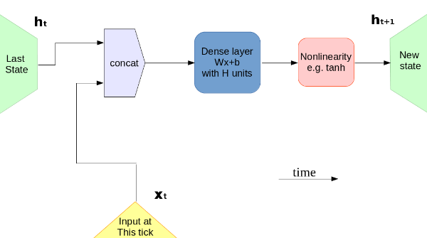
  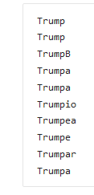
  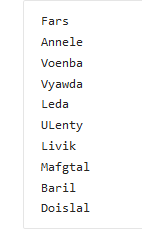

### NLP Parts of Speech [POS] Tagging

[Notebook](https://github.com/sankirnajoshi/sankirnajoshi.github.io/blob/master/notebooks/POS-task.ipynb) 
&nbsp; &nbsp; &nbsp; &nbsp; &nbsp;
[Webpage](markdowns/POS-task.md)

In this project, we convert a bunch of word sequences into a bunch of parts-of-speech tags. We develop a Bi-directional LSTM model to look at the sequences and generate POS tags for all the tokens. Tagging parts of speech accurately can significantly improve our language and context understanding and can be a great starting point for a Question Answering machine.

  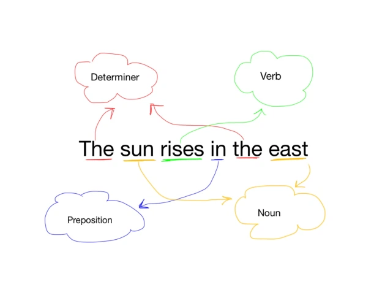
  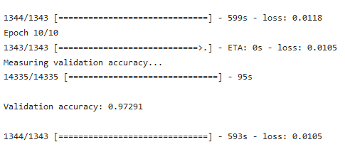

<a href="#top"><small>Go to top</small></a>

---

## Clustering

### European Employment Data – Clustering

[Webpage](markdowns/European_data_clustering.html)

Clustering is an unsupervised machine learning approach to find distinct clusters or groups within the dataset. In this project, we explore the data about the percentage employment in different industries in European countries during 1979. The purpose of examining this data is to get insight into patterns of employment (if any) amongst European countries in 1970s. We study methods like KMeans, Hierarchical clustering.

  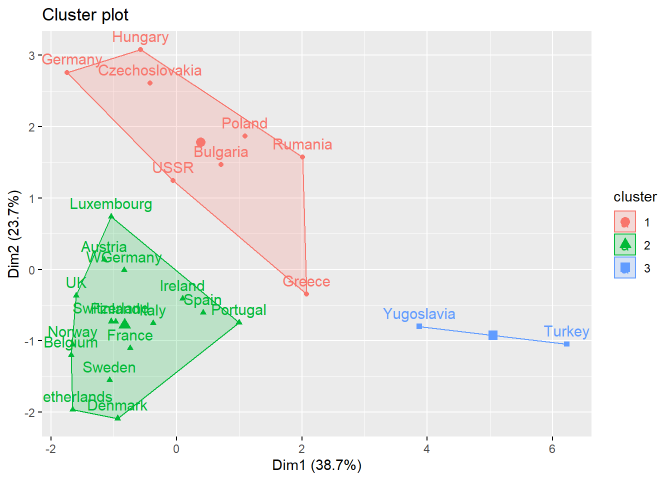
  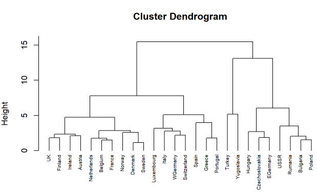

<a href="#top"><small>Go to top</small></a>

---

## Neural Networks - Computer Vision

### Image Captioning using GANs

[Notebook](https://github.com/sankirnajoshi/sankirnajoshi.github.io/blob/master/notebooks/week6_final_project_image_captioning_clean.ipynb)
&nbsp; &nbsp; &nbsp; &nbsp; &nbsp;
[Webpage](markdowns/week6_final_project_image_captioning_clean.md)

One of the most exciting projects I've worked on, Image captioning lies at the intersection of Computer vision and natural language processing. In this project, we develop an image to caption model that can produce a textual description for real world images.

  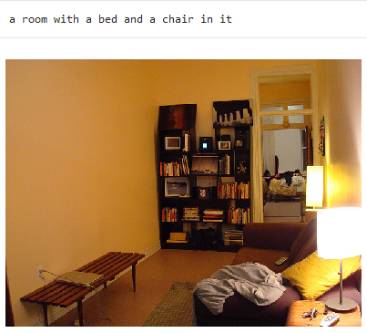
  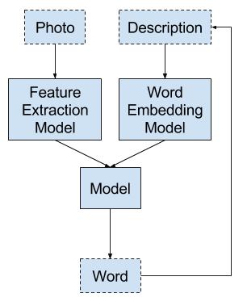

### MNIST digits classification with TensorFlow

[Notebook](https://github.com/sankirnajoshi/sankirnajoshi.github.io/blob/master/notebooks/mnist_with_keras.ipynb) 
&nbsp; &nbsp; &nbsp; &nbsp; &nbsp;
[Webpage](markdowns/mnist_with_keras.md)

We develop a simple logit model, a simple perceptron model, and an MLP model to classify hand-written digits.

  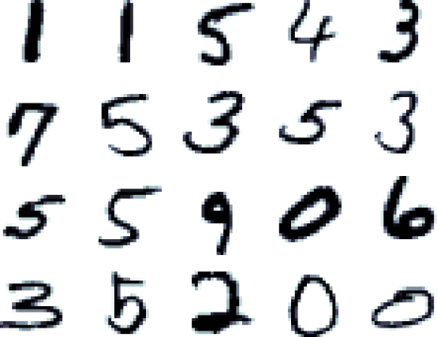
  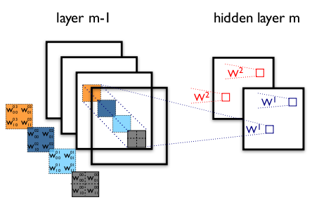

### Generating human faces with Adversarial Networks

[Notebook](https://github.com/sankirnajoshi/sankirnajoshi.github.io/blob/master/notebooks/Adversarial_task.ipynb)
&nbsp; &nbsp; &nbsp; &nbsp; &nbsp;
[Webpage](markdowns/Adversarial_task.md)

In this project, we study and develop an Adversarial network to  simulate human faces artificially. We employ a generator to generate new faces and a discriminator to predict if the faces are good enough. The model is trained using the popular Labelled faces in the wild (LFW) dataset.

  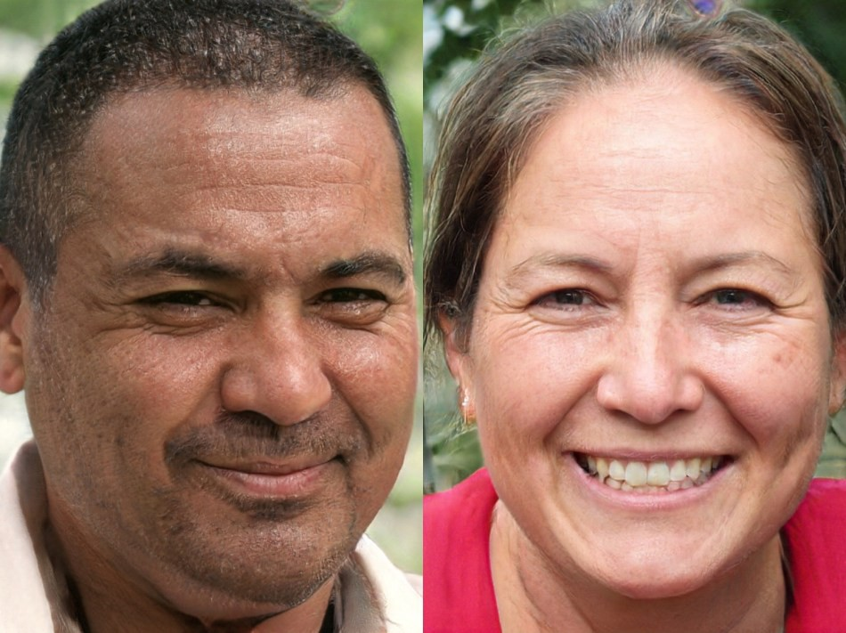
  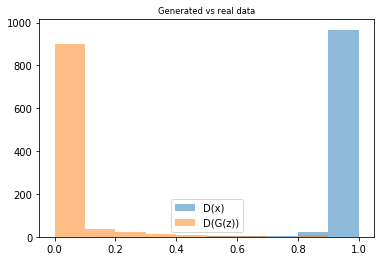

### Classification of Dogs using Transfer Learning

[Notebook](https://github.com/sankirnajoshi/sankirnajoshi.github.io/blob/master/notebooks/dog_app.ipynb)
&nbsp; &nbsp; &nbsp; &nbsp; &nbsp;
[Webpage](markdowns/dog_app.md)

In this project, we will accept any user-supplied image as input.  If a dog is detected in the image, it will provide an estimate of the dog's breed.  If a human is detected, it will provide an estimate of the dog breed that is most resembling. We train a deep CNN using LFW dataset and the dob subset from the ImageNet competition.

  
  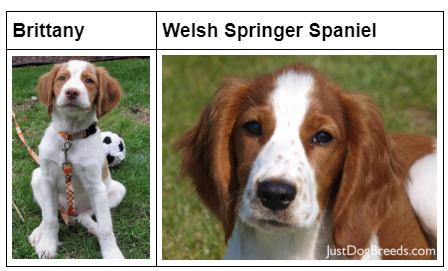

<a href="#top"><small>Go to top</small></a>
