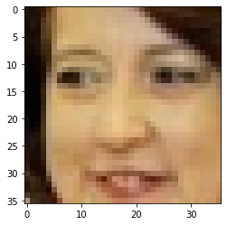
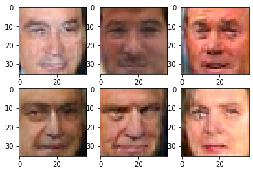
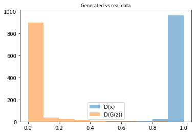
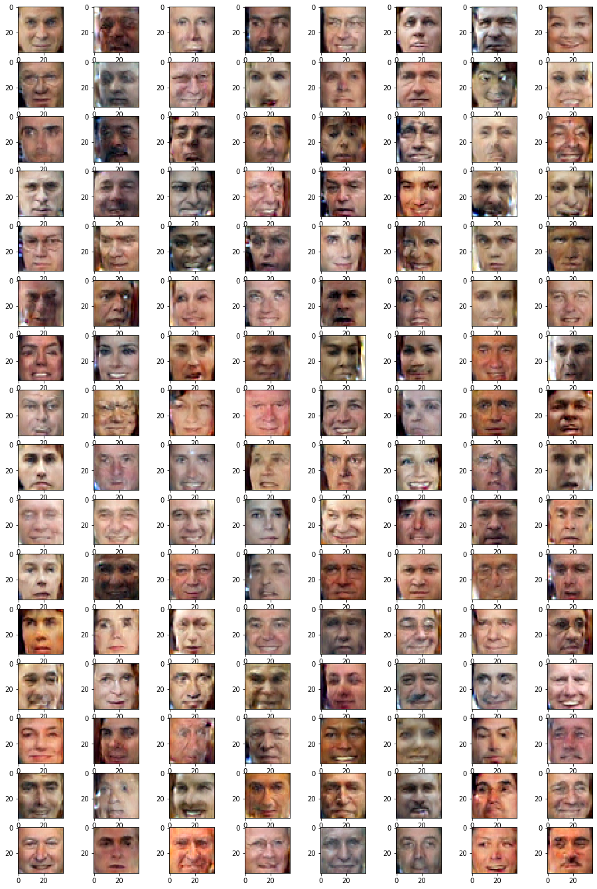

<a href="https://colab.research.google.com/github/sankirnajoshi/intro-to-dl/blob/master/week4/Adversarial_task.ipynb" target="_parent"></a>

### Generating human faces with Adversarial Networks

_© research.nvidia.com_

This time we'll train a neural net to generate plausible human faces in all their subtlty: appearance, expression, accessories, etc. 'Cuz when us machines gonna take over Earth, there won't be any more faces left. We want to preserve this data for future iterations. Yikes...

Based on https://github.com/Lasagne/Recipes/pull/94 .


```python
! shred -u setup_google_colab.py
! wget https://raw.githubusercontent.com/hse-aml/intro-to-dl/master/setup_google_colab.py -O setup_google_colab.py
import setup_google_colab
# please, uncomment the week you're working on
# setup_google_colab.setup_week1()
# setup_google_colab.setup_week2()
# setup_google_colab.setup_week2_honor()
# setup_google_colab.setup_week3()
setup_google_colab.setup_week4()
# setup_google_colab.setup_week5()
# setup_google_colab.setup_week6()
```

    --2019-11-30 20:42:49--  https://raw.githubusercontent.com/hse-aml/intro-to-dl/master/setup_google_colab.py
    Resolving raw.githubusercontent.com (raw.githubusercontent.com)... 151.101.0.133, 151.101.64.133, 151.101.128.133, ...
    Connecting to raw.githubusercontent.com (raw.githubusercontent.com)|151.101.0.133|:443... connected.
    HTTP request sent, awaiting response... 200 OK
    Length: 3636 (3.6K) [text/plain]
    Saving to: ‘setup_google_colab.py’
    
    setup_google_colab. 100%[===================>]   3.55K  --.-KB/s    in 0s      
    
    2019-11-30 20:42:49 (76.9 MB/s) - ‘setup_google_colab.py’ saved [3636/3636]
    
    **************************************************
    lfw-deepfunneled.tgz
    **************************************************
    lfw.tgz
    **************************************************
    lfw_attributes.txt
    


```python
import sys
sys.path.append("..")
import grading
import download_utils
import tqdm_utils
```


```python
download_utils.link_week_4_resources()
```


```python
import matplotlib.pyplot as plt
%matplotlib inline
import numpy as np
plt.rcParams.update({'axes.titlesize': 'small'})

from sklearn.datasets import load_digits
#The following line fetches you two datasets: images, usable for autoencoder training and attributes.
#Those attributes will be required for the final part of the assignment (applying smiles), so please keep them in mind
from lfw_dataset import load_lfw_dataset 
data,attrs = load_lfw_dataset(dimx=36,dimy=36)

#preprocess faces
data = np.float32(data)/255.

IMG_SHAPE = data.shape[1:]
```

    **************************************************
    
    


```python
IMG_SHAPE
```


    (36, 36, 3)


```python
#print random image
plt.imshow(data[np.random.randint(data.shape[0])], cmap="gray", interpolation="none")
```


    <matplotlib.image.AxesImage at 0x7f1862a82710>





# Generative adversarial nets 101


_© torch.github.io_

Deep learning is simple, isn't it? 
* build some network that generates the face (small image)
* make up a __measure__ of __how good that face is__
* optimize with gradient descent :)


The only problem is: how can we engineers tell well-generated faces from bad? And i bet you we won't ask a designer for help. 

__If we can't tell good faces from bad, we delegate it to yet another neural network!__

That makes the two of them:
* __G__enerator - takes random noize for inspiration and tries to generate a face sample. 
  * Let's call him __G__(z), where z is a gaussian noize.
* __D__iscriminator - takes a face sample and tries to tell if it's great or fake. 
  * Predicts the probability of input image being a __real face__
  * Let's call him __D__(x), x being an image.
  * __D(x)__ is a predition for real image and __D(G(z))__ is prediction for the face made by generator.

Before we dive into training them, let's construct the two networks.


```python
import tensorflow as tf
from keras_utils import reset_tf_session
s = reset_tf_session()

import keras
from keras.models import Sequential
from keras import layers as L
```


```python
CODE_SIZE = 256

generator = keras.models.Sequential()
generator.add(L.InputLayer([CODE_SIZE],name='noise'))
generator.add(L.Dense(10*8*8, activation='elu'))

generator.add(L.Reshape((8,8,10)))
generator.add(L.Deconv2D(64,kernel_size=(5,5),activation='elu'))
generator.add(L.Deconv2D(64,kernel_size=(5,5),activation='elu'))
generator.add(L.UpSampling2D(size=(2,2)))
generator.add(L.Deconv2D(32,kernel_size=3,activation='elu'))
generator.add(L.Deconv2D(32,kernel_size=3,activation='elu'))
generator.add(L.Deconv2D(32,kernel_size=3,activation='elu'))

generator.add(L.Conv2D(3,kernel_size=3,activation=None))

```


```python
print(generator.summary())
```

    _________________________________________________________________
    Layer (type)                 Output Shape              Param #   
    =================================================================
    noise (InputLayer)           (None, 256)               0         
    _________________________________________________________________
    dense_1 (Dense)              (None, 640)               164480    
    _________________________________________________________________
    reshape_1 (Reshape)          (None, 8, 8, 10)          0         
    _________________________________________________________________
    conv2d_transpose_1 (Conv2DTr (None, 12, 12, 64)        16064     
    _________________________________________________________________
    conv2d_transpose_2 (Conv2DTr (None, 16, 16, 64)        102464    
    _________________________________________________________________
    up_sampling2d_1 (UpSampling2 (None, 32, 32, 64)        0         
    _________________________________________________________________
    conv2d_transpose_3 (Conv2DTr (None, 34, 34, 32)        18464     
    _________________________________________________________________
    conv2d_transpose_4 (Conv2DTr (None, 36, 36, 32)        9248      
    _________________________________________________________________
    conv2d_transpose_5 (Conv2DTr (None, 38, 38, 32)        9248      
    _________________________________________________________________
    conv2d_1 (Conv2D)            (None, 36, 36, 3)         867       
    =================================================================
    Total params: 320,835
    Trainable params: 320,835
    Non-trainable params: 0
    _________________________________________________________________
    None
    


```python
assert generator.output_shape[1:] == IMG_SHAPE, "generator must output an image of shape %s, but instead it produces %s"%(IMG_SHAPE,generator.output_shape[1:])
```

### Discriminator
* Discriminator is your usual convolutional network with interlooping convolution and pooling layers
* The network does not include dropout/batchnorm to avoid learning complications.
* We also regularize the pre-output layer to prevent discriminator from being too certain.


```python
discriminator = Sequential()

discriminator.add(L.InputLayer(IMG_SHAPE))
discriminator.add(L.Conv2D(8, (3,3),padding='same', activation='elu'))
discriminator.add(L.Conv2D(16, (3,3),padding='same', activation='elu'))
discriminator.add(L.MaxPooling2D(pool_size=(2,2)))
discriminator.add(L.Conv2D(32, (3,3),padding='same', activation='elu'))
discriminator.add(L.MaxPooling2D(pool_size=(2,2)))
discriminator.add(L.Conv2D(64, (3,3),padding='same', activation='elu'))
discriminator.add(L.Flatten())
discriminator.add(L.Dense(256,activation='tanh'))
discriminator.add(L.Dense(2,activation=tf.nn.log_softmax))

```


```python
print(discriminator.summary())
```

    _________________________________________________________________
    Layer (type)                 Output Shape              Param #   
    =================================================================
    input_1 (InputLayer)         (None, 36, 36, 3)         0         
    _________________________________________________________________
    conv2d_2 (Conv2D)            (None, 36, 36, 8)         224       
    _________________________________________________________________
    conv2d_3 (Conv2D)            (None, 36, 36, 16)        1168      
    _________________________________________________________________
    max_pooling2d_1 (MaxPooling2 (None, 18, 18, 16)        0         
    _________________________________________________________________
    conv2d_4 (Conv2D)            (None, 18, 18, 32)        4640      
    _________________________________________________________________
    max_pooling2d_2 (MaxPooling2 (None, 9, 9, 32)          0         
    _________________________________________________________________
    conv2d_5 (Conv2D)            (None, 9, 9, 64)          18496     
    _________________________________________________________________
    flatten_1 (Flatten)          (None, 5184)              0         
    _________________________________________________________________
    dense_2 (Dense)              (None, 256)               1327360   
    _________________________________________________________________
    dense_3 (Dense)              (None, 2)                 514       
    =================================================================
    Total params: 1,352,402
    Trainable params: 1,352,402
    Non-trainable params: 0
    _________________________________________________________________
    None
    

# Training

We train the two networks concurrently:
* Train __discriminator__ to better distinguish real data from __current__ generator
* Train __generator__ to make discriminator think generator is real
* Since discriminator is a differentiable neural network, we train both with gradient descent.


_© deeplearning4j.org_

Training is done iteratively until discriminator is no longer able to find the difference (or until you run out of patience).


### Tricks:
* Regularize discriminator output weights to prevent explosion
* Train generator with __adam__ to speed up training. Discriminator trains with SGD to avoid problems with momentum.
* More: https://github.com/soumith/ganhacks


```python
noise = tf.placeholder('float32',[None,CODE_SIZE])
real_data = tf.placeholder('float32',[None,]+list(IMG_SHAPE))

logp_real = discriminator(real_data)

generated_data = generator(noise)

logp_gen = discriminator(generated_data)

```


```python
########################
#discriminator training#
########################

d_loss = -tf.reduce_mean(logp_real[:,1] + logp_gen[:,0])

#regularize
d_loss += tf.reduce_mean(discriminator.layers[-1].kernel**2)

#optimize
disc_optimizer =  tf.train.GradientDescentOptimizer(1e-3).minimize(d_loss,var_list=discriminator.trainable_weights)
```


```python
########################
###generator training###
########################

g_loss = tf.reduce_mean(logp_real[:,1] - logp_gen[:,1])

gen_optimizer = tf.train.AdamOptimizer(1e-4).minimize(g_loss,var_list=generator.trainable_weights)

    
```


```python
s.run(tf.global_variables_initializer())
```

### Auxiliary functions
Here we define a few helper functions that draw current data distributions and sample training batches.


```python
def sample_noise_batch(bsize):
    return np.random.normal(size=(bsize, CODE_SIZE)).astype('float32')

def sample_data_batch(bsize):
    idxs = np.random.choice(np.arange(data.shape[0]), size=bsize)
    return data[idxs]

def sample_images(nrow,ncol, sharp=False):
    images = generator.predict(sample_noise_batch(bsize=nrow*ncol))
    if np.var(images)!=0:
        images = images.clip(np.min(data),np.max(data))
    for i in range(nrow*ncol):
        plt.subplot(nrow,ncol,i+1)
        if sharp:
            plt.imshow(images[i].reshape(IMG_SHAPE),cmap="gray", interpolation="none")
        else:
            plt.imshow(images[i].reshape(IMG_SHAPE),cmap="gray")
    plt.show()

def sample_probas(bsize):
    plt.title('Generated vs real data')
    plt.hist(np.exp(discriminator.predict(sample_data_batch(bsize)))[:,1],
             label='D(x)', alpha=0.5,range=[0,1])
    plt.hist(np.exp(discriminator.predict(generator.predict(sample_noise_batch(bsize))))[:,1],
             label='D(G(z))',alpha=0.5,range=[0,1])
    plt.legend(loc='best')
    plt.show()
```

### Training
Main loop.
We just train generator and discriminator in a loop and plot results once every N iterations.


```python
from IPython import display

for epoch in tqdm_utils.tqdm_notebook_failsafe(range(50000)):
    
    feed_dict = {
        real_data:sample_data_batch(100),
        noise:sample_noise_batch(100)
    }
    
    for i in range(5):
        s.run(disc_optimizer,feed_dict)
    
    s.run(gen_optimizer,feed_dict)
    
    if epoch %100==0:
        print("The current Epoch is {}".format(epoch))
        display.clear_output(wait=True)
        sample_images(2,3,True)
        sample_probas(1000)
        
```








    *
    
    


```python
from submit_honor import submit_honor
submit_honor((generator, discriminator), "sankirna1292@gmail.com", "dsbfJJ2nOoZcIFt7")
```


```python
#The network was trained for about 15k iterations. 
#Training for longer yields MUCH better results
plt.figure(figsize=[16,24])
sample_images(16,8)
```





```python

```
