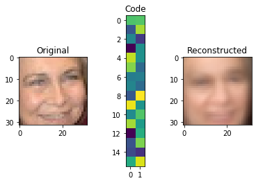
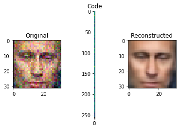
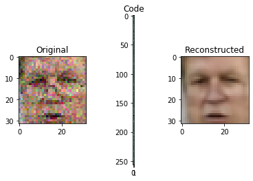
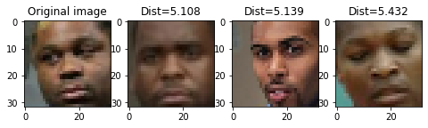

<a href="https://colab.research.google.com/github/sankirnajoshi/intro-to-dl/blob/master/week4/Autoencoders-task.ipynb" target="_parent"></a>

# Denoising Autoencoders And Where To Find Them

Today we're going to train deep autoencoders and apply them to faces and similar images search.

Our new test subjects are human faces from the [lfw dataset](http://vis-www.cs.umass.edu/lfw/).

# Import stuff


```python
! shred -u setup_google_colab.py
! wget https://raw.githubusercontent.com/hse-aml/intro-to-dl/master/setup_google_colab.py -O setup_google_colab.py
import setup_google_colab
# please, uncomment the week you're working on
# setup_google_colab.setup_week1()
# setup_google_colab.setup_week2()
# setup_google_colab.setup_week2_honor()
# setup_google_colab.setup_week3()
setup_google_colab.setup_week4()
# setup_google_colab.setup_week5()
# setup_google_colab.setup_week6()
```

    --2019-11-27 17:36:19--  https://raw.githubusercontent.com/hse-aml/intro-to-dl/master/setup_google_colab.py
    Resolving raw.githubusercontent.com (raw.githubusercontent.com)... 151.101.0.133, 151.101.64.133, 151.101.128.133, ...
    Connecting to raw.githubusercontent.com (raw.githubusercontent.com)|151.101.0.133|:443... connected.
    HTTP request sent, awaiting response... 200 OK
    Length: 3636 (3.6K) [text/plain]
    Saving to: ‘setup_google_colab.py’
    
    setup_google_colab. 100%[===================>]   3.55K  --.-KB/s    in 0s      
    
    2019-11-27 17:36:19 (77.3 MB/s) - ‘setup_google_colab.py’ saved [3636/3636]
    
    **************************************************
    lfw-deepfunneled.tgz
    **************************************************
    lfw.tgz
    **************************************************
    lfw_attributes.txt
    


```python
import sys
sys.path.append("..")
import grading
```


```python
import tensorflow as tf
import keras, keras.layers as L, keras.backend as K
import numpy as np
from sklearn.model_selection import train_test_split
from lfw_dataset import load_lfw_dataset
%matplotlib inline
import matplotlib.pyplot as plt
import download_utils
import keras_utils
import numpy as np
from keras_utils import reset_tf_session
```


<p style="color: red;">
The default version of TensorFlow in Colab will soon switch to TensorFlow 2.x.<br>
We recommend you <a href="https://www.tensorflow.org/guide/migrate" target="_blank">upgrade</a> now 
or ensure your notebook will continue to use TensorFlow 1.x via the <code>%tensorflow_version 1.x</code> magic:
<a href="https://colab.research.google.com/notebooks/tensorflow_version.ipynb" target="_blank">more info</a>.</p>


    Using TensorFlow backend.
    


```python
# !!! remember to clear session/graph if you rebuild your graph to avoid out-of-memory errors !!!
```

# Load dataset
Dataset was downloaded for you. Relevant links (just in case):
- http://www.cs.columbia.edu/CAVE/databases/pubfig/download/lfw_attributes.txt
- http://vis-www.cs.umass.edu/lfw/lfw-deepfunneled.tgz
- http://vis-www.cs.umass.edu/lfw/lfw.tgz


```python
import inspect
lines = inspect.getsource(download_utils)
print(lines)
```

    #!/usr/bin/env python
    # -*- coding: utf-8 -*-
    import os
    import shutil
    import requests
    import time
    from functools import wraps
    import traceback
    import tqdm_utils
    
    
    # https://www.saltycrane.com/blog/2009/11/trying-out-retry-decorator-python/
    def retry(ExceptionToCheck, tries=4, delay=3, backoff=2):
        def deco_retry(f):
    
            @wraps(f)
            def f_retry(*args, **kwargs):
                mtries, mdelay = tries, delay
                while mtries > 1:
                    try:
                        return f(*args, **kwargs)
                    except KeyboardInterrupt as e:
                        raise e
                    except ExceptionToCheck as e:
                        print("%s, retrying in %d seconds..." % (str(e), mdelay))
                        traceback.print_exc()
                        time.sleep(mdelay)
                        mtries -= 1
                        mdelay *= backoff
                return f(*args, **kwargs)
    
            return f_retry  # true decorator
    
        return deco_retry
    
    
    @retry(Exception)
    def download_file(url, file_path):
        r = requests.get(url, stream=True)
        total_size = int(r.headers.get('content-length'))
        bar = tqdm_utils.tqdm_notebook_failsafe(total=total_size, unit='B', unit_scale=True)
        bar.set_description(os.path.split(file_path)[-1])
        incomplete_download = False
        try:
            with open(file_path, 'wb', buffering=16 * 1024 * 1024) as f:
                for chunk in r.iter_content(4 * 1024 * 1024):
                    f.write(chunk)
                    bar.update(len(chunk))
        except Exception as e:
            raise e
        finally:
            bar.close()
            if os.path.exists(file_path) and os.path.getsize(file_path) != total_size:
                incomplete_download = True
                os.remove(file_path)
        if incomplete_download:
            raise Exception("Incomplete download")
    
    
    def download_from_github(version, fn, target_dir):
        url = "https://github.com/hse-aml/intro-to-dl/releases/download/{0}/{1}".format(version, fn)
        file_path = os.path.join(target_dir, fn)
        download_file(url, file_path)
    
    
    def sequential_downloader(version, fns, target_dir):
        os.makedirs(target_dir, exist_ok=True)
        for fn in fns:
            download_from_github(version, fn, target_dir)
    
    
    def link_all_files_from_dir(src_dir, dst_dir):
        os.makedirs(dst_dir, exist_ok=True)
        if not os.path.exists(src_dir):
            # Coursera "readonly/readonly" bug workaround
            src_dir = src_dir.replace("readonly", "readonly/readonly")
        for fn in os.listdir(src_dir):
            src_file = os.path.join(src_dir, fn)
            dst_file = os.path.join(dst_dir, fn)
            if os.name == "nt":
                shutil.copyfile(src_file, dst_file)
            else:
                if os.path.islink(dst_file):
                    os.remove(dst_file)
                if not os.path.exists(dst_file):
                    os.symlink(os.path.abspath(src_file), dst_file)
    
    
    def download_all_keras_resources(keras_models, keras_datasets):
        # Originals:
        # http://www.cs.toronto.edu/~kriz/cifar-10-python.tar.gz
        # https://github.com/fchollet/deep-learning-models/releases/download/v0.5/inception_v3_weights_tf_dim_ordering_tf_kernels_notop.h5
        # https://s3.amazonaws.com/img-datasets/mnist.npz
        sequential_downloader(
            "v0.2",
            [
                "inception_v3_weights_tf_dim_ordering_tf_kernels_notop.h5"
            ],
            keras_models
        )
        sequential_downloader(
            "v0.2",
            [
                "cifar-10-batches-py.tar.gz",
                "mnist.npz"
            ],
            keras_datasets
        )
    
    
    def download_week_3_resources(save_path):
        # Originals:
        # http://www.robots.ox.ac.uk/~vgg/data/flowers/102/102flowers.tgz
        # http://www.robots.ox.ac.uk/~vgg/data/flowers/102/imagelabels.mat
        sequential_downloader(
            "v0.3",
            [
                "102flowers.tgz",
                "imagelabels.mat"
            ],
            save_path
        )
    
    
    def download_week_4_resources(save_path):
        # Originals
        # http://www.cs.columbia.edu/CAVE/databases/pubfig/download/lfw_attributes.txt
        # http://vis-www.cs.umass.edu/lfw/lfw-deepfunneled.tgz
        # http://vis-www.cs.umass.edu/lfw/lfw.tgz
        sequential_downloader(
            "v0.4",
            [
                "lfw-deepfunneled.tgz",
                "lfw.tgz",
                "lfw_attributes.txt"
            ],
            save_path
        )
    
    
    def download_week_6_resources(save_path):
        # Originals:
        # http://msvocds.blob.core.windows.net/annotations-1-0-3/captions_train-val2014.zip
        sequential_downloader(
            "v0.1",
            [
                "captions_train-val2014.zip",
                "train2014_sample.zip",
                "train_img_embeds.pickle",
                "train_img_fns.pickle",
                "val2014_sample.zip",
                "val_img_embeds.pickle",
                "val_img_fns.pickle"
            ],
            save_path
        )
    
    
    def link_all_keras_resources():
        link_all_files_from_dir("../readonly/keras/datasets/", os.path.expanduser("~/.keras/datasets"))
        link_all_files_from_dir("../readonly/keras/models/", os.path.expanduser("~/.keras/models"))
    
    
    def link_week_3_resources():
        link_all_files_from_dir("../readonly/week3/", ".")
    
    
    def link_week_4_resources():
        link_all_files_from_dir("../readonly/week4/", ".")
    
    
    def link_week_6_resources():
        link_all_files_from_dir("../readonly/week6/", ".")
    
    


```python
# we downloaded them for you, just link them here
download_utils.link_week_4_resources()
```


```python
# load images
X, attr = load_lfw_dataset(use_raw=True, dimx=32, dimy=32)
IMG_SHAPE = X.shape[1:]

# center images
X = X.astype('float32') / 255.0 - 0.5

# split
X_train, X_test = train_test_split(X, test_size=0.1, random_state=42)
```

    **************************************************
    
    


```python
def show_image(x):
    plt.imshow(np.clip(x + 0.5, 0, 1))
```


```python
plt.title('sample images')

for i in range(6):
    plt.subplot(2,3,i+1)
    show_image(X[i])

print("X shape:", X.shape)
print("attr shape:", attr.shape)

# try to free memory
del X
import gc
gc.collect()
```

    X shape: (13143, 32, 32, 3)
    attr shape: (13143, 73)
    


    1405


# Autoencoder architecture

Let's design autoencoder as two sequential keras models: the encoder and decoder respectively.

We will then use symbolic API to apply and train these models.


# First step: PCA

Principial Component Analysis is a popular dimensionality reduction method. 

Under the hood, PCA attempts to decompose object-feature matrix $X$ into two smaller matrices: $W$ and $\hat W$ minimizing _mean squared error_:

$$\|(X W) \hat{W} - X\|^2_2 \to_{W, \hat{W}} \min$$
- $X \in \mathbb{R}^{n \times m}$ - object matrix (**centered**);
- $W \in \mathbb{R}^{m \times d}$ - matrix of direct transformation;
- $\hat{W} \in \mathbb{R}^{d \times m}$ - matrix of reverse transformation;
- $n$ samples, $m$ original dimensions and $d$ target dimensions;

In geometric terms, we want to find d axes along which most of variance occurs. The "natural" axes, if you wish.


PCA can also be seen as a special case of an autoencoder.

* __Encoder__: X -> Dense(d units) -> code
* __Decoder__: code -> Dense(m units) -> X

Where Dense is a fully-connected layer with linear activaton:   $f(X) = W \cdot X + \vec b $


Note: the bias term in those layers is responsible for "centering" the matrix i.e. substracting mean.


```python
def build_pca_autoencoder(img_shape, code_size):
    """
    Here we define a simple linear autoencoder as described above.
    We also flatten and un-flatten data to be compatible with image shapes
    """
    
    encoder = keras.models.Sequential()
    encoder.add(L.InputLayer(img_shape))
    encoder.add(L.Flatten())                  #flatten image to vector
    encoder.add(L.Dense(code_size))           #actual encoder

    decoder = keras.models.Sequential()
    decoder.add(L.InputLayer((code_size,)))
    decoder.add(L.Dense(np.prod(img_shape)))  #actual decoder, height*width*3 units
    decoder.add(L.Reshape(img_shape))         #un-flatten
    
    return encoder,decoder
```

Meld them together into one model:


```python
s = reset_tf_session()

encoder, decoder = build_pca_autoencoder(IMG_SHAPE, code_size=32)

inp = L.Input(IMG_SHAPE)
code = encoder(inp)
reconstruction = decoder(code)

autoencoder = keras.models.Model(inputs=inp, outputs=reconstruction)
autoencoder.compile(optimizer='adamax', loss='mse')

autoencoder.fit(x=X_train, y=X_train, epochs=15,
                validation_data=[X_test, X_test],
                callbacks=[keras_utils.TqdmProgressCallback()],
                verbose=0)
```

    WARNING:tensorflow:From /content/keras_utils.py:68: The name tf.get_default_session is deprecated. Please use tf.compat.v1.get_default_session instead.
    
    WARNING:tensorflow:From /usr/local/lib/python3.6/dist-packages/keras/backend/tensorflow_backend.py:79: The name tf.reset_default_graph is deprecated. Please use tf.compat.v1.reset_default_graph instead.
    
    WARNING:tensorflow:From /usr/local/lib/python3.6/dist-packages/keras/backend/tensorflow_backend.py:82: The name tf.placeholder is deprecated. Please use tf.compat.v1.placeholder instead.
    
    WARNING:tensorflow:From /usr/local/lib/python3.6/dist-packages/keras/backend/tensorflow_backend.py:84: The name tf.get_default_graph is deprecated. Please use tf.compat.v1.get_default_graph instead.
    
    WARNING:tensorflow:From /content/keras_utils.py:75: The name tf.ConfigProto is deprecated. Please use tf.compat.v1.ConfigProto instead.
    
    WARNING:tensorflow:From /content/keras_utils.py:77: The name tf.InteractiveSession is deprecated. Please use tf.compat.v1.InteractiveSession instead.
    
    WARNING:tensorflow:From /usr/local/lib/python3.6/dist-packages/keras/backend/tensorflow_backend.py:1210: calling reduce_prod_v1 (from tensorflow.python.ops.math_ops) with keep_dims is deprecated and will be removed in a future version.
    Instructions for updating:
    keep_dims is deprecated, use keepdims instead
    WARNING:tensorflow:From /usr/local/lib/python3.6/dist-packages/keras/backend/tensorflow_backend.py:3535: The name tf.random_uniform is deprecated. Please use tf.random.uniform instead.
    
    WARNING:tensorflow:From /usr/local/lib/python3.6/dist-packages/keras/optimizers.py:697: The name tf.train.Optimizer is deprecated. Please use tf.compat.v1.train.Optimizer instead.
    
    WARNING:tensorflow:From /usr/local/lib/python3.6/dist-packages/keras/backend/tensorflow_backend.py:2289: The name tf.Session is deprecated. Please use tf.compat.v1.Session instead.
    
    WARNING:tensorflow:From /usr/local/lib/python3.6/dist-packages/keras/backend/tensorflow_backend.py:879: The name tf.assign_add is deprecated. Please use tf.compat.v1.assign_add instead.
    
    WARNING:tensorflow:From /usr/local/lib/python3.6/dist-packages/keras/backend/tensorflow_backend.py:602: calling Constant.__init__ (from tensorflow.python.ops.init_ops) with dtype is deprecated and will be removed in a future version.
    Instructions for updating:
    Call initializer instance with the dtype argument instead of passing it to the constructor
    WARNING:tensorflow:From /usr/local/lib/python3.6/dist-packages/keras/backend/tensorflow_backend.py:866: The name tf.assign is deprecated. Please use tf.compat.v1.assign instead.
    
    
    Epoch 1/15
    WARNING:tensorflow:From /usr/local/lib/python3.6/dist-packages/keras/backend/tensorflow_backend.py:333: The name tf.global_variables is deprecated. Please use tf.compat.v1.global_variables instead.
    
    WARNING:tensorflow:From /usr/local/lib/python3.6/dist-packages/keras/backend/tensorflow_backend.py:341: The name tf.variables_initializer is deprecated. Please use tf.compat.v1.variables_initializer instead.
    
    **************************************************
    loss: 0.0125; val_loss: 0.0086
    
    Epoch 2/15
    **************************************************
    loss: 0.0077; val_loss: 0.0070
    
    Epoch 3/15
    **************************************************
    loss: 0.0069; val_loss: 0.0067
    
    Epoch 4/15
    **************************************************
    loss: 0.0067; val_loss: 0.0067
    
    Epoch 5/15
    **************************************************
    loss: 0.0067; val_loss: 0.0067
    
    Epoch 6/15
    **************************************************
    loss: 0.0067; val_loss: 0.0066
    
    Epoch 7/15
    **************************************************
    loss: 0.0067; val_loss: 0.0066
    
    Epoch 8/15
    **************************************************
    loss: 0.0067; val_loss: 0.0066
    
    Epoch 9/15
    **************************************************
    loss: 0.0067; val_loss: 0.0066
    
    Epoch 10/15
    **************************************************
    loss: 0.0067; val_loss: 0.0067
    
    Epoch 11/15
    **************************************************
    loss: 0.0067; val_loss: 0.0066
    
    Epoch 12/15
    **************************************************
    loss: 0.0067; val_loss: 0.0066
    
    Epoch 13/15
    **************************************************
    loss: 0.0067; val_loss: 0.0066
    
    Epoch 14/15
    **************************************************
    loss: 0.0067; val_loss: 0.0066
    
    Epoch 15/15
    **************************************************
    loss: 0.0067; val_loss: 0.0066
    


    <keras.callbacks.History at 0x7f4e0eed7f98>


```python
def visualize(img,encoder,decoder):
    """Draws original, encoded and decoded images"""
    code = encoder.predict(img[None])[0]  # img[None] is the same as img[np.newaxis, :]
    reco = decoder.predict(code[None])[0]

    plt.subplot(1,3,1)
    plt.title("Original")
    show_image(img)

    plt.subplot(1,3,2)
    plt.title("Code")
    plt.imshow(code.reshape([code.shape[-1]//2,-1]))

    plt.subplot(1,3,3)
    plt.title("Reconstructed")
    show_image(reco)
    plt.show()

```


```python
score = autoencoder.evaluate(X_test,X_test,verbose=0)
print("PCA MSE:", score)

for i in range(5):
    img = X_test[i]
    visualize(img,encoder,decoder)
```

    PCA MSE: 0.006583995994237099
    





# Going deeper: convolutional autoencoder

PCA is neat but surely we can do better. This time we want you to build a deep convolutional autoencoder by... stacking more layers.

## Encoder

The **encoder** part is pretty standard, we stack convolutional and pooling layers and finish with a dense layer to get the representation of desirable size (`code_size`).

We recommend to use `activation='elu'` for all convolutional and dense layers.

We recommend to repeat (conv, pool) 4 times with kernel size (3, 3), `padding='same'` and the following numbers of output channels: `32, 64, 128, 256`.

Remember to flatten (`L.Flatten()`) output before adding the last dense layer!

## Decoder

For **decoder** we will use so-called "transpose convolution". 

Traditional convolutional layer takes a patch of an image and produces a number (patch -> number). In "transpose convolution" we want to take a number and produce a patch of an image (number -> patch). We need this layer to "undo" convolutions in encoder. We had a glimpse of it during week 3 (watch [this video](https://www.coursera.org/learn/intro-to-deep-learning/lecture/auRqf/a-glimpse-of-other-computer-vision-tasks) starting at 5:41).

Here's how "transpose convolution" works:

In this example we use a stride of 2 to produce 4x4 output, this way we "undo" pooling as well. Another way to think about it: we "undo" convolution with stride 2 (which is similar to conv + pool).

You can add "transpose convolution" layer in Keras like this:
```python
L.Conv2DTranspose(filters=?, kernel_size=(3, 3), strides=2, activation='elu', padding='same')
```

Our decoder starts with a dense layer to "undo" the last layer of encoder. Remember to reshape its output to "undo" `L.Flatten()` in encoder.

Now we're ready to undo (conv, pool) pairs. For this we need to stack 4 `L.Conv2DTranspose` layers with the following numbers of output channels: `128, 64, 32, 3`. Each of these layers will learn to "undo" (conv, pool) pair in encoder. For the last `L.Conv2DTranspose` layer use `activation=None` because that is our final image.


```python
# Let's play around with transpose convolution on examples first
def test_conv2d_transpose(img_size, filter_size):
    print("Transpose convolution test for img_size={}, filter_size={}:".format(img_size, filter_size))
    
    x = (np.ones(img_size ** 2, dtype=np.float32)).reshape((1, img_size, img_size, 1))
    f = (np.ones(filter_size ** 2, dtype=np.float32)).reshape((filter_size, filter_size, 1, 1))

    s = reset_tf_session()
    
    conv = tf.nn.conv2d_transpose(x, f, 
                                  output_shape=(1, img_size * 2, img_size * 2, 1),
                                  strides=[1, 2, 2, 1], 
                                  padding='SAME')

    result = s.run(conv)
    print("input:")
    print(x[0, :, :, 0])
    print("filter:")
    print(f[:, :, 0, 0])
    print("output:")
    print(result[0, :, :, 0])
    s.close()
        
test_conv2d_transpose(img_size=2, filter_size=2)
test_conv2d_transpose(img_size=2, filter_size=3)
test_conv2d_transpose(img_size=4, filter_size=2)
test_conv2d_transpose(img_size=4, filter_size=3)
test_conv2d_transpose(img_size=4, filter_size=3)
```

    Transpose convolution test for img_size=2, filter_size=2:
    input:
    [[1. 1.]
     [1. 1.]]
    filter:
    [[1. 1.]
     [1. 1.]]
    output:
    [[1. 1. 1. 1.]
     [1. 1. 1. 1.]
     [1. 1. 1. 1.]
     [1. 1. 1. 1.]]
    Transpose convolution test for img_size=2, filter_size=3:
    input:
    [[1. 1.]
     [1. 1.]]
    filter:
    [[1. 1. 1.]
     [1. 1. 1.]
     [1. 1. 1.]]
    output:
    [[1. 1. 2. 1.]
     [1. 1. 2. 1.]
     [2. 2. 4. 2.]
     [1. 1. 2. 1.]]
    Transpose convolution test for img_size=4, filter_size=2:
    input:
    [[1. 1. 1. 1.]
     [1. 1. 1. 1.]
     [1. 1. 1. 1.]
     [1. 1. 1. 1.]]
    filter:
    [[1. 1.]
     [1. 1.]]
    output:
    [[1. 1. 1. 1. 1. 1. 1. 1.]
     [1. 1. 1. 1. 1. 1. 1. 1.]
     [1. 1. 1. 1. 1. 1. 1. 1.]
     [1. 1. 1. 1. 1. 1. 1. 1.]
     [1. 1. 1. 1. 1. 1. 1. 1.]
     [1. 1. 1. 1. 1. 1. 1. 1.]
     [1. 1. 1. 1. 1. 1. 1. 1.]
     [1. 1. 1. 1. 1. 1. 1. 1.]]
    Transpose convolution test for img_size=4, filter_size=3:
    input:
    [[1. 1. 1. 1.]
     [1. 1. 1. 1.]
     [1. 1. 1. 1.]
     [1. 1. 1. 1.]]
    filter:
    [[1. 1. 1.]
     [1. 1. 1.]
     [1. 1. 1.]]
    output:
    [[1. 1. 2. 1. 2. 1. 2. 1.]
     [1. 1. 2. 1. 2. 1. 2. 1.]
     [2. 2. 4. 2. 4. 2. 4. 2.]
     [1. 1. 2. 1. 2. 1. 2. 1.]
     [2. 2. 4. 2. 4. 2. 4. 2.]
     [1. 1. 2. 1. 2. 1. 2. 1.]
     [2. 2. 4. 2. 4. 2. 4. 2.]
     [1. 1. 2. 1. 2. 1. 2. 1.]]
    Transpose convolution test for img_size=4, filter_size=3:
    input:
    [[1. 1. 1. 1.]
     [1. 1. 1. 1.]
     [1. 1. 1. 1.]
     [1. 1. 1. 1.]]
    filter:
    [[1. 1. 1.]
     [1. 1. 1.]
     [1. 1. 1.]]
    output:
    [[1. 1. 2. 1. 2. 1. 2. 1.]
     [1. 1. 2. 1. 2. 1. 2. 1.]
     [2. 2. 4. 2. 4. 2. 4. 2.]
     [1. 1. 2. 1. 2. 1. 2. 1.]
     [2. 2. 4. 2. 4. 2. 4. 2.]
     [1. 1. 2. 1. 2. 1. 2. 1.]
     [2. 2. 4. 2. 4. 2. 4. 2.]
     [1. 1. 2. 1. 2. 1. 2. 1.]]
    

#### You can check layer shape using below command. This is helpful in findind the size of the first decoder Dense layer


```
for layer in decoder.layers:
    print(layer.name,layer.output_shape)
```


```python
def build_deep_autoencoder(img_shape, code_size):
    """PCA's deeper brother. See instructions above. Use `code_size` in layer definitions."""
    H,W,C = img_shape
    
    # encoder
    encoder = keras.models.Sequential()
    encoder.add(L.InputLayer(img_shape))
    
    ### YOUR CODE HERE: define encoder as per instructions above ###
    encoder.add(L.Conv2D(filters=(32),kernel_size=(3,3),padding='same',activation='elu'))
    encoder.add(L.MaxPooling2D(pool_size=(2,2)))
    encoder.add(L.Conv2D(filters=(64),kernel_size=(3,3),padding='same',activation='elu'))
    encoder.add(L.MaxPooling2D(pool_size=(2,2)))
    encoder.add(L.Conv2D(filters=(128),kernel_size=(3,3),padding='same',activation='elu'))
    encoder.add(L.MaxPooling2D(pool_size=(2,2)))
    encoder.add(L.Conv2D(filters=(256),kernel_size=(3,3),padding='same',activation='elu'))
    encoder.add(L.MaxPooling2D(pool_size=(2,2)))
    encoder.add(L.Flatten())
    encoder.add(L.Dense(code_size))
    print()

    # decoder
    decoder = keras.models.Sequential()
    decoder.add(L.InputLayer((code_size,)))
    
    ### YOUR CODE HERE: define decoder as per instructions above ###
    decoder.add(L.Dense(2*2*256))
    decoder.add(L.Reshape((2,2,256)))
    decoder.add(L.Conv2DTranspose(filters=128, kernel_size=(3, 3), strides=2, activation='elu', padding='same'))
    decoder.add(L.Conv2DTranspose(filters=64, kernel_size=(3, 3), strides=2, activation='elu', padding='same'))
    decoder.add(L.Conv2DTranspose(filters=32, kernel_size=(3, 3), strides=2, activation='elu', padding='same'))
    decoder.add(L.Conv2DTranspose(filters=3, kernel_size=(3, 3), strides=2, activation='elu', padding='same'))
    return encoder, decoder
```


```python
# Check autoencoder shapes along different code_sizes
get_dim = lambda layer: np.prod(layer.output_shape[1:])
for code_size in [1,8,32,128,512]:
    s = reset_tf_session()
    encoder, decoder = build_deep_autoencoder(IMG_SHAPE, code_size=code_size)
    print(decoder.output_shape[1:])
    print("Testing code size %i" % code_size)
    assert encoder.output_shape[1:]==(code_size,),"encoder must output a code of required size"
    assert decoder.output_shape[1:]==IMG_SHAPE,   "decoder must output an image of valid shape"
    assert len(encoder.trainable_weights)>=6,     "encoder must contain at least 3 layers"
    assert len(decoder.trainable_weights)>=6,     "decoder must contain at least 3 layers"
    
    for layer in encoder.layers + decoder.layers:
        assert get_dim(layer) >= code_size, "Encoder layer %s is smaller than bottleneck (%i units)"%(layer.name,get_dim(layer))

print("All tests passed!")
s = reset_tf_session()
```

    WARNING:tensorflow:From /usr/local/lib/python3.6/dist-packages/keras/backend/tensorflow_backend.py:3378: The name tf.nn.max_pool is deprecated. Please use tf.nn.max_pool2d instead.
    
    
    (32, 32, 3)
    Testing code size 1
    
    (32, 32, 3)
    Testing code size 8
    
    (32, 32, 3)
    Testing code size 32
    
    (32, 32, 3)
    Testing code size 128
    
    (32, 32, 3)
    Testing code size 512
    All tests passed!
    


```python
# Look at encoder and decoder shapes.
# Total number of trainable parameters of encoder and decoder should be close.
s = reset_tf_session()
encoder, decoder = build_deep_autoencoder(IMG_SHAPE, code_size=32)
encoder.summary()
decoder.summary()
```

    
    _________________________________________________________________
    Layer (type)                 Output Shape              Param #   
    =================================================================
    input_1 (InputLayer)         (None, 32, 32, 3)         0         
    _________________________________________________________________
    conv2d_1 (Conv2D)            (None, 32, 32, 32)        896       
    _________________________________________________________________
    max_pooling2d_1 (MaxPooling2 (None, 16, 16, 32)        0         
    _________________________________________________________________
    conv2d_2 (Conv2D)            (None, 16, 16, 64)        18496     
    _________________________________________________________________
    max_pooling2d_2 (MaxPooling2 (None, 8, 8, 64)          0         
    _________________________________________________________________
    conv2d_3 (Conv2D)            (None, 8, 8, 128)         73856     
    _________________________________________________________________
    max_pooling2d_3 (MaxPooling2 (None, 4, 4, 128)         0         
    _________________________________________________________________
    conv2d_4 (Conv2D)            (None, 4, 4, 256)         295168    
    _________________________________________________________________
    max_pooling2d_4 (MaxPooling2 (None, 2, 2, 256)         0         
    _________________________________________________________________
    flatten_1 (Flatten)          (None, 1024)              0         
    _________________________________________________________________
    dense_1 (Dense)              (None, 32)                32800     
    =================================================================
    Total params: 421,216
    Trainable params: 421,216
    Non-trainable params: 0
    _________________________________________________________________
    _________________________________________________________________
    Layer (type)                 Output Shape              Param #   
    =================================================================
    input_2 (InputLayer)         (None, 32)                0         
    _________________________________________________________________
    dense_2 (Dense)              (None, 1024)              33792     
    _________________________________________________________________
    reshape_1 (Reshape)          (None, 2, 2, 256)         0         
    _________________________________________________________________
    conv2d_transpose_1 (Conv2DTr (None, 4, 4, 128)         295040    
    _________________________________________________________________
    conv2d_transpose_2 (Conv2DTr (None, 8, 8, 64)          73792     
    _________________________________________________________________
    conv2d_transpose_3 (Conv2DTr (None, 16, 16, 32)        18464     
    _________________________________________________________________
    conv2d_transpose_4 (Conv2DTr (None, 32, 32, 3)         867       
    =================================================================
    Total params: 421,955
    Trainable params: 421,955
    Non-trainable params: 0
    _________________________________________________________________
    

Convolutional autoencoder training. This will take **1 hour**. You're aiming at ~0.0056 validation MSE and ~0.0054 training MSE.


```python
s = reset_tf_session()

encoder, decoder = build_deep_autoencoder(IMG_SHAPE, code_size=32)

inp = L.Input(IMG_SHAPE)
code = encoder(inp)
reconstruction = decoder(code)

autoencoder = keras.models.Model(inputs=inp, outputs=reconstruction)
autoencoder.compile(optimizer="adamax", loss='mse')
```

    
    


```python
# we will save model checkpoints here to continue training in case of kernel death
model_filename = 'autoencoder.{0:03d}.hdf5'
last_finished_epoch = None

#### uncomment below to continue training from model checkpoint
#### fill `last_finished_epoch` with your latest finished epoch
# from keras.models import load_model
# s = reset_tf_session()
# last_finished_epoch = 4
# autoencoder = load_model(model_filename.format(last_finished_epoch))
# encoder = autoencoder.layers[1]
# decoder = autoencoder.layers[2]
```


```python
autoencoder.fit(x=X_train, y=X_train, epochs=25,
                validation_data=[X_test, X_test],
                callbacks=[keras_utils.ModelSaveCallback(model_filename),
                           keras_utils.TqdmProgressCallback()],
                verbose=0)
                #initial_epoch=last_finished_epoch or 0)
                #initial_epoch=last_finished_epoch)
```

    
    Epoch 1/25
    **************************************************Model saved in autoencoder.000.hdf5
    
    loss: 0.0122; val_loss: 0.0083
    
    Epoch 2/25
    **************************************************Model saved in autoencoder.001.hdf5
    
    loss: 0.0077; val_loss: 0.0072
    
    Epoch 3/25
    **************************************************Model saved in autoencoder.002.hdf5
    
    loss: 0.0071; val_loss: 0.0069
    
    Epoch 4/25
    **************************************************Model saved in autoencoder.003.hdf5
    
    loss: 0.0069; val_loss: 0.0068
    
    Epoch 5/25
    **************************************************Model saved in autoencoder.004.hdf5
    
    loss: 0.0068; val_loss: 0.0067
    
    Epoch 6/25
    **************************************************Model saved in autoencoder.005.hdf5
    
    loss: 0.0067; val_loss: 0.0066
    
    Epoch 7/25
    **************************************************Model saved in autoencoder.006.hdf5
    
    loss: 0.0066; val_loss: 0.0065
    
    Epoch 8/25
    **************************************************Model saved in autoencoder.007.hdf5
    
    loss: 0.0065; val_loss: 0.0064
    
    Epoch 9/25
    **************************************************Model saved in autoencoder.008.hdf5
    
    loss: 0.0063; val_loss: 0.0063
    
    Epoch 10/25
    **************************************************Model saved in autoencoder.009.hdf5
    
    loss: 0.0062; val_loss: 0.0062
    
    Epoch 11/25
    **************************************************Model saved in autoencoder.010.hdf5
    
    loss: 0.0061; val_loss: 0.0060
    
    Epoch 12/25
    **************************************************Model saved in autoencoder.011.hdf5
    
    loss: 0.0060; val_loss: 0.0060
    
    Epoch 13/25
    **************************************************Model saved in autoencoder.012.hdf5
    
    loss: 0.0059; val_loss: 0.0059
    
    Epoch 14/25
    **************************************************Model saved in autoencoder.013.hdf5
    
    loss: 0.0058; val_loss: 0.0058
    
    Epoch 15/25
    **************************************************Model saved in autoencoder.014.hdf5
    
    loss: 0.0057; val_loss: 0.0058
    
    Epoch 16/25
    **************************************************Model saved in autoencoder.015.hdf5
    
    loss: 0.0056; val_loss: 0.0057
    
    Epoch 17/25
    **************************************************Model saved in autoencoder.016.hdf5
    
    loss: 0.0056; val_loss: 0.0057
    
    Epoch 18/25
    **************************************************Model saved in autoencoder.017.hdf5
    
    loss: 0.0055; val_loss: 0.0056
    
    Epoch 19/25
    **************************************************Model saved in autoencoder.018.hdf5
    
    loss: 0.0054; val_loss: 0.0056
    
    Epoch 20/25
    **************************************************Model saved in autoencoder.019.hdf5
    
    loss: 0.0054; val_loss: 0.0056
    
    Epoch 21/25
    **************************************************Model saved in autoencoder.020.hdf5
    
    loss: 0.0053; val_loss: 0.0056
    
    Epoch 22/25
    **************************************************Model saved in autoencoder.021.hdf5
    
    loss: 0.0053; val_loss: 0.0055
    
    Epoch 23/25
    **************************************************Model saved in autoencoder.022.hdf5
    
    loss: 0.0052; val_loss: 0.0055
    
    Epoch 24/25
    **************************************************Model saved in autoencoder.023.hdf5
    
    loss: 0.0052; val_loss: 0.0055
    
    Epoch 25/25
    **************************************************Model saved in autoencoder.024.hdf5
    
    loss: 0.0052; val_loss: 0.0055
    


    <keras.callbacks.History at 0x7f4d9cebb828>


```python
reconstruction_mse = autoencoder.evaluate(X_test, X_test, verbose=0)
print("Convolutional autoencoder MSE:", reconstruction_mse)
for i in range(5):
    img = X_test[i]
    visualize(img,encoder,decoder)
```

    Convolutional autoencoder MSE: 0.005453148273177473
    


```python
# save trained weights
encoder.save_weights("encoder.h5")
decoder.save_weights("decoder.h5")
```


```python
# restore trained weights
s = reset_tf_session()

encoder, decoder = build_deep_autoencoder(IMG_SHAPE, code_size=32)
encoder.load_weights("encoder.h5")
decoder.load_weights("decoder.h5")

inp = L.Input(IMG_SHAPE)
code = encoder(inp)
reconstruction = decoder(code)

autoencoder = keras.models.Model(inputs=inp, outputs=reconstruction)
autoencoder.compile(optimizer="adamax", loss='mse')

print(autoencoder.evaluate(X_test, X_test, verbose=0))
print(reconstruction_mse)
```

    
    0.005453148261845792
    0.005453148273177473
    

# Submit to Coursera


```python
from submit import submit_autoencoder
submission = build_deep_autoencoder(IMG_SHAPE, code_size=71)

# token expires every 30 min
COURSERA_TOKEN = "DM9keCLHxRYxZhNX"
COURSERA_EMAIL = "sankirna1292@gmail.com"

submit_autoencoder(submission, reconstruction_mse, COURSERA_EMAIL, COURSERA_TOKEN)
```

    
    You used an invalid email or your token may have expired. Please make sure you have entered all fields correctly. Try generating a new token if the issue still persists.
    

# Optional: Denoising Autoencoder

This part is **optional**, it shows you one useful application of autoencoders: denoising. You can run this code and make sure denoising works :) 

Let's now turn our model into a denoising autoencoder:


We'll keep the model architecture, but change the way it is trained. In particular, we'll corrupt its input data randomly with noise before each epoch.

There are many strategies to introduce noise: adding gaussian white noise, occluding with random black rectangles, etc. We will add gaussian white noise.


```python
def apply_gaussian_noise(X,sigma=0.1):
    """
    adds noise from standard normal distribution with standard deviation sigma
    :param X: image tensor of shape [batch,height,width,3]
    Returns X + noise.
    """
    noise = np.random.normal(0,sigma, X.shape)
    return X + noise

```


```python
# noise tests
theoretical_std = (X_train[:100].std()**2 + 0.5**2)**.5
our_std = apply_gaussian_noise(X_train[:100],sigma=0.5).std()
assert abs(theoretical_std - our_std) < 0.01, "Standard deviation does not match it's required value. Make sure you use sigma as std."
assert abs(apply_gaussian_noise(X_train[:100],sigma=0.5).mean() - X_train[:100].mean()) < 0.01, "Mean has changed. Please add zero-mean noise"
```


```python
# test different noise scales
plt.subplot(1,4,1)
show_image(X_train[0])
plt.subplot(1,4,2)
show_image(apply_gaussian_noise(X_train[:1],sigma=0.01)[0])
plt.subplot(1,4,3)
show_image(apply_gaussian_noise(X_train[:1],sigma=0.1)[0])
plt.subplot(1,4,4)
show_image(apply_gaussian_noise(X_train[:1],sigma=0.5)[0])
```


Training will take **1 hour**.


```python
s = reset_tf_session()

# we use bigger code size here for better quality
encoder, decoder = build_deep_autoencoder(IMG_SHAPE, code_size=512)
assert encoder.output_shape[1:]==(512,), "encoder must output a code of required size"

inp = L.Input(IMG_SHAPE)
code = encoder(inp)
reconstruction = decoder(code)

autoencoder = keras.models.Model(inp, reconstruction)
autoencoder.compile('adamax', 'mse')

for i in range(25):
    print("Epoch %i/25, Generating corrupted samples..."%(i+1))
    X_train_noise = apply_gaussian_noise(X_train)
    X_test_noise = apply_gaussian_noise(X_test)
    
    # we continue to train our model with new noise-augmented data
    autoencoder.fit(x=X_train_noise, y=X_train, epochs=1,
                    validation_data=[X_test_noise, X_test],
                    callbacks=[keras_utils.TqdmProgressCallback()],
                    verbose=0)
```

    
    Epoch 1/25, Generating corrupted samples...
    
    Epoch 1/1
    **************************************************
    loss: 0.0110; val_loss: 0.0072
    Epoch 2/25, Generating corrupted samples...
    
    Epoch 1/1
    **************************************************
    loss: 0.0065; val_loss: 0.0057
    Epoch 3/25, Generating corrupted samples...
    
    Epoch 1/1
    **************************************************
    loss: 0.0054; val_loss: 0.0050
    Epoch 4/25, Generating corrupted samples...
    
    Epoch 1/1
    **************************************************
    loss: 0.0048; val_loss: 0.0046
    Epoch 5/25, Generating corrupted samples...
    
    Epoch 1/1
    **************************************************
    loss: 0.0044; val_loss: 0.0043
    Epoch 6/25, Generating corrupted samples...
    
    Epoch 1/1
    **************************************************
    loss: 0.0041; val_loss: 0.0041
    Epoch 7/25, Generating corrupted samples...
    
    Epoch 1/1
    **************************************************
    loss: 0.0039; val_loss: 0.0039
    Epoch 8/25, Generating corrupted samples...
    
    Epoch 1/1
    **************************************************
    loss: 0.0037; val_loss: 0.0037
    Epoch 9/25, Generating corrupted samples...
    
    Epoch 1/1
    **************************************************
    loss: 0.0036; val_loss: 0.0035
    Epoch 10/25, Generating corrupted samples...
    
    Epoch 1/1
    **************************************************
    loss: 0.0035; val_loss: 0.0035
    Epoch 11/25, Generating corrupted samples...
    
    Epoch 1/1
    **************************************************
    loss: 0.0034; val_loss: 0.0034
    Epoch 12/25, Generating corrupted samples...
    
    Epoch 1/1
    **************************************************
    loss: 0.0033; val_loss: 0.0033
    Epoch 13/25, Generating corrupted samples...
    
    Epoch 1/1
    **************************************************
    loss: 0.0032; val_loss: 0.0033
    Epoch 14/25, Generating corrupted samples...
    
    Epoch 1/1
    **************************************************
    loss: 0.0031; val_loss: 0.0032
    Epoch 15/25, Generating corrupted samples...
    
    Epoch 1/1
    **************************************************
    loss: 0.0031; val_loss: 0.0032
    Epoch 16/25, Generating corrupted samples...
    
    Epoch 1/1
    **************************************************
    loss: 0.0030; val_loss: 0.0031
    Epoch 17/25, Generating corrupted samples...
    
    Epoch 1/1
    **************************************************
    loss: 0.0030; val_loss: 0.0030
    Epoch 18/25, Generating corrupted samples...
    
    Epoch 1/1
    **************************************************
    loss: 0.0029; val_loss: 0.0030
    Epoch 19/25, Generating corrupted samples...
    
    Epoch 1/1
    **************************************************
    loss: 0.0029; val_loss: 0.0030
    Epoch 20/25, Generating corrupted samples...
    
    Epoch 1/1
    **************************************************
    loss: 0.0028; val_loss: 0.0029
    Epoch 21/25, Generating corrupted samples...
    
    Epoch 1/1
    **************************************************
    loss: 0.0028; val_loss: 0.0029
    Epoch 22/25, Generating corrupted samples...
    
    Epoch 1/1
    **************************************************
    loss: 0.0028; val_loss: 0.0029
    Epoch 23/25, Generating corrupted samples...
    
    Epoch 1/1
    **************************************************
    loss: 0.0027; val_loss: 0.0028
    Epoch 24/25, Generating corrupted samples...
    
    Epoch 1/1
    **************************************************
    loss: 0.0027; val_loss: 0.0028
    Epoch 25/25, Generating corrupted samples...
    
    Epoch 1/1
    **************************************************
    loss: 0.0027; val_loss: 0.0028
    


```python
X_test_noise = apply_gaussian_noise(X_test)
denoising_mse = autoencoder.evaluate(X_test_noise, X_test, verbose=0)
print("Denoising MSE:", denoising_mse)
for i in range(5):
    img = X_test_noise[i]
    visualize(img,encoder,decoder)
```

    Denoising MSE: 0.002805789158778697
    








# Optional: Image retrieval with autoencoders

So we've just trained a network that converts image into itself imperfectly. This task is not that useful in and of itself, but it has a number of awesome side-effects. Let's see them in action.

First thing we can do is image retrieval aka image search. We will give it an image and find similar images in latent space:


To speed up retrieval process, one should use Locality Sensitive Hashing on top of encoded vectors. This [technique](https://erikbern.com/2015/07/04/benchmark-of-approximate-nearest-neighbor-libraries.html) can narrow down the potential nearest neighbours of our image in latent space (encoder code). We will caclulate nearest neighbours in brute force way for simplicity.


```python
# restore trained encoder weights
s = reset_tf_session()
encoder, decoder = build_deep_autoencoder(IMG_SHAPE, code_size=32)
encoder.load_weights("encoder.h5")
```

    
    


```python
images = X_train
codes = encoder.predict(images)
assert len(codes) == len(images)
```


```python
from sklearn.neighbors.unsupervised import NearestNeighbors
nei_clf = NearestNeighbors(metric="euclidean")
nei_clf.fit(codes)
```


    NearestNeighbors(algorithm='auto', leaf_size=30, metric='euclidean',
                     metric_params=None, n_jobs=None, n_neighbors=5, p=2,
                     radius=1.0)


```python
def get_similar(image, n_neighbors=5):
    assert image.ndim==3,"image must be [batch,height,width,3]"

    code = encoder.predict(image[None])
    
    (distances,),(idx,) = nei_clf.kneighbors(code,n_neighbors=n_neighbors)
    
    return distances,images[idx]
```


```python
def show_similar(image):
    
    distances,neighbors = get_similar(image,n_neighbors=3)
    
    plt.figure(figsize=[8,7])
    plt.subplot(1,4,1)
    show_image(image)
    plt.title("Original image")
    
    for i in range(3):
        plt.subplot(1,4,i+2)
        show_image(neighbors[i])
        plt.title("Dist=%.3f"%distances[i])
    plt.show()
```

Cherry-picked examples:


```python
# smiles
show_similar(X_test[247])
```


```python
# ethnicity
show_similar(X_test[56])
```





```python
# glasses
show_similar(X_test[63])
```


# Optional: Cheap image morphing


We can take linear combinations of image codes to produce new images with decoder.


```python
# restore trained encoder weights
s = reset_tf_session()
encoder, decoder = build_deep_autoencoder(IMG_SHAPE, code_size=32)
encoder.load_weights("encoder.h5")
decoder.load_weights("decoder.h5")
```

    
    


```python
for _ in range(5):
    image1,image2 = X_test[np.random.randint(0,len(X_test),size=2)]
    code1, code2 = encoder.predict(np.stack([image1, image2]))

    plt.figure(figsize=[10,4])
    for i,a in enumerate(np.linspace(0,1,num=7)):

        output_code = code1*(1-a) + code2*(a)
        output_image = decoder.predict(output_code[None])[0]

        plt.subplot(1,7,i+1)
        show_image(output_image)
        plt.title("a=%.2f"%a)
        
    plt.show()
```


That's it!

Of course there's a lot more you can do w)ith autoencoders.

If you want to generate images from scratch, however, we recommend you our honor track on Generative Adversarial Networks or GANs.


```python

```
