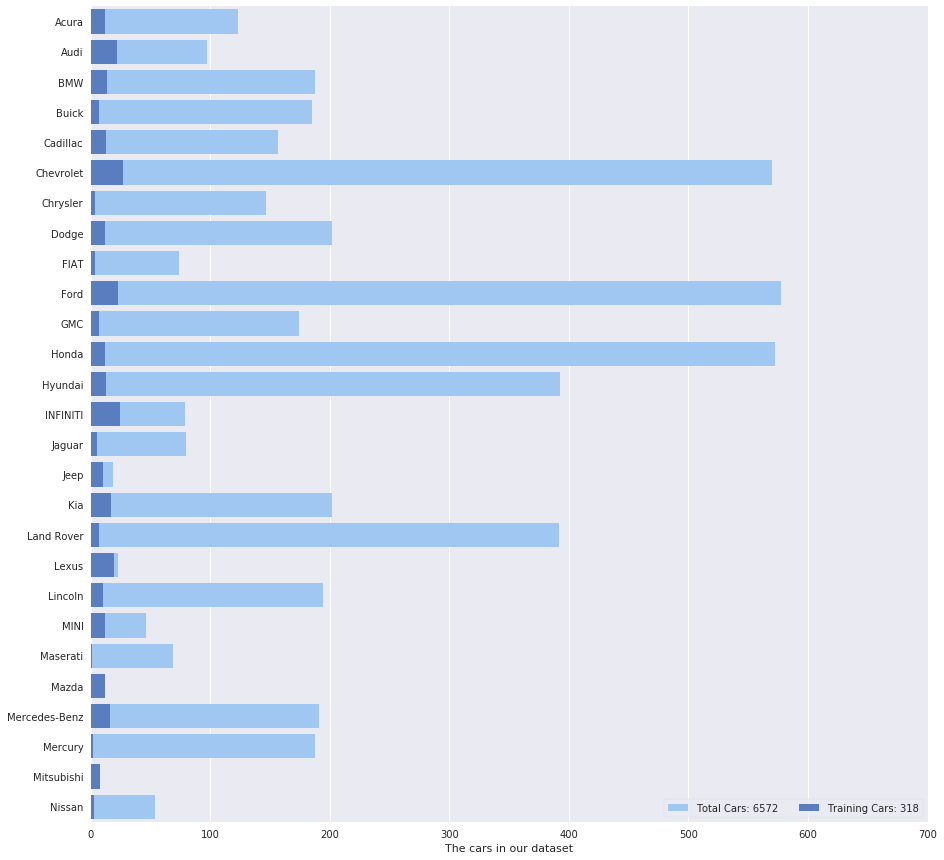

# Machine Learning Engineer Nanodegree Capstone

## Project: Carvana Image Masking Challenge

---
In this Kaggle competition, we would like to develop an algorithm that automatically removes the photo studio background from the pictures of cars from Carvana's inventory. This will allow Carvana to superimpose cars on a variety of backgrounds. We’ll be analyzing a dataset of photos, covering different vehicles with a wide variety of year, make, and model combinations.


It would be our challenge to make the task of automatic background editing comparable or even better than that of the manual photo editing as seen from the image above!

In computer vision, the process of partitioning a digital image into multiple segments (sets of pixels, also known as super-pixels) is called as image segmentation or semantic segmentation. Image segmentation has been used in various fields such as object detection, face recognition and medical imaging. As this task falls under segmenting the image into car and background,  we will also make use of image segmentation techniques that use deep learning models to attempt to automatically detect the car and remove the background from the image.

We will perform the steps in the below order and try to come up with an algorithm that does a good job of masking the car boundaries

### Steps Performed

Below steps will be used to tackle this challenge..

* [Step 0](#step0): Explore the data. Downloaded dataset from [Kaggle](https://www.kaggle.com/c/carvana-image-masking-challenge/data)
* [Step 1](#step1): Evaluation Metric
* [Step 2](#step2): Create a CNN for Image Segmentation
* [Step 3](#step3): Define the rle function
* [Step 4](#step4): Upload and Submit the submission file
* [Step 5](#step5): Observations

---
<a id='step0'></a>
## Step 0: Explore Dataset

### Import the train dataset

On Kaggle, the dataset has been made availble in zip format. We need to downloaded it and extracted it in our current working directory so that we can import it into our notebook. Below are the main files and folders that we would be using.

- `train/`, `train_masks/`, `train_masks.csv` - The training images folder, ground truth masks folder and training csv file in rle format.
- `test/`, `sample_submission.csv` - Test images folder and rle csv file to be populated in space delimited rle format and submitted.

- Usually we load the data into numpy arrays to proceed. But we will not load the entire data into memory as it would consume a lot of memory.
- Instead, we will just load the image ids for now and then use a lazy method like a generator to load the data into memory batchwise while training.


```python
import numpy as np
import pandas as pd
from IPython.display import display
data = pd.read_csv('train_masks.csv')
train_ids = data['img'].str[:-4]

print("Data.head()")
display(data.head())

print("\ntrain_ids.head()")
display(train_ids.head())

print ("\nTotal number of images: ", len(data))
```

    Data.head()
    


<div>
<style>
    .dataframe thead tr:only-child th {
        text-align: right;
    }

    .dataframe thead th {
        text-align: left;
    }

    .dataframe tbody tr th {
        vertical-align: top;
    }
</style>
<table border="1" class="dataframe">
  <thead>
    <tr style="text-align: right;">
      <th></th>
      <th>img</th>
      <th>rle_mask</th>
    </tr>
  </thead>
  <tbody>
    <tr>
      <th>0</th>
      <td>00087a6bd4dc_01.jpg</td>
      <td>879386 40 881253 141 883140 205 885009 17 8850...</td>
    </tr>
    <tr>
      <th>1</th>
      <td>00087a6bd4dc_02.jpg</td>
      <td>873779 4 875695 7 877612 9 879528 12 881267 15...</td>
    </tr>
    <tr>
      <th>2</th>
      <td>00087a6bd4dc_03.jpg</td>
      <td>864300 9 866217 13 868134 15 870051 16 871969 ...</td>
    </tr>
    <tr>
      <th>3</th>
      <td>00087a6bd4dc_04.jpg</td>
      <td>879735 20 881650 26 883315 92 883564 30 885208...</td>
    </tr>
    <tr>
      <th>4</th>
      <td>00087a6bd4dc_05.jpg</td>
      <td>883365 74 883638 28 885262 119 885550 34 88716...</td>
    </tr>
  </tbody>
</table>
</div>


    
    train_ids.head()
    


    0    00087a6bd4dc_01
    1    00087a6bd4dc_02
    2    00087a6bd4dc_03
    3    00087a6bd4dc_04
    4    00087a6bd4dc_05
    Name: img, dtype: object


    
    Total number of images:  5088
    

**Let us look at the data with some example plots**
- We know that every car image is shot from 16 different angles, lets try to visualize all images of a random car in a 4x4 subplot.


```python
import matplotlib.pyplot as plt
%matplotlib inline

plt.figure(figsize=(18,12))
for i in range(16):
    plt.subplot(4,4,i+1)
    plt.axis('off')
    img = plt.imread('train/{}.jpg'.format(train_ids[i+1024]))
    plt.imshow(img)

plt.tight_layout(w_pad=0.05)
plt.show()
```


- We need to predict the car mask ( target variable ) from the car images. Let us view how the data and the target look like for a random car image.


```python
plt.figure(figsize=(40,40))
plt.subplot(1,2,1)
img = plt.imread('train/{}.jpg'.format(train_ids[825]))
plt.axis('off')
plt.imshow(img)
plt.subplot(1,2,2)
img = plt.imread('train_masks/{}_mask.gif'.format(train_ids[825]))
plt.axis('off')
plt.imshow(img)

#plt.tight_layout(w_pad=0.05)
plt.show()
```


- The training data consists of a total of 318 cars, with 16 images per car shot from different angles.
- The `metadata.csv` file provides us with various additional info such as car brand, model and make. Lets take a look at the cars per brand available to us in the total dataset and compare it with the images available for training.


```python
import seaborn as sns

sns.set(style="darkgrid")
f, ax = plt.subplots(figsize=(15, 15))

metadata = pd.read_csv('metadata.csv')
train_metadata = metadata[metadata['id'].isin(train_ids.str[:-3].drop_duplicates())]
total_cars = metadata.groupby('make').size().reset_index(name = 'counts')
train_cars = train_metadata.groupby('make').size().reset_index(name = 'counts')

sns.set_color_codes("pastel")
sns.barplot(y="make", x="counts", data=total_cars,
            label="Total Cars: 6572", color="b")

sns.set_color_codes("muted")
sns.barplot(y="make", x="counts", data=train_cars,
            label="Training Cars: 318", color="b")

ax.legend(ncol=2, loc="lower right", frameon=True)
ax.set(xlim=(0, 700), ylabel="",
       xlabel="The cars in our dataset")
sns.despine(left=True, bottom=True)
```





**Some Observations..**
- There are a total of `6572` cars ( `105152` images ) in the dataset of which `318` cars ( `5088` images ) will be used for training and the remaining `6254` cars( `100064` images ) will be used for testing.
- There is a high proportion of Chevrolets, Fords, Hondas and Hyundais in the testing data.
- Lexus, Mazda and Mitsubishi cars have very high representation in the training data.
- However, we may not need to consider this unequal representation while designing our model, as I feel that the CNN will learn the shape of the cars in general, as most of the cars have very similar edges such as sloping windshields, somewhat flat hood and wheels.

Depending on the data available at hand, Data augementation may or may not be necessary. I will go ahead right now without any data augemetation and if results are not satisfactory, I will look at ways to augement the data.

----
<a id='step1'></a>
## Step 1: Evaluation metric

### Dice Coefficient

This competition is evaluated on the mean Dice coefficient. The Dice coefficient can be used to compare the pixel-wise agreement between a predicted segmentation and its corresponding ground truth. The formula is given by: 
 
- A is the ground truth
- B is the predicted value
- To get a high value of dice coefficient we would need maximum overlap between pixels between the ground truth image and the predicted image.
- Dice Coefficient will be zero for no intersection and 1 for perfect overlap.

Lets build a function `dice_coeff` to calculate the dice score:
It will take in 2 arguments, `y_true` and `y_pred` and return the dice score.


```python
import keras.backend as K

def dice_coeff(y_true, y_pred):
    smooth = 1.
    y_true_f = K.flatten(y_true)
    y_pred_f = K.flatten(y_pred)
    intersection = K.sum(y_true_f * y_pred_f)
    score = (2. * intersection + smooth) / (K.sum(y_true_f) + K.sum(y_pred_f) + smooth)
    return score
```

    Using TensorFlow backend.
    

We have added a smoothening value `smooth = 1` in the above formula as it helps smooth the dice loss ( which is defined below)  and also guards against when the denominator might be zero.

## Dice Loss

Since we want to maximize the Dice coefficient it will be our job to minimize the negative of the Dice Coefficient while training. 
That is, we will minimize the dice loss for updating our weights.
So, our Dice Loss is given by: 


```python
def dice_loss(y_true, y_pred):
    loss = 1 - dice_coeff(y_true, y_pred)
    return loss
```

---
<a id='step2'></a>
## Step 2: Create a CNN model


### Pre-process the Data

- As the original images are of a large size (1918 x 1280), we will need to resize the images into a smaller size to reduce the dimensionality of the data and also increase the training time.
- So, we will try with resizing the images to a square of (256 x 256) pixels and check the results and update if required.
- The training masks are in gif format, so we will first convert them to png format as gif is not supported by cv2 and then preprocess them as per the training images.
- As we have the train and test datasets only, we will split the train into training and validation datasets.
-  We will be using Tensorflow and Keras on the top for the model. As Keras requires a 4D tensor (nb_samples, width, height, channel ) we will convert the train images into this format and also normalize the data by dividing by 255.


```python
input_shape = 256
orig_width = 1918
orig_height = 1280
batch_size = 4 # Any higher batch does not fit into my GPU memory.
max_epochs = 100
```


```python
from sklearn.model_selection import train_test_split

id_train, id_valid = train_test_split(train_ids, test_size=0.2, random_state=42)
print('Total number of images: ', len(train_ids))
print('Number of Training images: ', len(id_train))
print('Number of Validation images: ', len(id_valid))
```

    Total number of images:  5088
    Number of Training images:  4070
    Number of Validation images:  1018
    


```python
from PIL import Image
import pandas as pd

for imgs in train_ids:
    img = Image.open('train_masks/{}_mask.gif'.format(imgs))
    img.save('train_masks_gif/{}_mask.png'.format(imgs))
```


```python
import cv2

def preproc_image(image):
    img = cv2.imread(image)
    img = cv2.resize(img, (input_shape, input_shape))
    return img

def prepoc_image_mask(image):
    mask = cv2.imread(image, cv2.IMREAD_GRAYSCALE)
    mask = cv2.resize(mask, (input_shape, input_shape))
    mask = np.expand_dims(mask, axis=2)
    return mask
```

Quick Note:

I am using the generator method as seen below which was inspired from a discussion on Kaggle. Initially, I tried to load the data into arrays by using numpy stacks but my CPU could not handle the volume and ran out of memory quite easily. 

The generator, unlike the iterator does not loop over an existing object in memory such as list or dict, but generates or yields the samples with every call as long as the condition is true.


```python
def train_generator():
    while True:
        for start in range(0, len(id_train), batch_size): 
            x_batch = []
            y_batch = []
            end = min(start + batch_size, len(id_train)) 
            id_train_batch = id_train[start:end]
            for id in id_train_batch.values:
                img = preproc_image('train/{}.jpg'.format(id))
                mask = prepoc_image_mask('train_masks_gif/{}_mask.png'.format(id))
                x_batch.append(img)
                y_batch.append(mask)
            x_batch = np.array(x_batch, np.float32) / 255
            y_batch = np.array(y_batch, np.float32) / 255
            yield x_batch, y_batch
            
def valid_generator():
    while True:
        for start in range(0, len(id_valid), batch_size):
            x_batch = []
            y_batch = []
            end = min(start + batch_size, len(id_valid))
            id_valid_batch = id_valid[start:end]
            for id in id_valid_batch.values:
                img = preproc_image('train/{}.jpg'.format(id))
                mask = prepoc_image_mask('train_masks_gif/{}_mask.png'.format(id))
                x_batch.append(img)
                y_batch.append(mask)
            x_batch = np.array(x_batch, np.float32) / 255
            y_batch = np.array(y_batch, np.float32) / 255
            yield x_batch, y_batch
```

### Develop the model
The architecture for the below model is inspired by 
[The One Hundred Layers Tiramisu: Fully Convolutional DenseNets for Semantic Segmentation](https://arxiv.org/abs/1611.09326)


```python
from keras.models import Model

from keras.layers import Input, concatenate, Conv2D, MaxPooling2D, Activation, UpSampling2D, BatchNormalization, Conv2DTranspose
from keras.layers import Dropout
from keras.layers import Reshape

from keras.optimizers import RMSprop

from keras.regularizers import l2

#Concatenate is used in Sequential Model, concatenate is used in functional API
```


```python
wd = 1e-4 #Weight decay
```

** Lets define dense block, transition down and transition up layer. **


```python
def dense_block(x, nlayer, added, wd):
    added = []
    for i in range(nlayer):
        d = BatchNormalization(axis=-1)(x)
        d = Activation('relu')(d)
        d = Conv2D(16, (3,3), kernel_initializer='he_uniform', padding="same", kernel_regularizer=l2(wd))(d)
        d = Dropout(0.2)(d)
        x = concatenate([x,d])
        added.append(d)
    return x, added

def transition_down(x, wd):
    x = BatchNormalization()(x)
    x = Activation('relu')(x)
    x = Conv2D(x.get_shape().as_list()[-1], (1,1), strides=(2, 2), kernel_initializer='he_uniform', padding="same", kernel_regularizer=l2(wd))(x)
    x = Dropout(0.2)(x)
    return x

def transition_up(added, wd):
    x = concatenate(added)
    x = Conv2DTranspose(x.get_shape().as_list()[-1], (3,3), strides=(2, 2), kernel_initializer='he_uniform', padding="same", kernel_regularizer=l2(wd))(x)
    return x
```

### Create the actual Tiramisu model using Keras Functional API.

The below cell contains the downpath of the model. Here the model undergoes convolution gradually.


```python
inputs = Input(shape=(input_shape, input_shape, 3))
c1 = Conv2D(48, (3, 3), kernel_initializer='he_uniform', padding="same", kernel_regularizer=l2(wd))(inputs)
c1 = Dropout(0.2)(c1)
added = []
d1, _  = dense_block(c1, 4, added, wd)
t1 = transition_down(d1, wd)
d2, _ = dense_block(t1, 5, added, wd)
t2 = transition_down(d2, wd)
d3, _ = dense_block(t2, 7, added, wd)
t3 = transition_down(d3, wd)
d4, _ = dense_block(t3, 10, added, wd)
t4 = transition_down(d4, wd)
d5, _ = dense_block(t4, 12, added, wd)
t5 = transition_down(d5, wd)
```

The below cell contains the bottleneck denseblock. After this dense block, the model will incorporate deconvolutions.


```python
d6, added6 = dense_block(t5, 15, added, wd)
```

The below cells are the upward path of the model where model begins to regain the original shape.


```python
t5 = transition_up(added6, wd)
s5 = concatenate([t5,d5])
u5, added5 = dense_block(s5, 12, added, wd)
t4 = transition_up(added5, wd)
s4 = concatenate([t4,d4])
u4, added4 = dense_block(s4, 10, added, wd)
t3 = transition_up(added4, wd)
s3 = concatenate([t3,d3])
u3, added3 = dense_block(s3, 7, added, wd)
t2 = transition_up(added3, wd)
s2 = concatenate([t2,d2])
u2, added2 = dense_block(s2, 5, added, wd)
t1 = transition_up(added2, wd)
s1 = concatenate([t1,d1])
u1, added1 = dense_block(s1, 4, added, wd)
```


```python
classify = Conv2D(1, (1,1),padding="same")(u1)
classify = Activation("sigmoid")(classify)
```


```python
model = Model(inputs = inputs, outputs= classify)
```


```python
model.summary()
```

    ____________________________________________________________________________________________________
    Layer (type)                     Output Shape          Param #     Connected to                     
    ====================================================================================================
    input_1 (InputLayer)             (None, 256, 256, 3)   0                                            
    ____________________________________________________________________________________________________
    conv2d_1 (Conv2D)                (None, 256, 256, 48)  1344        input_1[0][0]                    
    ____________________________________________________________________________________________________
    dropout_1 (Dropout)              (None, 256, 256, 48)  0           conv2d_1[0][0]                   
    ____________________________________________________________________________________________________
    batch_normalization_1 (BatchNorm (None, 256, 256, 48)  192         dropout_1[0][0]                  
    ____________________________________________________________________________________________________
    activation_1 (Activation)        (None, 256, 256, 48)  0           batch_normalization_1[0][0]      
    ____________________________________________________________________________________________________
    conv2d_2 (Conv2D)                (None, 256, 256, 16)  6928        activation_1[0][0]               
    ____________________________________________________________________________________________________
    dropout_2 (Dropout)              (None, 256, 256, 16)  0           conv2d_2[0][0]                   
    ____________________________________________________________________________________________________
    concatenate_1 (Concatenate)      (None, 256, 256, 64)  0           dropout_1[0][0]                  
                                                                       dropout_2[0][0]                  
    ____________________________________________________________________________________________________
    batch_normalization_2 (BatchNorm (None, 256, 256, 64)  256         concatenate_1[0][0]              
    ____________________________________________________________________________________________________
    activation_2 (Activation)        (None, 256, 256, 64)  0           batch_normalization_2[0][0]      
    ____________________________________________________________________________________________________
    conv2d_3 (Conv2D)                (None, 256, 256, 16)  9232        activation_2[0][0]               
    ____________________________________________________________________________________________________
    dropout_3 (Dropout)              (None, 256, 256, 16)  0           conv2d_3[0][0]                   
    ____________________________________________________________________________________________________
    concatenate_2 (Concatenate)      (None, 256, 256, 80)  0           concatenate_1[0][0]              
                                                                       dropout_3[0][0]                  
    ____________________________________________________________________________________________________
    batch_normalization_3 (BatchNorm (None, 256, 256, 80)  320         concatenate_2[0][0]              
    ____________________________________________________________________________________________________
    activation_3 (Activation)        (None, 256, 256, 80)  0           batch_normalization_3[0][0]      
    ____________________________________________________________________________________________________
    conv2d_4 (Conv2D)                (None, 256, 256, 16)  11536       activation_3[0][0]               
    ____________________________________________________________________________________________________
    dropout_4 (Dropout)              (None, 256, 256, 16)  0           conv2d_4[0][0]                   
    ____________________________________________________________________________________________________
    concatenate_3 (Concatenate)      (None, 256, 256, 96)  0           concatenate_2[0][0]              
                                                                       dropout_4[0][0]                  
    ____________________________________________________________________________________________________
    batch_normalization_4 (BatchNorm (None, 256, 256, 96)  384         concatenate_3[0][0]              
    ____________________________________________________________________________________________________
    activation_4 (Activation)        (None, 256, 256, 96)  0           batch_normalization_4[0][0]      
    ____________________________________________________________________________________________________
    conv2d_5 (Conv2D)                (None, 256, 256, 16)  13840       activation_4[0][0]               
    ____________________________________________________________________________________________________
    dropout_5 (Dropout)              (None, 256, 256, 16)  0           conv2d_5[0][0]                   
    ____________________________________________________________________________________________________
    concatenate_4 (Concatenate)      (None, 256, 256, 112) 0           concatenate_3[0][0]              
                                                                       dropout_5[0][0]                  
    ____________________________________________________________________________________________________
    batch_normalization_5 (BatchNorm (None, 256, 256, 112) 448         concatenate_4[0][0]              
    ____________________________________________________________________________________________________
    activation_5 (Activation)        (None, 256, 256, 112) 0           batch_normalization_5[0][0]      
    ____________________________________________________________________________________________________
    conv2d_6 (Conv2D)                (None, 128, 128, 112) 12656       activation_5[0][0]               
    ____________________________________________________________________________________________________
    dropout_6 (Dropout)              (None, 128, 128, 112) 0           conv2d_6[0][0]                   
    ____________________________________________________________________________________________________
    batch_normalization_6 (BatchNorm (None, 128, 128, 112) 448         dropout_6[0][0]                  
    ____________________________________________________________________________________________________
    activation_6 (Activation)        (None, 128, 128, 112) 0           batch_normalization_6[0][0]      
    ____________________________________________________________________________________________________
    conv2d_7 (Conv2D)                (None, 128, 128, 16)  16144       activation_6[0][0]               
    ____________________________________________________________________________________________________
    dropout_7 (Dropout)              (None, 128, 128, 16)  0           conv2d_7[0][0]                   
    ____________________________________________________________________________________________________
    concatenate_5 (Concatenate)      (None, 128, 128, 128) 0           dropout_6[0][0]                  
                                                                       dropout_7[0][0]                  
    ____________________________________________________________________________________________________
    batch_normalization_7 (BatchNorm (None, 128, 128, 128) 512         concatenate_5[0][0]              
    ____________________________________________________________________________________________________
    activation_7 (Activation)        (None, 128, 128, 128) 0           batch_normalization_7[0][0]      
    ____________________________________________________________________________________________________
    conv2d_8 (Conv2D)                (None, 128, 128, 16)  18448       activation_7[0][0]               
    ____________________________________________________________________________________________________
    dropout_8 (Dropout)              (None, 128, 128, 16)  0           conv2d_8[0][0]                   
    ____________________________________________________________________________________________________
    concatenate_6 (Concatenate)      (None, 128, 128, 144) 0           concatenate_5[0][0]              
                                                                       dropout_8[0][0]                  
    ____________________________________________________________________________________________________
    batch_normalization_8 (BatchNorm (None, 128, 128, 144) 576         concatenate_6[0][0]              
    ____________________________________________________________________________________________________
    activation_8 (Activation)        (None, 128, 128, 144) 0           batch_normalization_8[0][0]      
    ____________________________________________________________________________________________________
    conv2d_9 (Conv2D)                (None, 128, 128, 16)  20752       activation_8[0][0]               
    ____________________________________________________________________________________________________
    dropout_9 (Dropout)              (None, 128, 128, 16)  0           conv2d_9[0][0]                   
    ____________________________________________________________________________________________________
    concatenate_7 (Concatenate)      (None, 128, 128, 160) 0           concatenate_6[0][0]              
                                                                       dropout_9[0][0]                  
    ____________________________________________________________________________________________________
    batch_normalization_9 (BatchNorm (None, 128, 128, 160) 640         concatenate_7[0][0]              
    ____________________________________________________________________________________________________
    activation_9 (Activation)        (None, 128, 128, 160) 0           batch_normalization_9[0][0]      
    ____________________________________________________________________________________________________
    conv2d_10 (Conv2D)               (None, 128, 128, 16)  23056       activation_9[0][0]               
    ____________________________________________________________________________________________________
    dropout_10 (Dropout)             (None, 128, 128, 16)  0           conv2d_10[0][0]                  
    ____________________________________________________________________________________________________
    concatenate_8 (Concatenate)      (None, 128, 128, 176) 0           concatenate_7[0][0]              
                                                                       dropout_10[0][0]                 
    ____________________________________________________________________________________________________
    batch_normalization_10 (BatchNor (None, 128, 128, 176) 704         concatenate_8[0][0]              
    ____________________________________________________________________________________________________
    activation_10 (Activation)       (None, 128, 128, 176) 0           batch_normalization_10[0][0]     
    ____________________________________________________________________________________________________
    conv2d_11 (Conv2D)               (None, 128, 128, 16)  25360       activation_10[0][0]              
    ____________________________________________________________________________________________________
    dropout_11 (Dropout)             (None, 128, 128, 16)  0           conv2d_11[0][0]                  
    ____________________________________________________________________________________________________
    concatenate_9 (Concatenate)      (None, 128, 128, 192) 0           concatenate_8[0][0]              
                                                                       dropout_11[0][0]                 
    ____________________________________________________________________________________________________
    batch_normalization_11 (BatchNor (None, 128, 128, 192) 768         concatenate_9[0][0]              
    ____________________________________________________________________________________________________
    activation_11 (Activation)       (None, 128, 128, 192) 0           batch_normalization_11[0][0]     
    ____________________________________________________________________________________________________
    conv2d_12 (Conv2D)               (None, 64, 64, 192)   37056       activation_11[0][0]              
    ____________________________________________________________________________________________________
    dropout_12 (Dropout)             (None, 64, 64, 192)   0           conv2d_12[0][0]                  
    ____________________________________________________________________________________________________
    batch_normalization_12 (BatchNor (None, 64, 64, 192)   768         dropout_12[0][0]                 
    ____________________________________________________________________________________________________
    activation_12 (Activation)       (None, 64, 64, 192)   0           batch_normalization_12[0][0]     
    ____________________________________________________________________________________________________
    conv2d_13 (Conv2D)               (None, 64, 64, 16)    27664       activation_12[0][0]              
    ____________________________________________________________________________________________________
    dropout_13 (Dropout)             (None, 64, 64, 16)    0           conv2d_13[0][0]                  
    ____________________________________________________________________________________________________
    concatenate_10 (Concatenate)     (None, 64, 64, 208)   0           dropout_12[0][0]                 
                                                                       dropout_13[0][0]                 
    ____________________________________________________________________________________________________
    batch_normalization_13 (BatchNor (None, 64, 64, 208)   832         concatenate_10[0][0]             
    ____________________________________________________________________________________________________
    activation_13 (Activation)       (None, 64, 64, 208)   0           batch_normalization_13[0][0]     
    ____________________________________________________________________________________________________
    conv2d_14 (Conv2D)               (None, 64, 64, 16)    29968       activation_13[0][0]              
    ____________________________________________________________________________________________________
    dropout_14 (Dropout)             (None, 64, 64, 16)    0           conv2d_14[0][0]                  
    ____________________________________________________________________________________________________
    concatenate_11 (Concatenate)     (None, 64, 64, 224)   0           concatenate_10[0][0]             
                                                                       dropout_14[0][0]                 
    ____________________________________________________________________________________________________
    batch_normalization_14 (BatchNor (None, 64, 64, 224)   896         concatenate_11[0][0]             
    ____________________________________________________________________________________________________
    activation_14 (Activation)       (None, 64, 64, 224)   0           batch_normalization_14[0][0]     
    ____________________________________________________________________________________________________
    conv2d_15 (Conv2D)               (None, 64, 64, 16)    32272       activation_14[0][0]              
    ____________________________________________________________________________________________________
    dropout_15 (Dropout)             (None, 64, 64, 16)    0           conv2d_15[0][0]                  
    ____________________________________________________________________________________________________
    concatenate_12 (Concatenate)     (None, 64, 64, 240)   0           concatenate_11[0][0]             
                                                                       dropout_15[0][0]                 
    ____________________________________________________________________________________________________
    batch_normalization_15 (BatchNor (None, 64, 64, 240)   960         concatenate_12[0][0]             
    ____________________________________________________________________________________________________
    activation_15 (Activation)       (None, 64, 64, 240)   0           batch_normalization_15[0][0]     
    ____________________________________________________________________________________________________
    conv2d_16 (Conv2D)               (None, 64, 64, 16)    34576       activation_15[0][0]              
    ____________________________________________________________________________________________________
    dropout_16 (Dropout)             (None, 64, 64, 16)    0           conv2d_16[0][0]                  
    ____________________________________________________________________________________________________
    concatenate_13 (Concatenate)     (None, 64, 64, 256)   0           concatenate_12[0][0]             
                                                                       dropout_16[0][0]                 
    ____________________________________________________________________________________________________
    batch_normalization_16 (BatchNor (None, 64, 64, 256)   1024        concatenate_13[0][0]             
    ____________________________________________________________________________________________________
    activation_16 (Activation)       (None, 64, 64, 256)   0           batch_normalization_16[0][0]     
    ____________________________________________________________________________________________________
    conv2d_17 (Conv2D)               (None, 64, 64, 16)    36880       activation_16[0][0]              
    ____________________________________________________________________________________________________
    dropout_17 (Dropout)             (None, 64, 64, 16)    0           conv2d_17[0][0]                  
    ____________________________________________________________________________________________________
    concatenate_14 (Concatenate)     (None, 64, 64, 272)   0           concatenate_13[0][0]             
                                                                       dropout_17[0][0]                 
    ____________________________________________________________________________________________________
    batch_normalization_17 (BatchNor (None, 64, 64, 272)   1088        concatenate_14[0][0]             
    ____________________________________________________________________________________________________
    activation_17 (Activation)       (None, 64, 64, 272)   0           batch_normalization_17[0][0]     
    ____________________________________________________________________________________________________
    conv2d_18 (Conv2D)               (None, 64, 64, 16)    39184       activation_17[0][0]              
    ____________________________________________________________________________________________________
    dropout_18 (Dropout)             (None, 64, 64, 16)    0           conv2d_18[0][0]                  
    ____________________________________________________________________________________________________
    concatenate_15 (Concatenate)     (None, 64, 64, 288)   0           concatenate_14[0][0]             
                                                                       dropout_18[0][0]                 
    ____________________________________________________________________________________________________
    batch_normalization_18 (BatchNor (None, 64, 64, 288)   1152        concatenate_15[0][0]             
    ____________________________________________________________________________________________________
    activation_18 (Activation)       (None, 64, 64, 288)   0           batch_normalization_18[0][0]     
    ____________________________________________________________________________________________________
    conv2d_19 (Conv2D)               (None, 64, 64, 16)    41488       activation_18[0][0]              
    ____________________________________________________________________________________________________
    dropout_19 (Dropout)             (None, 64, 64, 16)    0           conv2d_19[0][0]                  
    ____________________________________________________________________________________________________
    concatenate_16 (Concatenate)     (None, 64, 64, 304)   0           concatenate_15[0][0]             
                                                                       dropout_19[0][0]                 
    ____________________________________________________________________________________________________
    batch_normalization_19 (BatchNor (None, 64, 64, 304)   1216        concatenate_16[0][0]             
    ____________________________________________________________________________________________________
    activation_19 (Activation)       (None, 64, 64, 304)   0           batch_normalization_19[0][0]     
    ____________________________________________________________________________________________________
    conv2d_20 (Conv2D)               (None, 32, 32, 304)   92720       activation_19[0][0]              
    ____________________________________________________________________________________________________
    dropout_20 (Dropout)             (None, 32, 32, 304)   0           conv2d_20[0][0]                  
    ____________________________________________________________________________________________________
    batch_normalization_20 (BatchNor (None, 32, 32, 304)   1216        dropout_20[0][0]                 
    ____________________________________________________________________________________________________
    activation_20 (Activation)       (None, 32, 32, 304)   0           batch_normalization_20[0][0]     
    ____________________________________________________________________________________________________
    conv2d_21 (Conv2D)               (None, 32, 32, 16)    43792       activation_20[0][0]              
    ____________________________________________________________________________________________________
    dropout_21 (Dropout)             (None, 32, 32, 16)    0           conv2d_21[0][0]                  
    ____________________________________________________________________________________________________
    concatenate_17 (Concatenate)     (None, 32, 32, 320)   0           dropout_20[0][0]                 
                                                                       dropout_21[0][0]                 
    ____________________________________________________________________________________________________
    batch_normalization_21 (BatchNor (None, 32, 32, 320)   1280        concatenate_17[0][0]             
    ____________________________________________________________________________________________________
    activation_21 (Activation)       (None, 32, 32, 320)   0           batch_normalization_21[0][0]     
    ____________________________________________________________________________________________________
    conv2d_22 (Conv2D)               (None, 32, 32, 16)    46096       activation_21[0][0]              
    ____________________________________________________________________________________________________
    dropout_22 (Dropout)             (None, 32, 32, 16)    0           conv2d_22[0][0]                  
    ____________________________________________________________________________________________________
    concatenate_18 (Concatenate)     (None, 32, 32, 336)   0           concatenate_17[0][0]             
                                                                       dropout_22[0][0]                 
    ____________________________________________________________________________________________________
    batch_normalization_22 (BatchNor (None, 32, 32, 336)   1344        concatenate_18[0][0]             
    ____________________________________________________________________________________________________
    activation_22 (Activation)       (None, 32, 32, 336)   0           batch_normalization_22[0][0]     
    ____________________________________________________________________________________________________
    conv2d_23 (Conv2D)               (None, 32, 32, 16)    48400       activation_22[0][0]              
    ____________________________________________________________________________________________________
    dropout_23 (Dropout)             (None, 32, 32, 16)    0           conv2d_23[0][0]                  
    ____________________________________________________________________________________________________
    concatenate_19 (Concatenate)     (None, 32, 32, 352)   0           concatenate_18[0][0]             
                                                                       dropout_23[0][0]                 
    ____________________________________________________________________________________________________
    batch_normalization_23 (BatchNor (None, 32, 32, 352)   1408        concatenate_19[0][0]             
    ____________________________________________________________________________________________________
    activation_23 (Activation)       (None, 32, 32, 352)   0           batch_normalization_23[0][0]     
    ____________________________________________________________________________________________________
    conv2d_24 (Conv2D)               (None, 32, 32, 16)    50704       activation_23[0][0]              
    ____________________________________________________________________________________________________
    dropout_24 (Dropout)             (None, 32, 32, 16)    0           conv2d_24[0][0]                  
    ____________________________________________________________________________________________________
    concatenate_20 (Concatenate)     (None, 32, 32, 368)   0           concatenate_19[0][0]             
                                                                       dropout_24[0][0]                 
    ____________________________________________________________________________________________________
    batch_normalization_24 (BatchNor (None, 32, 32, 368)   1472        concatenate_20[0][0]             
    ____________________________________________________________________________________________________
    activation_24 (Activation)       (None, 32, 32, 368)   0           batch_normalization_24[0][0]     
    ____________________________________________________________________________________________________
    conv2d_25 (Conv2D)               (None, 32, 32, 16)    53008       activation_24[0][0]              
    ____________________________________________________________________________________________________
    dropout_25 (Dropout)             (None, 32, 32, 16)    0           conv2d_25[0][0]                  
    ____________________________________________________________________________________________________
    concatenate_21 (Concatenate)     (None, 32, 32, 384)   0           concatenate_20[0][0]             
                                                                       dropout_25[0][0]                 
    ____________________________________________________________________________________________________
    batch_normalization_25 (BatchNor (None, 32, 32, 384)   1536        concatenate_21[0][0]             
    ____________________________________________________________________________________________________
    activation_25 (Activation)       (None, 32, 32, 384)   0           batch_normalization_25[0][0]     
    ____________________________________________________________________________________________________
    conv2d_26 (Conv2D)               (None, 32, 32, 16)    55312       activation_25[0][0]              
    ____________________________________________________________________________________________________
    dropout_26 (Dropout)             (None, 32, 32, 16)    0           conv2d_26[0][0]                  
    ____________________________________________________________________________________________________
    concatenate_22 (Concatenate)     (None, 32, 32, 400)   0           concatenate_21[0][0]             
                                                                       dropout_26[0][0]                 
    ____________________________________________________________________________________________________
    batch_normalization_26 (BatchNor (None, 32, 32, 400)   1600        concatenate_22[0][0]             
    ____________________________________________________________________________________________________
    activation_26 (Activation)       (None, 32, 32, 400)   0           batch_normalization_26[0][0]     
    ____________________________________________________________________________________________________
    conv2d_27 (Conv2D)               (None, 32, 32, 16)    57616       activation_26[0][0]              
    ____________________________________________________________________________________________________
    dropout_27 (Dropout)             (None, 32, 32, 16)    0           conv2d_27[0][0]                  
    ____________________________________________________________________________________________________
    concatenate_23 (Concatenate)     (None, 32, 32, 416)   0           concatenate_22[0][0]             
                                                                       dropout_27[0][0]                 
    ____________________________________________________________________________________________________
    batch_normalization_27 (BatchNor (None, 32, 32, 416)   1664        concatenate_23[0][0]             
    ____________________________________________________________________________________________________
    activation_27 (Activation)       (None, 32, 32, 416)   0           batch_normalization_27[0][0]     
    ____________________________________________________________________________________________________
    conv2d_28 (Conv2D)               (None, 32, 32, 16)    59920       activation_27[0][0]              
    ____________________________________________________________________________________________________
    dropout_28 (Dropout)             (None, 32, 32, 16)    0           conv2d_28[0][0]                  
    ____________________________________________________________________________________________________
    concatenate_24 (Concatenate)     (None, 32, 32, 432)   0           concatenate_23[0][0]             
                                                                       dropout_28[0][0]                 
    ____________________________________________________________________________________________________
    batch_normalization_28 (BatchNor (None, 32, 32, 432)   1728        concatenate_24[0][0]             
    ____________________________________________________________________________________________________
    activation_28 (Activation)       (None, 32, 32, 432)   0           batch_normalization_28[0][0]     
    ____________________________________________________________________________________________________
    conv2d_29 (Conv2D)               (None, 32, 32, 16)    62224       activation_28[0][0]              
    ____________________________________________________________________________________________________
    dropout_29 (Dropout)             (None, 32, 32, 16)    0           conv2d_29[0][0]                  
    ____________________________________________________________________________________________________
    concatenate_25 (Concatenate)     (None, 32, 32, 448)   0           concatenate_24[0][0]             
                                                                       dropout_29[0][0]                 
    ____________________________________________________________________________________________________
    batch_normalization_29 (BatchNor (None, 32, 32, 448)   1792        concatenate_25[0][0]             
    ____________________________________________________________________________________________________
    activation_29 (Activation)       (None, 32, 32, 448)   0           batch_normalization_29[0][0]     
    ____________________________________________________________________________________________________
    conv2d_30 (Conv2D)               (None, 32, 32, 16)    64528       activation_29[0][0]              
    ____________________________________________________________________________________________________
    dropout_30 (Dropout)             (None, 32, 32, 16)    0           conv2d_30[0][0]                  
    ____________________________________________________________________________________________________
    concatenate_26 (Concatenate)     (None, 32, 32, 464)   0           concatenate_25[0][0]             
                                                                       dropout_30[0][0]                 
    ____________________________________________________________________________________________________
    batch_normalization_30 (BatchNor (None, 32, 32, 464)   1856        concatenate_26[0][0]             
    ____________________________________________________________________________________________________
    activation_30 (Activation)       (None, 32, 32, 464)   0           batch_normalization_30[0][0]     
    ____________________________________________________________________________________________________
    conv2d_31 (Conv2D)               (None, 16, 16, 464)   215760      activation_30[0][0]              
    ____________________________________________________________________________________________________
    dropout_31 (Dropout)             (None, 16, 16, 464)   0           conv2d_31[0][0]                  
    ____________________________________________________________________________________________________
    batch_normalization_31 (BatchNor (None, 16, 16, 464)   1856        dropout_31[0][0]                 
    ____________________________________________________________________________________________________
    activation_31 (Activation)       (None, 16, 16, 464)   0           batch_normalization_31[0][0]     
    ____________________________________________________________________________________________________
    conv2d_32 (Conv2D)               (None, 16, 16, 16)    66832       activation_31[0][0]              
    ____________________________________________________________________________________________________
    dropout_32 (Dropout)             (None, 16, 16, 16)    0           conv2d_32[0][0]                  
    ____________________________________________________________________________________________________
    concatenate_27 (Concatenate)     (None, 16, 16, 480)   0           dropout_31[0][0]                 
                                                                       dropout_32[0][0]                 
    ____________________________________________________________________________________________________
    batch_normalization_32 (BatchNor (None, 16, 16, 480)   1920        concatenate_27[0][0]             
    ____________________________________________________________________________________________________
    activation_32 (Activation)       (None, 16, 16, 480)   0           batch_normalization_32[0][0]     
    ____________________________________________________________________________________________________
    conv2d_33 (Conv2D)               (None, 16, 16, 16)    69136       activation_32[0][0]              
    ____________________________________________________________________________________________________
    dropout_33 (Dropout)             (None, 16, 16, 16)    0           conv2d_33[0][0]                  
    ____________________________________________________________________________________________________
    concatenate_28 (Concatenate)     (None, 16, 16, 496)   0           concatenate_27[0][0]             
                                                                       dropout_33[0][0]                 
    ____________________________________________________________________________________________________
    batch_normalization_33 (BatchNor (None, 16, 16, 496)   1984        concatenate_28[0][0]             
    ____________________________________________________________________________________________________
    activation_33 (Activation)       (None, 16, 16, 496)   0           batch_normalization_33[0][0]     
    ____________________________________________________________________________________________________
    conv2d_34 (Conv2D)               (None, 16, 16, 16)    71440       activation_33[0][0]              
    ____________________________________________________________________________________________________
    dropout_34 (Dropout)             (None, 16, 16, 16)    0           conv2d_34[0][0]                  
    ____________________________________________________________________________________________________
    concatenate_29 (Concatenate)     (None, 16, 16, 512)   0           concatenate_28[0][0]             
                                                                       dropout_34[0][0]                 
    ____________________________________________________________________________________________________
    batch_normalization_34 (BatchNor (None, 16, 16, 512)   2048        concatenate_29[0][0]             
    ____________________________________________________________________________________________________
    activation_34 (Activation)       (None, 16, 16, 512)   0           batch_normalization_34[0][0]     
    ____________________________________________________________________________________________________
    conv2d_35 (Conv2D)               (None, 16, 16, 16)    73744       activation_34[0][0]              
    ____________________________________________________________________________________________________
    dropout_35 (Dropout)             (None, 16, 16, 16)    0           conv2d_35[0][0]                  
    ____________________________________________________________________________________________________
    concatenate_30 (Concatenate)     (None, 16, 16, 528)   0           concatenate_29[0][0]             
                                                                       dropout_35[0][0]                 
    ____________________________________________________________________________________________________
    batch_normalization_35 (BatchNor (None, 16, 16, 528)   2112        concatenate_30[0][0]             
    ____________________________________________________________________________________________________
    activation_35 (Activation)       (None, 16, 16, 528)   0           batch_normalization_35[0][0]     
    ____________________________________________________________________________________________________
    conv2d_36 (Conv2D)               (None, 16, 16, 16)    76048       activation_35[0][0]              
    ____________________________________________________________________________________________________
    dropout_36 (Dropout)             (None, 16, 16, 16)    0           conv2d_36[0][0]                  
    ____________________________________________________________________________________________________
    concatenate_31 (Concatenate)     (None, 16, 16, 544)   0           concatenate_30[0][0]             
                                                                       dropout_36[0][0]                 
    ____________________________________________________________________________________________________
    batch_normalization_36 (BatchNor (None, 16, 16, 544)   2176        concatenate_31[0][0]             
    ____________________________________________________________________________________________________
    activation_36 (Activation)       (None, 16, 16, 544)   0           batch_normalization_36[0][0]     
    ____________________________________________________________________________________________________
    conv2d_37 (Conv2D)               (None, 16, 16, 16)    78352       activation_36[0][0]              
    ____________________________________________________________________________________________________
    dropout_37 (Dropout)             (None, 16, 16, 16)    0           conv2d_37[0][0]                  
    ____________________________________________________________________________________________________
    concatenate_32 (Concatenate)     (None, 16, 16, 560)   0           concatenate_31[0][0]             
                                                                       dropout_37[0][0]                 
    ____________________________________________________________________________________________________
    batch_normalization_37 (BatchNor (None, 16, 16, 560)   2240        concatenate_32[0][0]             
    ____________________________________________________________________________________________________
    activation_37 (Activation)       (None, 16, 16, 560)   0           batch_normalization_37[0][0]     
    ____________________________________________________________________________________________________
    conv2d_38 (Conv2D)               (None, 16, 16, 16)    80656       activation_37[0][0]              
    ____________________________________________________________________________________________________
    dropout_38 (Dropout)             (None, 16, 16, 16)    0           conv2d_38[0][0]                  
    ____________________________________________________________________________________________________
    concatenate_33 (Concatenate)     (None, 16, 16, 576)   0           concatenate_32[0][0]             
                                                                       dropout_38[0][0]                 
    ____________________________________________________________________________________________________
    batch_normalization_38 (BatchNor (None, 16, 16, 576)   2304        concatenate_33[0][0]             
    ____________________________________________________________________________________________________
    activation_38 (Activation)       (None, 16, 16, 576)   0           batch_normalization_38[0][0]     
    ____________________________________________________________________________________________________
    conv2d_39 (Conv2D)               (None, 16, 16, 16)    82960       activation_38[0][0]              
    ____________________________________________________________________________________________________
    dropout_39 (Dropout)             (None, 16, 16, 16)    0           conv2d_39[0][0]                  
    ____________________________________________________________________________________________________
    concatenate_34 (Concatenate)     (None, 16, 16, 592)   0           concatenate_33[0][0]             
                                                                       dropout_39[0][0]                 
    ____________________________________________________________________________________________________
    batch_normalization_39 (BatchNor (None, 16, 16, 592)   2368        concatenate_34[0][0]             
    ____________________________________________________________________________________________________
    activation_39 (Activation)       (None, 16, 16, 592)   0           batch_normalization_39[0][0]     
    ____________________________________________________________________________________________________
    conv2d_40 (Conv2D)               (None, 16, 16, 16)    85264       activation_39[0][0]              
    ____________________________________________________________________________________________________
    dropout_40 (Dropout)             (None, 16, 16, 16)    0           conv2d_40[0][0]                  
    ____________________________________________________________________________________________________
    concatenate_35 (Concatenate)     (None, 16, 16, 608)   0           concatenate_34[0][0]             
                                                                       dropout_40[0][0]                 
    ____________________________________________________________________________________________________
    batch_normalization_40 (BatchNor (None, 16, 16, 608)   2432        concatenate_35[0][0]             
    ____________________________________________________________________________________________________
    activation_40 (Activation)       (None, 16, 16, 608)   0           batch_normalization_40[0][0]     
    ____________________________________________________________________________________________________
    conv2d_41 (Conv2D)               (None, 16, 16, 16)    87568       activation_40[0][0]              
    ____________________________________________________________________________________________________
    dropout_41 (Dropout)             (None, 16, 16, 16)    0           conv2d_41[0][0]                  
    ____________________________________________________________________________________________________
    concatenate_36 (Concatenate)     (None, 16, 16, 624)   0           concatenate_35[0][0]             
                                                                       dropout_41[0][0]                 
    ____________________________________________________________________________________________________
    batch_normalization_41 (BatchNor (None, 16, 16, 624)   2496        concatenate_36[0][0]             
    ____________________________________________________________________________________________________
    activation_41 (Activation)       (None, 16, 16, 624)   0           batch_normalization_41[0][0]     
    ____________________________________________________________________________________________________
    conv2d_42 (Conv2D)               (None, 16, 16, 16)    89872       activation_41[0][0]              
    ____________________________________________________________________________________________________
    dropout_42 (Dropout)             (None, 16, 16, 16)    0           conv2d_42[0][0]                  
    ____________________________________________________________________________________________________
    concatenate_37 (Concatenate)     (None, 16, 16, 640)   0           concatenate_36[0][0]             
                                                                       dropout_42[0][0]                 
    ____________________________________________________________________________________________________
    batch_normalization_42 (BatchNor (None, 16, 16, 640)   2560        concatenate_37[0][0]             
    ____________________________________________________________________________________________________
    activation_42 (Activation)       (None, 16, 16, 640)   0           batch_normalization_42[0][0]     
    ____________________________________________________________________________________________________
    conv2d_43 (Conv2D)               (None, 16, 16, 16)    92176       activation_42[0][0]              
    ____________________________________________________________________________________________________
    dropout_43 (Dropout)             (None, 16, 16, 16)    0           conv2d_43[0][0]                  
    ____________________________________________________________________________________________________
    concatenate_38 (Concatenate)     (None, 16, 16, 656)   0           concatenate_37[0][0]             
                                                                       dropout_43[0][0]                 
    ____________________________________________________________________________________________________
    batch_normalization_43 (BatchNor (None, 16, 16, 656)   2624        concatenate_38[0][0]             
    ____________________________________________________________________________________________________
    activation_43 (Activation)       (None, 16, 16, 656)   0           batch_normalization_43[0][0]     
    ____________________________________________________________________________________________________
    conv2d_44 (Conv2D)               (None, 8, 8, 656)     430992      activation_43[0][0]              
    ____________________________________________________________________________________________________
    dropout_44 (Dropout)             (None, 8, 8, 656)     0           conv2d_44[0][0]                  
    ____________________________________________________________________________________________________
    batch_normalization_44 (BatchNor (None, 8, 8, 656)     2624        dropout_44[0][0]                 
    ____________________________________________________________________________________________________
    activation_44 (Activation)       (None, 8, 8, 656)     0           batch_normalization_44[0][0]     
    ____________________________________________________________________________________________________
    conv2d_45 (Conv2D)               (None, 8, 8, 16)      94480       activation_44[0][0]              
    ____________________________________________________________________________________________________
    dropout_45 (Dropout)             (None, 8, 8, 16)      0           conv2d_45[0][0]                  
    ____________________________________________________________________________________________________
    concatenate_39 (Concatenate)     (None, 8, 8, 672)     0           dropout_44[0][0]                 
                                                                       dropout_45[0][0]                 
    ____________________________________________________________________________________________________
    batch_normalization_45 (BatchNor (None, 8, 8, 672)     2688        concatenate_39[0][0]             
    ____________________________________________________________________________________________________
    activation_45 (Activation)       (None, 8, 8, 672)     0           batch_normalization_45[0][0]     
    ____________________________________________________________________________________________________
    conv2d_46 (Conv2D)               (None, 8, 8, 16)      96784       activation_45[0][0]              
    ____________________________________________________________________________________________________
    dropout_46 (Dropout)             (None, 8, 8, 16)      0           conv2d_46[0][0]                  
    ____________________________________________________________________________________________________
    concatenate_40 (Concatenate)     (None, 8, 8, 688)     0           concatenate_39[0][0]             
                                                                       dropout_46[0][0]                 
    ____________________________________________________________________________________________________
    batch_normalization_46 (BatchNor (None, 8, 8, 688)     2752        concatenate_40[0][0]             
    ____________________________________________________________________________________________________
    activation_46 (Activation)       (None, 8, 8, 688)     0           batch_normalization_46[0][0]     
    ____________________________________________________________________________________________________
    conv2d_47 (Conv2D)               (None, 8, 8, 16)      99088       activation_46[0][0]              
    ____________________________________________________________________________________________________
    dropout_47 (Dropout)             (None, 8, 8, 16)      0           conv2d_47[0][0]                  
    ____________________________________________________________________________________________________
    concatenate_41 (Concatenate)     (None, 8, 8, 704)     0           concatenate_40[0][0]             
                                                                       dropout_47[0][0]                 
    ____________________________________________________________________________________________________
    batch_normalization_47 (BatchNor (None, 8, 8, 704)     2816        concatenate_41[0][0]             
    ____________________________________________________________________________________________________
    activation_47 (Activation)       (None, 8, 8, 704)     0           batch_normalization_47[0][0]     
    ____________________________________________________________________________________________________
    conv2d_48 (Conv2D)               (None, 8, 8, 16)      101392      activation_47[0][0]              
    ____________________________________________________________________________________________________
    dropout_48 (Dropout)             (None, 8, 8, 16)      0           conv2d_48[0][0]                  
    ____________________________________________________________________________________________________
    concatenate_42 (Concatenate)     (None, 8, 8, 720)     0           concatenate_41[0][0]             
                                                                       dropout_48[0][0]                 
    ____________________________________________________________________________________________________
    batch_normalization_48 (BatchNor (None, 8, 8, 720)     2880        concatenate_42[0][0]             
    ____________________________________________________________________________________________________
    activation_48 (Activation)       (None, 8, 8, 720)     0           batch_normalization_48[0][0]     
    ____________________________________________________________________________________________________
    conv2d_49 (Conv2D)               (None, 8, 8, 16)      103696      activation_48[0][0]              
    ____________________________________________________________________________________________________
    dropout_49 (Dropout)             (None, 8, 8, 16)      0           conv2d_49[0][0]                  
    ____________________________________________________________________________________________________
    concatenate_43 (Concatenate)     (None, 8, 8, 736)     0           concatenate_42[0][0]             
                                                                       dropout_49[0][0]                 
    ____________________________________________________________________________________________________
    batch_normalization_49 (BatchNor (None, 8, 8, 736)     2944        concatenate_43[0][0]             
    ____________________________________________________________________________________________________
    activation_49 (Activation)       (None, 8, 8, 736)     0           batch_normalization_49[0][0]     
    ____________________________________________________________________________________________________
    conv2d_50 (Conv2D)               (None, 8, 8, 16)      106000      activation_49[0][0]              
    ____________________________________________________________________________________________________
    dropout_50 (Dropout)             (None, 8, 8, 16)      0           conv2d_50[0][0]                  
    ____________________________________________________________________________________________________
    concatenate_44 (Concatenate)     (None, 8, 8, 752)     0           concatenate_43[0][0]             
                                                                       dropout_50[0][0]                 
    ____________________________________________________________________________________________________
    batch_normalization_50 (BatchNor (None, 8, 8, 752)     3008        concatenate_44[0][0]             
    ____________________________________________________________________________________________________
    activation_50 (Activation)       (None, 8, 8, 752)     0           batch_normalization_50[0][0]     
    ____________________________________________________________________________________________________
    conv2d_51 (Conv2D)               (None, 8, 8, 16)      108304      activation_50[0][0]              
    ____________________________________________________________________________________________________
    dropout_51 (Dropout)             (None, 8, 8, 16)      0           conv2d_51[0][0]                  
    ____________________________________________________________________________________________________
    concatenate_45 (Concatenate)     (None, 8, 8, 768)     0           concatenate_44[0][0]             
                                                                       dropout_51[0][0]                 
    ____________________________________________________________________________________________________
    batch_normalization_51 (BatchNor (None, 8, 8, 768)     3072        concatenate_45[0][0]             
    ____________________________________________________________________________________________________
    activation_51 (Activation)       (None, 8, 8, 768)     0           batch_normalization_51[0][0]     
    ____________________________________________________________________________________________________
    conv2d_52 (Conv2D)               (None, 8, 8, 16)      110608      activation_51[0][0]              
    ____________________________________________________________________________________________________
    dropout_52 (Dropout)             (None, 8, 8, 16)      0           conv2d_52[0][0]                  
    ____________________________________________________________________________________________________
    concatenate_46 (Concatenate)     (None, 8, 8, 784)     0           concatenate_45[0][0]             
                                                                       dropout_52[0][0]                 
    ____________________________________________________________________________________________________
    batch_normalization_52 (BatchNor (None, 8, 8, 784)     3136        concatenate_46[0][0]             
    ____________________________________________________________________________________________________
    activation_52 (Activation)       (None, 8, 8, 784)     0           batch_normalization_52[0][0]     
    ____________________________________________________________________________________________________
    conv2d_53 (Conv2D)               (None, 8, 8, 16)      112912      activation_52[0][0]              
    ____________________________________________________________________________________________________
    dropout_53 (Dropout)             (None, 8, 8, 16)      0           conv2d_53[0][0]                  
    ____________________________________________________________________________________________________
    concatenate_47 (Concatenate)     (None, 8, 8, 800)     0           concatenate_46[0][0]             
                                                                       dropout_53[0][0]                 
    ____________________________________________________________________________________________________
    batch_normalization_53 (BatchNor (None, 8, 8, 800)     3200        concatenate_47[0][0]             
    ____________________________________________________________________________________________________
    activation_53 (Activation)       (None, 8, 8, 800)     0           batch_normalization_53[0][0]     
    ____________________________________________________________________________________________________
    conv2d_54 (Conv2D)               (None, 8, 8, 16)      115216      activation_53[0][0]              
    ____________________________________________________________________________________________________
    dropout_54 (Dropout)             (None, 8, 8, 16)      0           conv2d_54[0][0]                  
    ____________________________________________________________________________________________________
    concatenate_48 (Concatenate)     (None, 8, 8, 816)     0           concatenate_47[0][0]             
                                                                       dropout_54[0][0]                 
    ____________________________________________________________________________________________________
    batch_normalization_54 (BatchNor (None, 8, 8, 816)     3264        concatenate_48[0][0]             
    ____________________________________________________________________________________________________
    activation_54 (Activation)       (None, 8, 8, 816)     0           batch_normalization_54[0][0]     
    ____________________________________________________________________________________________________
    conv2d_55 (Conv2D)               (None, 8, 8, 16)      117520      activation_54[0][0]              
    ____________________________________________________________________________________________________
    dropout_55 (Dropout)             (None, 8, 8, 16)      0           conv2d_55[0][0]                  
    ____________________________________________________________________________________________________
    concatenate_49 (Concatenate)     (None, 8, 8, 832)     0           concatenate_48[0][0]             
                                                                       dropout_55[0][0]                 
    ____________________________________________________________________________________________________
    batch_normalization_55 (BatchNor (None, 8, 8, 832)     3328        concatenate_49[0][0]             
    ____________________________________________________________________________________________________
    activation_55 (Activation)       (None, 8, 8, 832)     0           batch_normalization_55[0][0]     
    ____________________________________________________________________________________________________
    conv2d_56 (Conv2D)               (None, 8, 8, 16)      119824      activation_55[0][0]              
    ____________________________________________________________________________________________________
    dropout_56 (Dropout)             (None, 8, 8, 16)      0           conv2d_56[0][0]                  
    ____________________________________________________________________________________________________
    concatenate_50 (Concatenate)     (None, 8, 8, 848)     0           concatenate_49[0][0]             
                                                                       dropout_56[0][0]                 
    ____________________________________________________________________________________________________
    batch_normalization_56 (BatchNor (None, 8, 8, 848)     3392        concatenate_50[0][0]             
    ____________________________________________________________________________________________________
    activation_56 (Activation)       (None, 8, 8, 848)     0           batch_normalization_56[0][0]     
    ____________________________________________________________________________________________________
    conv2d_57 (Conv2D)               (None, 8, 8, 16)      122128      activation_56[0][0]              
    ____________________________________________________________________________________________________
    dropout_57 (Dropout)             (None, 8, 8, 16)      0           conv2d_57[0][0]                  
    ____________________________________________________________________________________________________
    concatenate_51 (Concatenate)     (None, 8, 8, 864)     0           concatenate_50[0][0]             
                                                                       dropout_57[0][0]                 
    ____________________________________________________________________________________________________
    batch_normalization_57 (BatchNor (None, 8, 8, 864)     3456        concatenate_51[0][0]             
    ____________________________________________________________________________________________________
    activation_57 (Activation)       (None, 8, 8, 864)     0           batch_normalization_57[0][0]     
    ____________________________________________________________________________________________________
    conv2d_58 (Conv2D)               (None, 8, 8, 16)      124432      activation_57[0][0]              
    ____________________________________________________________________________________________________
    dropout_58 (Dropout)             (None, 8, 8, 16)      0           conv2d_58[0][0]                  
    ____________________________________________________________________________________________________
    concatenate_52 (Concatenate)     (None, 8, 8, 880)     0           concatenate_51[0][0]             
                                                                       dropout_58[0][0]                 
    ____________________________________________________________________________________________________
    batch_normalization_58 (BatchNor (None, 8, 8, 880)     3520        concatenate_52[0][0]             
    ____________________________________________________________________________________________________
    activation_58 (Activation)       (None, 8, 8, 880)     0           batch_normalization_58[0][0]     
    ____________________________________________________________________________________________________
    conv2d_59 (Conv2D)               (None, 8, 8, 16)      126736      activation_58[0][0]              
    ____________________________________________________________________________________________________
    dropout_59 (Dropout)             (None, 8, 8, 16)      0           conv2d_59[0][0]                  
    ____________________________________________________________________________________________________
    concatenate_54 (Concatenate)     (None, 8, 8, 240)     0           dropout_45[0][0]                 
                                                                       dropout_46[0][0]                 
                                                                       dropout_47[0][0]                 
                                                                       dropout_48[0][0]                 
                                                                       dropout_49[0][0]                 
                                                                       dropout_50[0][0]                 
                                                                       dropout_51[0][0]                 
                                                                       dropout_52[0][0]                 
                                                                       dropout_53[0][0]                 
                                                                       dropout_54[0][0]                 
                                                                       dropout_55[0][0]                 
                                                                       dropout_56[0][0]                 
                                                                       dropout_57[0][0]                 
                                                                       dropout_58[0][0]                 
                                                                       dropout_59[0][0]                 
    ____________________________________________________________________________________________________
    conv2d_transpose_1 (Conv2DTransp (None, 16, 16, 240)   518640      concatenate_54[0][0]             
    ____________________________________________________________________________________________________
    concatenate_55 (Concatenate)     (None, 16, 16, 896)   0           conv2d_transpose_1[0][0]         
                                                                       concatenate_38[0][0]             
    ____________________________________________________________________________________________________
    batch_normalization_59 (BatchNor (None, 16, 16, 896)   3584        concatenate_55[0][0]             
    ____________________________________________________________________________________________________
    activation_59 (Activation)       (None, 16, 16, 896)   0           batch_normalization_59[0][0]     
    ____________________________________________________________________________________________________
    conv2d_60 (Conv2D)               (None, 16, 16, 16)    129040      activation_59[0][0]              
    ____________________________________________________________________________________________________
    dropout_60 (Dropout)             (None, 16, 16, 16)    0           conv2d_60[0][0]                  
    ____________________________________________________________________________________________________
    concatenate_56 (Concatenate)     (None, 16, 16, 912)   0           concatenate_55[0][0]             
                                                                       dropout_60[0][0]                 
    ____________________________________________________________________________________________________
    batch_normalization_60 (BatchNor (None, 16, 16, 912)   3648        concatenate_56[0][0]             
    ____________________________________________________________________________________________________
    activation_60 (Activation)       (None, 16, 16, 912)   0           batch_normalization_60[0][0]     
    ____________________________________________________________________________________________________
    conv2d_61 (Conv2D)               (None, 16, 16, 16)    131344      activation_60[0][0]              
    ____________________________________________________________________________________________________
    dropout_61 (Dropout)             (None, 16, 16, 16)    0           conv2d_61[0][0]                  
    ____________________________________________________________________________________________________
    concatenate_57 (Concatenate)     (None, 16, 16, 928)   0           concatenate_56[0][0]             
                                                                       dropout_61[0][0]                 
    ____________________________________________________________________________________________________
    batch_normalization_61 (BatchNor (None, 16, 16, 928)   3712        concatenate_57[0][0]             
    ____________________________________________________________________________________________________
    activation_61 (Activation)       (None, 16, 16, 928)   0           batch_normalization_61[0][0]     
    ____________________________________________________________________________________________________
    conv2d_62 (Conv2D)               (None, 16, 16, 16)    133648      activation_61[0][0]              
    ____________________________________________________________________________________________________
    dropout_62 (Dropout)             (None, 16, 16, 16)    0           conv2d_62[0][0]                  
    ____________________________________________________________________________________________________
    concatenate_58 (Concatenate)     (None, 16, 16, 944)   0           concatenate_57[0][0]             
                                                                       dropout_62[0][0]                 
    ____________________________________________________________________________________________________
    batch_normalization_62 (BatchNor (None, 16, 16, 944)   3776        concatenate_58[0][0]             
    ____________________________________________________________________________________________________
    activation_62 (Activation)       (None, 16, 16, 944)   0           batch_normalization_62[0][0]     
    ____________________________________________________________________________________________________
    conv2d_63 (Conv2D)               (None, 16, 16, 16)    135952      activation_62[0][0]              
    ____________________________________________________________________________________________________
    dropout_63 (Dropout)             (None, 16, 16, 16)    0           conv2d_63[0][0]                  
    ____________________________________________________________________________________________________
    concatenate_59 (Concatenate)     (None, 16, 16, 960)   0           concatenate_58[0][0]             
                                                                       dropout_63[0][0]                 
    ____________________________________________________________________________________________________
    batch_normalization_63 (BatchNor (None, 16, 16, 960)   3840        concatenate_59[0][0]             
    ____________________________________________________________________________________________________
    activation_63 (Activation)       (None, 16, 16, 960)   0           batch_normalization_63[0][0]     
    ____________________________________________________________________________________________________
    conv2d_64 (Conv2D)               (None, 16, 16, 16)    138256      activation_63[0][0]              
    ____________________________________________________________________________________________________
    dropout_64 (Dropout)             (None, 16, 16, 16)    0           conv2d_64[0][0]                  
    ____________________________________________________________________________________________________
    concatenate_60 (Concatenate)     (None, 16, 16, 976)   0           concatenate_59[0][0]             
                                                                       dropout_64[0][0]                 
    ____________________________________________________________________________________________________
    batch_normalization_64 (BatchNor (None, 16, 16, 976)   3904        concatenate_60[0][0]             
    ____________________________________________________________________________________________________
    activation_64 (Activation)       (None, 16, 16, 976)   0           batch_normalization_64[0][0]     
    ____________________________________________________________________________________________________
    conv2d_65 (Conv2D)               (None, 16, 16, 16)    140560      activation_64[0][0]              
    ____________________________________________________________________________________________________
    dropout_65 (Dropout)             (None, 16, 16, 16)    0           conv2d_65[0][0]                  
    ____________________________________________________________________________________________________
    concatenate_61 (Concatenate)     (None, 16, 16, 992)   0           concatenate_60[0][0]             
                                                                       dropout_65[0][0]                 
    ____________________________________________________________________________________________________
    batch_normalization_65 (BatchNor (None, 16, 16, 992)   3968        concatenate_61[0][0]             
    ____________________________________________________________________________________________________
    activation_65 (Activation)       (None, 16, 16, 992)   0           batch_normalization_65[0][0]     
    ____________________________________________________________________________________________________
    conv2d_66 (Conv2D)               (None, 16, 16, 16)    142864      activation_65[0][0]              
    ____________________________________________________________________________________________________
    dropout_66 (Dropout)             (None, 16, 16, 16)    0           conv2d_66[0][0]                  
    ____________________________________________________________________________________________________
    concatenate_62 (Concatenate)     (None, 16, 16, 1008)  0           concatenate_61[0][0]             
                                                                       dropout_66[0][0]                 
    ____________________________________________________________________________________________________
    batch_normalization_66 (BatchNor (None, 16, 16, 1008)  4032        concatenate_62[0][0]             
    ____________________________________________________________________________________________________
    activation_66 (Activation)       (None, 16, 16, 1008)  0           batch_normalization_66[0][0]     
    ____________________________________________________________________________________________________
    conv2d_67 (Conv2D)               (None, 16, 16, 16)    145168      activation_66[0][0]              
    ____________________________________________________________________________________________________
    dropout_67 (Dropout)             (None, 16, 16, 16)    0           conv2d_67[0][0]                  
    ____________________________________________________________________________________________________
    concatenate_63 (Concatenate)     (None, 16, 16, 1024)  0           concatenate_62[0][0]             
                                                                       dropout_67[0][0]                 
    ____________________________________________________________________________________________________
    batch_normalization_67 (BatchNor (None, 16, 16, 1024)  4096        concatenate_63[0][0]             
    ____________________________________________________________________________________________________
    activation_67 (Activation)       (None, 16, 16, 1024)  0           batch_normalization_67[0][0]     
    ____________________________________________________________________________________________________
    conv2d_68 (Conv2D)               (None, 16, 16, 16)    147472      activation_67[0][0]              
    ____________________________________________________________________________________________________
    dropout_68 (Dropout)             (None, 16, 16, 16)    0           conv2d_68[0][0]                  
    ____________________________________________________________________________________________________
    concatenate_64 (Concatenate)     (None, 16, 16, 1040)  0           concatenate_63[0][0]             
                                                                       dropout_68[0][0]                 
    ____________________________________________________________________________________________________
    batch_normalization_68 (BatchNor (None, 16, 16, 1040)  4160        concatenate_64[0][0]             
    ____________________________________________________________________________________________________
    activation_68 (Activation)       (None, 16, 16, 1040)  0           batch_normalization_68[0][0]     
    ____________________________________________________________________________________________________
    conv2d_69 (Conv2D)               (None, 16, 16, 16)    149776      activation_68[0][0]              
    ____________________________________________________________________________________________________
    dropout_69 (Dropout)             (None, 16, 16, 16)    0           conv2d_69[0][0]                  
    ____________________________________________________________________________________________________
    concatenate_65 (Concatenate)     (None, 16, 16, 1056)  0           concatenate_64[0][0]             
                                                                       dropout_69[0][0]                 
    ____________________________________________________________________________________________________
    batch_normalization_69 (BatchNor (None, 16, 16, 1056)  4224        concatenate_65[0][0]             
    ____________________________________________________________________________________________________
    activation_69 (Activation)       (None, 16, 16, 1056)  0           batch_normalization_69[0][0]     
    ____________________________________________________________________________________________________
    conv2d_70 (Conv2D)               (None, 16, 16, 16)    152080      activation_69[0][0]              
    ____________________________________________________________________________________________________
    dropout_70 (Dropout)             (None, 16, 16, 16)    0           conv2d_70[0][0]                  
    ____________________________________________________________________________________________________
    concatenate_66 (Concatenate)     (None, 16, 16, 1072)  0           concatenate_65[0][0]             
                                                                       dropout_70[0][0]                 
    ____________________________________________________________________________________________________
    batch_normalization_70 (BatchNor (None, 16, 16, 1072)  4288        concatenate_66[0][0]             
    ____________________________________________________________________________________________________
    activation_70 (Activation)       (None, 16, 16, 1072)  0           batch_normalization_70[0][0]     
    ____________________________________________________________________________________________________
    conv2d_71 (Conv2D)               (None, 16, 16, 16)    154384      activation_70[0][0]              
    ____________________________________________________________________________________________________
    dropout_71 (Dropout)             (None, 16, 16, 16)    0           conv2d_71[0][0]                  
    ____________________________________________________________________________________________________
    concatenate_68 (Concatenate)     (None, 16, 16, 192)   0           dropout_60[0][0]                 
                                                                       dropout_61[0][0]                 
                                                                       dropout_62[0][0]                 
                                                                       dropout_63[0][0]                 
                                                                       dropout_64[0][0]                 
                                                                       dropout_65[0][0]                 
                                                                       dropout_66[0][0]                 
                                                                       dropout_67[0][0]                 
                                                                       dropout_68[0][0]                 
                                                                       dropout_69[0][0]                 
                                                                       dropout_70[0][0]                 
                                                                       dropout_71[0][0]                 
    ____________________________________________________________________________________________________
    conv2d_transpose_2 (Conv2DTransp (None, 32, 32, 192)   331968      concatenate_68[0][0]             
    ____________________________________________________________________________________________________
    concatenate_69 (Concatenate)     (None, 32, 32, 656)   0           conv2d_transpose_2[0][0]         
                                                                       concatenate_26[0][0]             
    ____________________________________________________________________________________________________
    batch_normalization_71 (BatchNor (None, 32, 32, 656)   2624        concatenate_69[0][0]             
    ____________________________________________________________________________________________________
    activation_71 (Activation)       (None, 32, 32, 656)   0           batch_normalization_71[0][0]     
    ____________________________________________________________________________________________________
    conv2d_72 (Conv2D)               (None, 32, 32, 16)    94480       activation_71[0][0]              
    ____________________________________________________________________________________________________
    dropout_72 (Dropout)             (None, 32, 32, 16)    0           conv2d_72[0][0]                  
    ____________________________________________________________________________________________________
    concatenate_70 (Concatenate)     (None, 32, 32, 672)   0           concatenate_69[0][0]             
                                                                       dropout_72[0][0]                 
    ____________________________________________________________________________________________________
    batch_normalization_72 (BatchNor (None, 32, 32, 672)   2688        concatenate_70[0][0]             
    ____________________________________________________________________________________________________
    activation_72 (Activation)       (None, 32, 32, 672)   0           batch_normalization_72[0][0]     
    ____________________________________________________________________________________________________
    conv2d_73 (Conv2D)               (None, 32, 32, 16)    96784       activation_72[0][0]              
    ____________________________________________________________________________________________________
    dropout_73 (Dropout)             (None, 32, 32, 16)    0           conv2d_73[0][0]                  
    ____________________________________________________________________________________________________
    concatenate_71 (Concatenate)     (None, 32, 32, 688)   0           concatenate_70[0][0]             
                                                                       dropout_73[0][0]                 
    ____________________________________________________________________________________________________
    batch_normalization_73 (BatchNor (None, 32, 32, 688)   2752        concatenate_71[0][0]             
    ____________________________________________________________________________________________________
    activation_73 (Activation)       (None, 32, 32, 688)   0           batch_normalization_73[0][0]     
    ____________________________________________________________________________________________________
    conv2d_74 (Conv2D)               (None, 32, 32, 16)    99088       activation_73[0][0]              
    ____________________________________________________________________________________________________
    dropout_74 (Dropout)             (None, 32, 32, 16)    0           conv2d_74[0][0]                  
    ____________________________________________________________________________________________________
    concatenate_72 (Concatenate)     (None, 32, 32, 704)   0           concatenate_71[0][0]             
                                                                       dropout_74[0][0]                 
    ____________________________________________________________________________________________________
    batch_normalization_74 (BatchNor (None, 32, 32, 704)   2816        concatenate_72[0][0]             
    ____________________________________________________________________________________________________
    activation_74 (Activation)       (None, 32, 32, 704)   0           batch_normalization_74[0][0]     
    ____________________________________________________________________________________________________
    conv2d_75 (Conv2D)               (None, 32, 32, 16)    101392      activation_74[0][0]              
    ____________________________________________________________________________________________________
    dropout_75 (Dropout)             (None, 32, 32, 16)    0           conv2d_75[0][0]                  
    ____________________________________________________________________________________________________
    concatenate_73 (Concatenate)     (None, 32, 32, 720)   0           concatenate_72[0][0]             
                                                                       dropout_75[0][0]                 
    ____________________________________________________________________________________________________
    batch_normalization_75 (BatchNor (None, 32, 32, 720)   2880        concatenate_73[0][0]             
    ____________________________________________________________________________________________________
    activation_75 (Activation)       (None, 32, 32, 720)   0           batch_normalization_75[0][0]     
    ____________________________________________________________________________________________________
    conv2d_76 (Conv2D)               (None, 32, 32, 16)    103696      activation_75[0][0]              
    ____________________________________________________________________________________________________
    dropout_76 (Dropout)             (None, 32, 32, 16)    0           conv2d_76[0][0]                  
    ____________________________________________________________________________________________________
    concatenate_74 (Concatenate)     (None, 32, 32, 736)   0           concatenate_73[0][0]             
                                                                       dropout_76[0][0]                 
    ____________________________________________________________________________________________________
    batch_normalization_76 (BatchNor (None, 32, 32, 736)   2944        concatenate_74[0][0]             
    ____________________________________________________________________________________________________
    activation_76 (Activation)       (None, 32, 32, 736)   0           batch_normalization_76[0][0]     
    ____________________________________________________________________________________________________
    conv2d_77 (Conv2D)               (None, 32, 32, 16)    106000      activation_76[0][0]              
    ____________________________________________________________________________________________________
    dropout_77 (Dropout)             (None, 32, 32, 16)    0           conv2d_77[0][0]                  
    ____________________________________________________________________________________________________
    concatenate_75 (Concatenate)     (None, 32, 32, 752)   0           concatenate_74[0][0]             
                                                                       dropout_77[0][0]                 
    ____________________________________________________________________________________________________
    batch_normalization_77 (BatchNor (None, 32, 32, 752)   3008        concatenate_75[0][0]             
    ____________________________________________________________________________________________________
    activation_77 (Activation)       (None, 32, 32, 752)   0           batch_normalization_77[0][0]     
    ____________________________________________________________________________________________________
    conv2d_78 (Conv2D)               (None, 32, 32, 16)    108304      activation_77[0][0]              
    ____________________________________________________________________________________________________
    dropout_78 (Dropout)             (None, 32, 32, 16)    0           conv2d_78[0][0]                  
    ____________________________________________________________________________________________________
    concatenate_76 (Concatenate)     (None, 32, 32, 768)   0           concatenate_75[0][0]             
                                                                       dropout_78[0][0]                 
    ____________________________________________________________________________________________________
    batch_normalization_78 (BatchNor (None, 32, 32, 768)   3072        concatenate_76[0][0]             
    ____________________________________________________________________________________________________
    activation_78 (Activation)       (None, 32, 32, 768)   0           batch_normalization_78[0][0]     
    ____________________________________________________________________________________________________
    conv2d_79 (Conv2D)               (None, 32, 32, 16)    110608      activation_78[0][0]              
    ____________________________________________________________________________________________________
    dropout_79 (Dropout)             (None, 32, 32, 16)    0           conv2d_79[0][0]                  
    ____________________________________________________________________________________________________
    concatenate_77 (Concatenate)     (None, 32, 32, 784)   0           concatenate_76[0][0]             
                                                                       dropout_79[0][0]                 
    ____________________________________________________________________________________________________
    batch_normalization_79 (BatchNor (None, 32, 32, 784)   3136        concatenate_77[0][0]             
    ____________________________________________________________________________________________________
    activation_79 (Activation)       (None, 32, 32, 784)   0           batch_normalization_79[0][0]     
    ____________________________________________________________________________________________________
    conv2d_80 (Conv2D)               (None, 32, 32, 16)    112912      activation_79[0][0]              
    ____________________________________________________________________________________________________
    dropout_80 (Dropout)             (None, 32, 32, 16)    0           conv2d_80[0][0]                  
    ____________________________________________________________________________________________________
    concatenate_78 (Concatenate)     (None, 32, 32, 800)   0           concatenate_77[0][0]             
                                                                       dropout_80[0][0]                 
    ____________________________________________________________________________________________________
    batch_normalization_80 (BatchNor (None, 32, 32, 800)   3200        concatenate_78[0][0]             
    ____________________________________________________________________________________________________
    activation_80 (Activation)       (None, 32, 32, 800)   0           batch_normalization_80[0][0]     
    ____________________________________________________________________________________________________
    conv2d_81 (Conv2D)               (None, 32, 32, 16)    115216      activation_80[0][0]              
    ____________________________________________________________________________________________________
    dropout_81 (Dropout)             (None, 32, 32, 16)    0           conv2d_81[0][0]                  
    ____________________________________________________________________________________________________
    concatenate_80 (Concatenate)     (None, 32, 32, 160)   0           dropout_72[0][0]                 
                                                                       dropout_73[0][0]                 
                                                                       dropout_74[0][0]                 
                                                                       dropout_75[0][0]                 
                                                                       dropout_76[0][0]                 
                                                                       dropout_77[0][0]                 
                                                                       dropout_78[0][0]                 
                                                                       dropout_79[0][0]                 
                                                                       dropout_80[0][0]                 
                                                                       dropout_81[0][0]                 
    ____________________________________________________________________________________________________
    conv2d_transpose_3 (Conv2DTransp (None, 64, 64, 160)   230560      concatenate_80[0][0]             
    ____________________________________________________________________________________________________
    concatenate_81 (Concatenate)     (None, 64, 64, 464)   0           conv2d_transpose_3[0][0]         
                                                                       concatenate_16[0][0]             
    ____________________________________________________________________________________________________
    batch_normalization_81 (BatchNor (None, 64, 64, 464)   1856        concatenate_81[0][0]             
    ____________________________________________________________________________________________________
    activation_81 (Activation)       (None, 64, 64, 464)   0           batch_normalization_81[0][0]     
    ____________________________________________________________________________________________________
    conv2d_82 (Conv2D)               (None, 64, 64, 16)    66832       activation_81[0][0]              
    ____________________________________________________________________________________________________
    dropout_82 (Dropout)             (None, 64, 64, 16)    0           conv2d_82[0][0]                  
    ____________________________________________________________________________________________________
    concatenate_82 (Concatenate)     (None, 64, 64, 480)   0           concatenate_81[0][0]             
                                                                       dropout_82[0][0]                 
    ____________________________________________________________________________________________________
    batch_normalization_82 (BatchNor (None, 64, 64, 480)   1920        concatenate_82[0][0]             
    ____________________________________________________________________________________________________
    activation_82 (Activation)       (None, 64, 64, 480)   0           batch_normalization_82[0][0]     
    ____________________________________________________________________________________________________
    conv2d_83 (Conv2D)               (None, 64, 64, 16)    69136       activation_82[0][0]              
    ____________________________________________________________________________________________________
    dropout_83 (Dropout)             (None, 64, 64, 16)    0           conv2d_83[0][0]                  
    ____________________________________________________________________________________________________
    concatenate_83 (Concatenate)     (None, 64, 64, 496)   0           concatenate_82[0][0]             
                                                                       dropout_83[0][0]                 
    ____________________________________________________________________________________________________
    batch_normalization_83 (BatchNor (None, 64, 64, 496)   1984        concatenate_83[0][0]             
    ____________________________________________________________________________________________________
    activation_83 (Activation)       (None, 64, 64, 496)   0           batch_normalization_83[0][0]     
    ____________________________________________________________________________________________________
    conv2d_84 (Conv2D)               (None, 64, 64, 16)    71440       activation_83[0][0]              
    ____________________________________________________________________________________________________
    dropout_84 (Dropout)             (None, 64, 64, 16)    0           conv2d_84[0][0]                  
    ____________________________________________________________________________________________________
    concatenate_84 (Concatenate)     (None, 64, 64, 512)   0           concatenate_83[0][0]             
                                                                       dropout_84[0][0]                 
    ____________________________________________________________________________________________________
    batch_normalization_84 (BatchNor (None, 64, 64, 512)   2048        concatenate_84[0][0]             
    ____________________________________________________________________________________________________
    activation_84 (Activation)       (None, 64, 64, 512)   0           batch_normalization_84[0][0]     
    ____________________________________________________________________________________________________
    conv2d_85 (Conv2D)               (None, 64, 64, 16)    73744       activation_84[0][0]              
    ____________________________________________________________________________________________________
    dropout_85 (Dropout)             (None, 64, 64, 16)    0           conv2d_85[0][0]                  
    ____________________________________________________________________________________________________
    concatenate_85 (Concatenate)     (None, 64, 64, 528)   0           concatenate_84[0][0]             
                                                                       dropout_85[0][0]                 
    ____________________________________________________________________________________________________
    batch_normalization_85 (BatchNor (None, 64, 64, 528)   2112        concatenate_85[0][0]             
    ____________________________________________________________________________________________________
    activation_85 (Activation)       (None, 64, 64, 528)   0           batch_normalization_85[0][0]     
    ____________________________________________________________________________________________________
    conv2d_86 (Conv2D)               (None, 64, 64, 16)    76048       activation_85[0][0]              
    ____________________________________________________________________________________________________
    dropout_86 (Dropout)             (None, 64, 64, 16)    0           conv2d_86[0][0]                  
    ____________________________________________________________________________________________________
    concatenate_86 (Concatenate)     (None, 64, 64, 544)   0           concatenate_85[0][0]             
                                                                       dropout_86[0][0]                 
    ____________________________________________________________________________________________________
    batch_normalization_86 (BatchNor (None, 64, 64, 544)   2176        concatenate_86[0][0]             
    ____________________________________________________________________________________________________
    activation_86 (Activation)       (None, 64, 64, 544)   0           batch_normalization_86[0][0]     
    ____________________________________________________________________________________________________
    conv2d_87 (Conv2D)               (None, 64, 64, 16)    78352       activation_86[0][0]              
    ____________________________________________________________________________________________________
    dropout_87 (Dropout)             (None, 64, 64, 16)    0           conv2d_87[0][0]                  
    ____________________________________________________________________________________________________
    concatenate_87 (Concatenate)     (None, 64, 64, 560)   0           concatenate_86[0][0]             
                                                                       dropout_87[0][0]                 
    ____________________________________________________________________________________________________
    batch_normalization_87 (BatchNor (None, 64, 64, 560)   2240        concatenate_87[0][0]             
    ____________________________________________________________________________________________________
    activation_87 (Activation)       (None, 64, 64, 560)   0           batch_normalization_87[0][0]     
    ____________________________________________________________________________________________________
    conv2d_88 (Conv2D)               (None, 64, 64, 16)    80656       activation_87[0][0]              
    ____________________________________________________________________________________________________
    dropout_88 (Dropout)             (None, 64, 64, 16)    0           conv2d_88[0][0]                  
    ____________________________________________________________________________________________________
    concatenate_89 (Concatenate)     (None, 64, 64, 112)   0           dropout_82[0][0]                 
                                                                       dropout_83[0][0]                 
                                                                       dropout_84[0][0]                 
                                                                       dropout_85[0][0]                 
                                                                       dropout_86[0][0]                 
                                                                       dropout_87[0][0]                 
                                                                       dropout_88[0][0]                 
    ____________________________________________________________________________________________________
    conv2d_transpose_4 (Conv2DTransp (None, 128, 128, 112) 113008      concatenate_89[0][0]             
    ____________________________________________________________________________________________________
    concatenate_90 (Concatenate)     (None, 128, 128, 304) 0           conv2d_transpose_4[0][0]         
                                                                       concatenate_9[0][0]              
    ____________________________________________________________________________________________________
    batch_normalization_88 (BatchNor (None, 128, 128, 304) 1216        concatenate_90[0][0]             
    ____________________________________________________________________________________________________
    activation_88 (Activation)       (None, 128, 128, 304) 0           batch_normalization_88[0][0]     
    ____________________________________________________________________________________________________
    conv2d_89 (Conv2D)               (None, 128, 128, 16)  43792       activation_88[0][0]              
    ____________________________________________________________________________________________________
    dropout_89 (Dropout)             (None, 128, 128, 16)  0           conv2d_89[0][0]                  
    ____________________________________________________________________________________________________
    concatenate_91 (Concatenate)     (None, 128, 128, 320) 0           concatenate_90[0][0]             
                                                                       dropout_89[0][0]                 
    ____________________________________________________________________________________________________
    batch_normalization_89 (BatchNor (None, 128, 128, 320) 1280        concatenate_91[0][0]             
    ____________________________________________________________________________________________________
    activation_89 (Activation)       (None, 128, 128, 320) 0           batch_normalization_89[0][0]     
    ____________________________________________________________________________________________________
    conv2d_90 (Conv2D)               (None, 128, 128, 16)  46096       activation_89[0][0]              
    ____________________________________________________________________________________________________
    dropout_90 (Dropout)             (None, 128, 128, 16)  0           conv2d_90[0][0]                  
    ____________________________________________________________________________________________________
    concatenate_92 (Concatenate)     (None, 128, 128, 336) 0           concatenate_91[0][0]             
                                                                       dropout_90[0][0]                 
    ____________________________________________________________________________________________________
    batch_normalization_90 (BatchNor (None, 128, 128, 336) 1344        concatenate_92[0][0]             
    ____________________________________________________________________________________________________
    activation_90 (Activation)       (None, 128, 128, 336) 0           batch_normalization_90[0][0]     
    ____________________________________________________________________________________________________
    conv2d_91 (Conv2D)               (None, 128, 128, 16)  48400       activation_90[0][0]              
    ____________________________________________________________________________________________________
    dropout_91 (Dropout)             (None, 128, 128, 16)  0           conv2d_91[0][0]                  
    ____________________________________________________________________________________________________
    concatenate_93 (Concatenate)     (None, 128, 128, 352) 0           concatenate_92[0][0]             
                                                                       dropout_91[0][0]                 
    ____________________________________________________________________________________________________
    batch_normalization_91 (BatchNor (None, 128, 128, 352) 1408        concatenate_93[0][0]             
    ____________________________________________________________________________________________________
    activation_91 (Activation)       (None, 128, 128, 352) 0           batch_normalization_91[0][0]     
    ____________________________________________________________________________________________________
    conv2d_92 (Conv2D)               (None, 128, 128, 16)  50704       activation_91[0][0]              
    ____________________________________________________________________________________________________
    dropout_92 (Dropout)             (None, 128, 128, 16)  0           conv2d_92[0][0]                  
    ____________________________________________________________________________________________________
    concatenate_94 (Concatenate)     (None, 128, 128, 368) 0           concatenate_93[0][0]             
                                                                       dropout_92[0][0]                 
    ____________________________________________________________________________________________________
    batch_normalization_92 (BatchNor (None, 128, 128, 368) 1472        concatenate_94[0][0]             
    ____________________________________________________________________________________________________
    activation_92 (Activation)       (None, 128, 128, 368) 0           batch_normalization_92[0][0]     
    ____________________________________________________________________________________________________
    conv2d_93 (Conv2D)               (None, 128, 128, 16)  53008       activation_92[0][0]              
    ____________________________________________________________________________________________________
    dropout_93 (Dropout)             (None, 128, 128, 16)  0           conv2d_93[0][0]                  
    ____________________________________________________________________________________________________
    concatenate_96 (Concatenate)     (None, 128, 128, 80)  0           dropout_89[0][0]                 
                                                                       dropout_90[0][0]                 
                                                                       dropout_91[0][0]                 
                                                                       dropout_92[0][0]                 
                                                                       dropout_93[0][0]                 
    ____________________________________________________________________________________________________
    conv2d_transpose_5 (Conv2DTransp (None, 256, 256, 80)  57680       concatenate_96[0][0]             
    ____________________________________________________________________________________________________
    concatenate_97 (Concatenate)     (None, 256, 256, 192) 0           conv2d_transpose_5[0][0]         
                                                                       concatenate_4[0][0]              
    ____________________________________________________________________________________________________
    batch_normalization_93 (BatchNor (None, 256, 256, 192) 768         concatenate_97[0][0]             
    ____________________________________________________________________________________________________
    activation_93 (Activation)       (None, 256, 256, 192) 0           batch_normalization_93[0][0]     
    ____________________________________________________________________________________________________
    conv2d_94 (Conv2D)               (None, 256, 256, 16)  27664       activation_93[0][0]              
    ____________________________________________________________________________________________________
    dropout_94 (Dropout)             (None, 256, 256, 16)  0           conv2d_94[0][0]                  
    ____________________________________________________________________________________________________
    concatenate_98 (Concatenate)     (None, 256, 256, 208) 0           concatenate_97[0][0]             
                                                                       dropout_94[0][0]                 
    ____________________________________________________________________________________________________
    batch_normalization_94 (BatchNor (None, 256, 256, 208) 832         concatenate_98[0][0]             
    ____________________________________________________________________________________________________
    activation_94 (Activation)       (None, 256, 256, 208) 0           batch_normalization_94[0][0]     
    ____________________________________________________________________________________________________
    conv2d_95 (Conv2D)               (None, 256, 256, 16)  29968       activation_94[0][0]              
    ____________________________________________________________________________________________________
    dropout_95 (Dropout)             (None, 256, 256, 16)  0           conv2d_95[0][0]                  
    ____________________________________________________________________________________________________
    concatenate_99 (Concatenate)     (None, 256, 256, 224) 0           concatenate_98[0][0]             
                                                                       dropout_95[0][0]                 
    ____________________________________________________________________________________________________
    batch_normalization_95 (BatchNor (None, 256, 256, 224) 896         concatenate_99[0][0]             
    ____________________________________________________________________________________________________
    activation_95 (Activation)       (None, 256, 256, 224) 0           batch_normalization_95[0][0]     
    ____________________________________________________________________________________________________
    conv2d_96 (Conv2D)               (None, 256, 256, 16)  32272       activation_95[0][0]              
    ____________________________________________________________________________________________________
    dropout_96 (Dropout)             (None, 256, 256, 16)  0           conv2d_96[0][0]                  
    ____________________________________________________________________________________________________
    concatenate_100 (Concatenate)    (None, 256, 256, 240) 0           concatenate_99[0][0]             
                                                                       dropout_96[0][0]                 
    ____________________________________________________________________________________________________
    batch_normalization_96 (BatchNor (None, 256, 256, 240) 960         concatenate_100[0][0]            
    ____________________________________________________________________________________________________
    activation_96 (Activation)       (None, 256, 256, 240) 0           batch_normalization_96[0][0]     
    ____________________________________________________________________________________________________
    conv2d_97 (Conv2D)               (None, 256, 256, 16)  34576       activation_96[0][0]              
    ____________________________________________________________________________________________________
    dropout_97 (Dropout)             (None, 256, 256, 16)  0           conv2d_97[0][0]                  
    ____________________________________________________________________________________________________
    concatenate_101 (Concatenate)    (None, 256, 256, 256) 0           concatenate_100[0][0]            
                                                                       dropout_97[0][0]                 
    ____________________________________________________________________________________________________
    conv2d_98 (Conv2D)               (None, 256, 256, 1)   257         concatenate_101[0][0]            
    ____________________________________________________________________________________________________
    activation_97 (Activation)       (None, 256, 256, 1)   0           conv2d_98[0][0]                  
    ====================================================================================================
    Total params: 9,422,593
    Trainable params: 9,319,521
    Non-trainable params: 103,072
    ____________________________________________________________________________________________________
    

### Callbacks for better monitoring:
- Early stopping - Models to stop training if val_loss does not decrease by more than the min_delta value even after the number of epochs = patience.
- ReduceLROnPlateau - Models often benefit from reducing the learning rate by a factor of 2-10 once learning stagnates. This callback monitors a quantity and if no improvement is seen for a 'patience' number of epochs, the learning rate is reduced.
- ModelCheckPoint - Callback for Models to save the model weights if the monitor condition is satisfied. Usually a decrease in validation loss value.
- TensorBoard - Will enable TensorBoard visualizations.


```python
from keras.callbacks import EarlyStopping, ReduceLROnPlateau, ModelCheckpoint, TensorBoard

callbacks = [EarlyStopping(monitor='val_loss',
                           patience=8,
                           verbose=1,
                           min_delta=1e-4),
             ReduceLROnPlateau(monitor='val_loss',
                               factor=0.1,
                               patience=4,
                               verbose=1,
                               epsilon=1e-4),
             ModelCheckpoint(monitor='val_loss',
                             filepath='weights/best_weights.hdf5',
                             save_best_only=True,
                             save_weights_only=True),
             TensorBoard(log_dir='logs')]
```

### Compile the model


```python
model.compile(optimizer=RMSprop(lr=0.0001), loss=dice_loss, metrics=[dice_coeff])
```

### Train the model


```python
%%time

model.fit_generator(generator=train_generator(),
                    steps_per_epoch=np.ceil(float(len(id_train)) / float(batch_size)),
                    epochs=max_epochs,
                    verbose=2,
                    callbacks=callbacks,
                    validation_data=valid_generator(),
                    validation_steps=np.ceil(float(len(id_valid)) / float(batch_size)))
```

     
    

Note:

I could not capture the training epochs here as an output as i had shutdown my notebook and ssh and let the model train overnight using tmux on google cloud compute. This model takes around 2300s per epoch to train and it ran for 33 epochs.

---- 
<a id='step3'></a>
## Step 3: Define the RLE funtion


Load the test image ids into a list.


```python
test_data = pd.read_csv('sample_submission.csv')
test_ids = test_data['img'].str[:-4]

test_imgs = []
for id in test_ids:
    test_imgs.append('{}.jpg'.format(id))
```

As Kaggle expects submissions to be sent in rle format, we will need to convert the image masks generated by our model into rle format and then upload them to Kaggle.
Here, I will directly import below, the rle function made available [here](https://www.kaggle.com/stainsby/fast-tested-rle) as it is fast and tested.


```python
 def run_length_encode(mask):
    '''
    img: numpy array, 1 - mask, 0 - background
    Returns run length as string formated
    '''
    inds = mask.flatten()
    runs = np.where(inds[1:] != inds[:-1])[0] + 2
    runs[1::2] = runs[1::2] - runs[:-1:2]
    rle = ' '.join([str(r) for r in runs])
    return rle
```


```python
from tqdm import tqdm
model.load_weights(filepath='weights/best_weights.hdf5')
```


```python
rles = []
print('Predicting on {} samples with batch_size = {}...'.format(len(test_ids), batch_size))
for start in tqdm(range(0, len(test_ids), batch_size)):
    x_batch = []
    end = min(start + batch_size, len(test_ids))
    test_batch = test_ids[start:end]
    for id in test_batch.values:
        img = cv2.imread('./test/{}.jpg'.format(id))
        img = cv2.resize(img,(input_shape,input_shape))
        x_batch.append(img)
    x_batch = np.array(x_batch, np.float32) / 255
    preds = model.predict_on_batch(x_batch)
    preds = np.squeeze(preds, axis=3)
    for pred in preds:
        prob = cv2.resize(pred, (orig_width, orig_height))
        mask = prob > threshold
        rle = run_length_encode(mask)
        rles.append(rle)

print("Generating submission file...")
df = pd.DataFrame({'img': names, 'rle_mask': rles})
df.to_csv('submit/submission_tiramisu_2.csv.gz', index=False, compression='gzip')
```

Note: Same thing happened here. I could not capture the output. The submission consists of perdiction of over 100,000 images and the file took 6 hours to generate. I closed my notebook on the below screen and on resuming it did not update. Removed this from output to avoid confusion.

`0%|          | 90/25016 [01:31<6:38:35,  1.04it/s]`

---- 
<a id='step4'></a>
## Step 4: Upload and Submit the submission file 


I got a very decent score of 0.9944 on the Kaggle Leaderboard with this submission.
My Kaggle rank is in the top 46 % at the time of this submission!!
The dice score difference between the LB topper and my score is just 0.0028.

This result means that the model generated mask and the actual mask have 99.44 % conformation on an average.

---- 
<a id='step5'></a>
## Step 5: Final Observations


Let us see the results to check how the actual test images compare to the results output from our model by decoding the model. Decode function taken from [here](https://www.kaggle.com/paulorzp/run-length-encode-and-decode)


```python
def rle_decode(mask_rle, shape):
    '''
    mask_rle: run-length as string formated (start length)
    shape: (height,width) of array to return 
    Returns numpy array, 1 - mask, 0 - background

    '''
    s = mask_rle.split()
    starts, lengths = [np.asarray(x, dtype=int) for x in (s[0:][::2], s[1:][::2])]
    starts -= 1
    ends = starts + lengths
    img = np.zeros(shape[0]*shape[1], dtype=np.uint8)

    
    for lo, hi in zip(starts, ends):
        img[lo:hi] = 1
    return img.reshape(shape)
```


```python
submissions_csv = pd.read_csv('submit/submission_tiramisu_2.csv.gz')
```


```python
plt.figure(figsize=(40,40))
img = cv2.imread('test/{}'.format(submissions_csv['img'][100059]))
img = cv2.cvtColor(img, cv2.COLOR_BGR2RGB)
mask = rle_decode(submissions_csv['rle_mask'][100059],(1280,1918,1))
masked_img = cv2.bitwise_and(img, img, mask=mask)

plt.figure(figsize=(40,40))
plt.subplot(3,1,1)
plt.axis('off')
plt.imshow(img)
plt.subplot(3,1,2)
plt.axis('off')
mask = mask.squeeze(axis = 2)
plt.imshow(mask)
plt.subplot(3,1,3)
plt.axis('off')
plt.imshow(masked_img)

#plt.tight_layout(w_pad=0.05)
plt.show()
```


    <matplotlib.figure.Figure at 0x7f043205ba58>


As seen above, the model has done very well to get the finer details right on the mask such as the gaps we can see through the tyres. The coarse edges would be a result of lower resolution and small size images used for training and resizing them to get the output.

Let us see a few more examples output from the algorithm.


```python
plt.figure(figsize=(40,40))
j = 0
for i in range(5):
    img = cv2.imread('test/{}'.format(submissions_csv['img'][42 + 42*i]))
    img = cv2.cvtColor(img, cv2.COLOR_BGR2RGB)
    mask = rle_decode(submissions_csv['rle_mask'][42 + 42*i],(1280,1918,1))
    masked_img = cv2.bitwise_and(img, img, mask=mask)
    plt.subplot(5,3,j+1)
    plt.imshow(img)
    plt.subplot(5,3,j+2)
    mask = mask.squeeze(axis =2)
    plt.imshow(mask)
    plt.subplot(5,3,j+3)
    plt.imshow(masked_img)
    j +=3

plt.show()
```


- The model has correctly identified all the car edges and boundaries and even very fine details sucj as the gaps in the carrier grills and tyres. 
- As seen above, the mask output from our model is not very smooth for this size of the original size of the image.
- As we have predicted on just 256x256 images, we ended up with a very coarse output after resizing the image to its original pixels.
- To get an idea of how many pixels the model misclassified, we can use the dice score we received.
   - The car image is of size (1918, 1280) that is around 2.455M Pixels!
   - We got a score of 0.9944, that means we correctly segmented (0.9944 * 2.455M) i.e  2.441 M pixels!. 
   - Considering that we used just (256,256) sized images or ~65K pixels, its impressive, the model could correctly segment ~2.4M pixels. 
- The next obvious step to improve the results seems to be training with larger image sizes and on a powerful system that can handle these size of images with a good amount of images per batch. I will leave this to be explored in the future.


