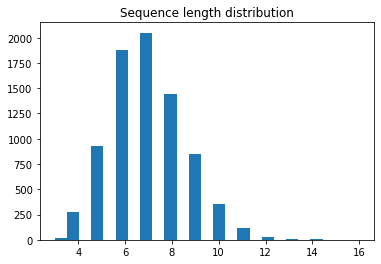
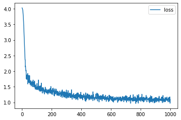

<a href="https://colab.research.google.com/github/sankirnajoshi/intro-to-dl/blob/master/week5/RNN-task.ipynb" target="_parent"></a>

# Generating names with recurrent neural networks

This time you'll find yourself delving into the heart (and other intestines) of recurrent neural networks on a class of toy problems.

Struggle to find a name for the variable? Let's see how you'll come up with a name for your son/daughter. Surely no human has expertize over what is a good child name, so let us train RNN instead;

It's dangerous to go alone, take these:


```python
! shred -u setup_google_colab.py
! wget https://raw.githubusercontent.com/hse-aml/intro-to-dl/master/setup_google_colab.py -O setup_google_colab.py
import setup_google_colab
# please, uncomment the week you're working on
# setup_google_colab.setup_week1()
# setup_google_colab.setup_week2()
# setup_google_colab.setup_week2_honor()
# setup_google_colab.setup_week3()
# setup_google_colab.setup_week4()
setup_google_colab.setup_week5()
# setup_google_colab.setup_week6()
```

    --2020-01-04 18:49:41--  https://raw.githubusercontent.com/hse-aml/intro-to-dl/master/setup_google_colab.py
    Resolving raw.githubusercontent.com (raw.githubusercontent.com)... 151.101.0.133, 151.101.64.133, 151.101.128.133, ...
    Connecting to raw.githubusercontent.com (raw.githubusercontent.com)|151.101.0.133|:443... connected.
    HTTP request sent, awaiting response... 200 OK
    Length: 3636 (3.6K) [text/plain]
    Saving to: ‘setup_google_colab.py’
    
    setup_google_colab. 100%[===================>]   3.55K  --.-KB/s    in 0s      
    
    2020-01-04 18:49:41 (93.0 MB/s) - ‘setup_google_colab.py’ saved [3636/3636]
    
    


```python
import tensorflow as tf
print(tf.__version__)
import numpy as np
import matplotlib.pyplot as plt
%matplotlib inline
import os
import sys
sys.path.append("..")
import keras_utils
import tqdm_utils
```


<p style="color: red;">
The default version of TensorFlow in Colab will soon switch to TensorFlow 2.x.<br>
We recommend you <a href="https://www.tensorflow.org/guide/migrate" target="_blank">upgrade</a> now 
or ensure your notebook will continue to use TensorFlow 1.x via the <code>%tensorflow_version 1.x</code> magic:
<a href="https://colab.research.google.com/notebooks/tensorflow_version.ipynb" target="_blank">more info</a>.</p>


    1.15.0
    

    Using TensorFlow backend.
    

# Load data
The dataset contains ~8k earthling names from different cultures, all in latin transcript.

This notebook has been designed so as to allow you to quickly swap names for something similar: deep learning article titles, IKEA furniture, pokemon names, etc.


```python
! pip install wget
```

    Collecting wget
      Downloading https://files.pythonhosted.org/packages/47/6a/62e288da7bcda82b935ff0c6cfe542970f04e29c756b0e147251b2fb251f/wget-3.2.zip
    Building wheels for collected packages: wget
      Building wheel for wget (setup.py) ... [?25l[?25hdone
      Created wheel for wget: filename=wget-3.2-cp36-none-any.whl size=9681 sha256=1be0cf40ba1ae90460cf29727375ddb98ddf009dca250b0e0ce7e15b6fea5044
      Stored in directory: /root/.cache/pip/wheels/40/15/30/7d8f7cea2902b4db79e3fea550d7d7b85ecb27ef992b618f3f
    Successfully built wget
    Installing collected packages: wget
    Successfully installed wget-3.2
    


```python
from google.colab import drive
drive.mount('/content/drive')

## Upload the names file from the link : https://raw.githubusercontent.com/hse-aml/intro-to-dl/master/week5/names after mounting the google drive.
```

    Go to this URL in a browser: https://accounts.google.com/o/oauth2/auth?client_id=947318989803-6bn6qk8qdgf4n4g3pfee6491hc0brc4i.apps.googleusercontent.com&redirect_uri=urn%3aietf%3awg%3aoauth%3a2.0%3aoob&response_type=code&scope=email%20https%3a%2f%2fwww.googleapis.com%2fauth%2fdocs.test%20https%3a%2f%2fwww.googleapis.com%2fauth%2fdrive%20https%3a%2f%2fwww.googleapis.com%2fauth%2fdrive.photos.readonly%20https%3a%2f%2fwww.googleapis.com%2fauth%2fpeopleapi.readonly
    
    Enter your authorization code:
    ··········
    Mounted at /content/drive
    


```python
start_token = " "  # so that the network knows that we're generating a first token

# this is the token for padding,
# we will add fake pad token at the end of names 
# to make them of equal size for further batching
pad_token = "#"

with open("names") as f:
    names = f.read()[:-1].split('\n')
    names = [start_token + name for name in names]
```


```python
print('number of samples:', len(names))
for x in names[::1000]:
    print(x)
```

    number of samples: 7944
     Abagael
     Claresta
     Glory
     Liliane
     Prissie
     Geeta
     Giovanne
     Piggy
    


```python
MAX_LENGTH = max(map(len, names))
print("max length:", MAX_LENGTH)

plt.title('Sequence length distribution')
plt.hist(list(map(len, names)), bins=25);
```

    max length: 16
    





# Text processing

First we need to collect a "vocabulary" of all unique tokens i.e. unique characters. We can then encode inputs as a sequence of character ids.


```python
tokens = set(''.join(names[:])) ### YOUR CODE HERE: all unique characters go here, padding included!
tokens = list(tokens)
tokens.append('#')
n_tokens = len(tokens)
print ('n_tokens:', n_tokens)

assert 50 < n_tokens < 60
```

    n_tokens: 56
    

### Cast everything from symbols into identifiers

Tensorflow string manipulation is a bit tricky, so we'll work around it. 
We'll feed our recurrent neural network with ids of characters from our dictionary.

To create such dictionary, let's assign `token_to_id`


```python
token_to_id = {}### YOUR CODE HERE: create a dictionary of {symbol -> its  index in tokens}

for i in range(n_tokens):
    token_to_id[tokens[i]] = i
    
assert len(tokens) == len(token_to_id), "dictionaries must have same size"
```


```python
def to_matrix(names, max_len=None, pad=token_to_id[pad_token], dtype=np.int32):
    """Casts a list of names into rnn-digestable padded matrix"""
    
    max_len = max_len or max(map(len, names))
    names_ix = np.zeros([len(names), max_len], dtype) + pad

    for i in range(len(names)):
        name_ix = list(map(token_to_id.get, names[i]))
        names_ix[i, :len(name_ix)] = name_ix

    return names_ix
```


```python
# Example: cast 4 random names to padded matrices (so that we can easily batch them)
print('\n'.join(names[::2000]))
print(to_matrix(names[::2000]))
```

     Abagael
     Glory
     Prissie
     Giovanne
    [[ 9 15 46 29 41 29 17  2 55]
     [ 9 31  2 48  0  4 55 55 55]
     [ 9 53  0 13  1  1 13 17 55]
     [ 9 31 13 48 24 29 36 36 17]]
    

# Defining a recurrent neural network

We can rewrite recurrent neural network as a consecutive application of dense layer to input $x_t$ and previous rnn state $h_t$. This is exactly what we're gonna do now.


Since we're training a language model, there should also be:
* An embedding layer that converts character id x_t to a vector.
* An output layer that predicts probabilities of next phoneme based on h_t+1


```python
# remember to reset your session if you change your graph!
s = keras_utils.reset_tf_session()
```

    WARNING:tensorflow:From /content/keras_utils.py:68: The name tf.get_default_session is deprecated. Please use tf.compat.v1.get_default_session instead.
    
    WARNING:tensorflow:From /usr/local/lib/python3.6/dist-packages/keras/backend/tensorflow_backend.py:79: The name tf.reset_default_graph is deprecated. Please use tf.compat.v1.reset_default_graph instead.
    
    WARNING:tensorflow:From /usr/local/lib/python3.6/dist-packages/keras/backend/tensorflow_backend.py:82: The name tf.placeholder is deprecated. Please use tf.compat.v1.placeholder instead.
    
    WARNING:tensorflow:From /usr/local/lib/python3.6/dist-packages/keras/backend/tensorflow_backend.py:84: The name tf.get_default_graph is deprecated. Please use tf.compat.v1.get_default_graph instead.
    
    WARNING:tensorflow:From /content/keras_utils.py:75: The name tf.ConfigProto is deprecated. Please use tf.compat.v1.ConfigProto instead.
    
    WARNING:tensorflow:From /content/keras_utils.py:77: The name tf.InteractiveSession is deprecated. Please use tf.compat.v1.InteractiveSession instead.
    
    


```python
import keras
from keras.layers import concatenate, Dense, Embedding

rnn_num_units = 64  # size of hidden state
embedding_size = 16  # for characters

# Let's create layers for our recurrent network
# Note: we create layers but we don't "apply" them yet (this is a "functional API" of Keras)
# Note: set the correct activation (from keras.activations) to Dense layers!

# an embedding layer that converts character ids into embeddings
embed_x = Embedding(n_tokens, embedding_size)

# a dense layer that maps input and previous state to new hidden state, [x_t,h_t]->h_t+1
get_h_next = Dense(rnn_num_units, activation='tanh')  ### YOUR CODE HERE

# a dense layer that maps current hidden state to probabilities of characters [h_t+1]->P(x_t+1|h_t+1)
get_probas = Dense(n_tokens, activation='softmax')
```

[link text](https://)We will generate names character by character starting with `start_token`:


```python
def rnn_one_step(x_t, h_t):
    """
    Recurrent neural network step that produces 
    probabilities for next token x_t+1 and next state h_t+1
    given current input x_t and previous state h_t.
    We'll call this method repeatedly to produce the whole sequence.
    
    You're supposed to "apply" above layers to produce new tensors.
    Follow inline instructions to complete the function.
    """
    # convert character id into embedding
    x_t_emb = embed_x(tf.reshape(x_t, [-1, 1]))[:, 0]
    
    # concatenate x_t embedding and previous h_t state
    x_and_h = tf.concat([x_t_emb, h_t], 1)### YOUR CODE HERE
    
    # compute next state given x_and_h
    h_next = get_h_next(x_and_h)### YOUR CODE HERE
    
    # get probabilities for language model P(x_next|h_next)
    output_probas = get_probas(h_next) ### YOUR CODE HERE
    
    return output_probas, h_next
```

# RNN: loop

Once `rnn_one_step` is ready, let's apply it in a loop over name characters to get predictions.

Let's assume that all names are at most length-16 for now, so we can simply iterate over them in a for loop.


```python
input_sequence = tf.placeholder(tf.int32, (None, MAX_LENGTH))  # batch of token ids
batch_size = tf.shape(input_sequence)[0]

predicted_probas = []
h_prev = tf.zeros([batch_size, rnn_num_units])  # initial hidden state

for t in range(MAX_LENGTH):
    x_t = input_sequence[:, t]  # column t
    probas_next, h_next = rnn_one_step(x_t, h_prev)
    
    h_prev = h_next
    predicted_probas.append(probas_next)
    
# combine predicted_probas into [batch, time, n_tokens] tensor
predicted_probas = tf.transpose(tf.stack(predicted_probas), [1, 0, 2])

# next to last token prediction is not needed
predicted_probas = predicted_probas[:, :-1, :]
```

    WARNING:tensorflow:From /usr/local/lib/python3.6/dist-packages/keras/backend/tensorflow_backend.py:3535: The name tf.random_uniform is deprecated. Please use tf.random.uniform instead.
    
    

# RNN: loss and gradients

Let's gather a matrix of predictions for $P(x_{next}|h)$ and the corresponding correct answers.

We will flatten our matrices to shape [None, n_tokens] to make it easier.

Our network can then be trained by minimizing crossentropy between predicted probabilities and those answers.


```python
# flatten predictions to [batch*time, n_tokens]
predictions_matrix = tf.reshape(predicted_probas, [-1, n_tokens])

# flatten answers (next tokens) and one-hot encode them
answers_matrix = tf.one_hot(tf.reshape(input_sequence[:, 1:], [-1]), n_tokens)
```

Usually it's a good idea to ignore gradients of loss for padding token predictions.

Because we don't care about further prediction after the pad_token is predicted for the first time, so it doesn't make sense to punish our network after the pad_token is predicted.

For simplicity you can ignore this comment, it's up to you.


```python
# Define the loss as categorical cross-entropy (e.g. from keras.losses).
# Mind that predictions are probabilities and NOT logits!
# Remember to apply tf.reduce_mean to get a scalar loss!
from keras.objectives import categorical_crossentropy
loss = tf.reduce_mean(categorical_crossentropy(answers_matrix, predictions_matrix)) ### YOUR CODE HERE

optimize = tf.train.AdamOptimizer().minimize(loss)
```

    WARNING:tensorflow:From /usr/local/lib/python3.6/dist-packages/keras/backend/tensorflow_backend.py:2745: calling reduce_sum_v1 (from tensorflow.python.ops.math_ops) with keep_dims is deprecated and will be removed in a future version.
    Instructions for updating:
    keep_dims is deprecated, use keepdims instead
    WARNING:tensorflow:From /usr/local/lib/python3.6/dist-packages/keras/backend/tensorflow_backend.py:2749: The name tf.log is deprecated. Please use tf.math.log instead.
    
    WARNING:tensorflow:From /usr/local/lib/python3.6/dist-packages/tensorflow_core/python/ops/math_grad.py:1424: where (from tensorflow.python.ops.array_ops) is deprecated and will be removed in a future version.
    Instructions for updating:
    Use tf.where in 2.0, which has the same broadcast rule as np.where
    

# RNN: training


```python
from IPython.display import clear_output
from random import sample

s.run(tf.global_variables_initializer())

batch_size = 32
history = []

for i in range(1000):
    batch = to_matrix(sample(names, batch_size), max_len=MAX_LENGTH)
    loss_i, _ = s.run([loss, optimize], {input_sequence: batch})
    
    history.append(loss_i)
    
    if (i + 1) % 100 == 0:
        clear_output(True)
        plt.plot(history, label='loss')
        plt.legend()
        plt.show()

assert np.mean(history[:10]) > np.mean(history[-10:]), "RNN didn't converge"
```





# RNN: sampling
Once we've trained our network a bit, let's get to actually generating stuff. All we need is the `rnn_one_step` function you have written above.


```python
x_t = tf.placeholder(tf.int32, (1,))
h_t = tf.Variable(np.zeros([1, rnn_num_units], np.float32))  # we will update hidden state in this variable

# For sampling we need to define `rnn_one_step` tensors only once in our graph.
# We reuse all parameters thanks to functional API usage.
# Then we can feed appropriate tensor values using feed_dict in a loop.
# Note how different it is from training stage, where we had to unroll the whole sequence for backprop.
next_probs, next_h = rnn_one_step(x_t, h_t)
```


```python
def generate_sample(seed_phrase=start_token, max_length=MAX_LENGTH):
    '''
    This function generates text given a `seed_phrase` as a seed.
    Remember to include start_token in seed phrase!
    Parameter `max_length` is used to set the number of characters in prediction.
    '''
    x_sequence = [token_to_id[token] for token in seed_phrase]
    s.run(tf.assign(h_t, h_t.initial_value))
    
    # feed the seed phrase, if any
    for ix in x_sequence[:-1]:
         s.run(tf.assign(h_t, next_h), {x_t: [ix]})
    
    # start generating
    for _ in range(max_length-len(seed_phrase)):
        x_probs,_ = s.run([next_probs, tf.assign(h_t, next_h)], {x_t: [x_sequence[-1]]})
        x_sequence.append(np.random.choice(n_tokens, p=x_probs[0]))
        
    return ''.join([tokens[ix] for ix in x_sequence if tokens[ix] != pad_token])
```


```python
# without prefix
for _ in range(10):
    print(generate_sample())
```

     Fars
     Annele
     Voenba
     Vyawda
     Leda
     ULenty
     Livik
     Mafgtal
     Baril
     Doislal
    


```python
# with prefix conditioning
for _ in range(10):
    print(generate_sample(' Trump'))
```

     Trump
     Trump
     TrumpB
     Trumpa
     Trumpa
     Trumpio
     Trumpea
     Trumpe
     Trumpar
     Trumpa
    

# Submit to Coursera


```python
# token expires every 30 min
COURSERA_TOKEN = "PngruUBm4gGlq5fD"
COURSERA_EMAIL = "sankirna1292@gmail.com"
```


```python
from submit import submit_char_rnn
samples = [generate_sample(' Al') for i in tqdm_utils.tqdm_notebook_failsafe(range(25))]
submission = (history, samples)
submit_char_rnn(submission, COURSERA_EMAIL, COURSERA_TOKEN)
```

    *************************
    
    You used an invalid email or your token may have expired. Please make sure you have entered all fields correctly. Try generating a new token if the issue still persists.
    

# Try it out!

__Disclaimer:__ This part of assignment is entirely optional. You won't receive bonus points for it. However, it's a fun thing to do. Please share your results on course forums.

You've just implemented a recurrent language model that can be tasked with generating any kind of sequence, so there's plenty of data you can try it on:

* Novels/poems/songs of your favorite author
* News titles/clickbait titles
* Source code of Linux or Tensorflow
* Molecules in [smiles](https://en.wikipedia.org/wiki/Simplified_molecular-input_line-entry_system) format
* Melody in notes/chords format
* IKEA catalog titles
* Pokemon names
* Cards from Magic, the Gathering / Hearthstone

If you're willing to give it a try, here's what you wanna look at:
* Current data format is a sequence of lines, so a novel can be formatted as a list of sentences. Alternatively, you can change data preprocessing altogether.
* While some datasets are readily available, others can only be scraped from the web. Try `Selenium` or `Scrapy` for that.
* Make sure MAX_LENGTH is adjusted for longer datasets. There's also a bonus section about dynamic RNNs at the bottom.
* More complex tasks require larger RNN architecture, try more neurons or several layers. It would also require more training iterations.
* Long-term dependencies in music, novels or molecules are better handled with LSTM or GRU

__Good hunting!__

# Bonus level: dynamic RNNs

Apart from Keras, there's also a friendly TensorFlow API for recurrent neural nets. It's based around the symbolic loop function (aka [tf.scan](https://www.tensorflow.org/api_docs/python/tf/scan)).

RNN loop that we implemented for training can be replaced with single TensorFlow instruction: [tf.nn.dynamic_rnn](https://www.tensorflow.org/api_docs/python/tf/nn/dynamic_rnn).
This interface allows for dynamic sequence length and comes with some pre-implemented architectures.

Take a look at [tf.nn.rnn_cell.BasicRNNCell](https://www.tensorflow.org/api_docs/python/tf/contrib/rnn/BasicRNNCell).


```python
class CustomRNN(tf.nn.rnn_cell.BasicRNNCell):
    def call(self, input, state):
        # from docs:
        # Returns:
        # Output: A 2-D tensor with shape [batch_size, self.output_size].
        # New state: Either a single 2-D tensor, or a tuple of tensors matching the arity and shapes of state.
        return rnn_one_step(input[:, 0], state)
    
    @property
    def output_size(self):
        return n_tokens
    
cell = CustomRNN(rnn_num_units)

input_sequence = tf.placeholder(tf.int32, (None, None))
    
predicted_probas, last_state = tf.nn.dynamic_rnn(cell, input_sequence[:, :, None], dtype=tf.float32)

print('LSTM outputs for each step [batch,time,n_tokens]:')
print(predicted_probas.eval({input_sequence: to_matrix(names[:10], max_len=50)}).shape)
```

    WARNING:tensorflow:From <ipython-input-26-5f3812e903bf>:13: BasicRNNCell.__init__ (from tensorflow.python.ops.rnn_cell_impl) is deprecated and will be removed in a future version.
    Instructions for updating:
    This class is equivalent as tf.keras.layers.SimpleRNNCell, and will be replaced by that in Tensorflow 2.0.
    WARNING:tensorflow:From <ipython-input-26-5f3812e903bf>:17: dynamic_rnn (from tensorflow.python.ops.rnn) is deprecated and will be removed in a future version.
    Instructions for updating:
    Please use `keras.layers.RNN(cell)`, which is equivalent to this API
    


    ---------------------------------------------------------------------------

    ValueError                                Traceback (most recent call last)

    <ipython-input-26-5f3812e903bf> in <module>()
         15 input_sequence = tf.placeholder(tf.int32, (None, None))
         16 
    ---> 17 predicted_probas, last_state = tf.nn.dynamic_rnn(cell, input_sequence[:, :, None], dtype=tf.float32)
         18 
         19 print('LSTM outputs for each step [batch,time,n_tokens]:')
    

    /usr/local/lib/python3.6/dist-packages/tensorflow_core/python/util/deprecation.py in new_func(*args, **kwargs)
        322               'in a future version' if date is None else ('after %s' % date),
        323               instructions)
    --> 324       return func(*args, **kwargs)
        325     return tf_decorator.make_decorator(
        326         func, new_func, 'deprecated',
    

    /usr/local/lib/python3.6/dist-packages/tensorflow_core/python/ops/rnn.py in dynamic_rnn(cell, inputs, sequence_length, initial_state, dtype, parallel_iterations, swap_memory, time_major, scope)
        705         swap_memory=swap_memory,
        706         sequence_length=sequence_length,
    --> 707         dtype=dtype)
        708 
        709     # Outputs of _dynamic_rnn_loop are always shaped [time, batch, depth].
    

    /usr/local/lib/python3.6/dist-packages/tensorflow_core/python/ops/rnn.py in _dynamic_rnn_loop(cell, inputs, initial_state, parallel_iterations, swap_memory, sequence_length, dtype)
        914       parallel_iterations=parallel_iterations,
        915       maximum_iterations=time_steps,
    --> 916       swap_memory=swap_memory)
        917 
        918   # Unpack final output if not using output tuples.
    

    /usr/local/lib/python3.6/dist-packages/tensorflow_core/python/ops/control_flow_ops.py in while_loop(cond, body, loop_vars, shape_invariants, parallel_iterations, back_prop, swap_memory, name, maximum_iterations, return_same_structure)
       2751       ops.add_to_collection(ops.GraphKeys.WHILE_CONTEXT, loop_context)
       2752     result = loop_context.BuildLoop(cond, body, loop_vars, shape_invariants,
    -> 2753                                     return_same_structure)
       2754     if maximum_iterations is not None:
       2755       return result[1]
    

    /usr/local/lib/python3.6/dist-packages/tensorflow_core/python/ops/control_flow_ops.py in BuildLoop(self, pred, body, loop_vars, shape_invariants, return_same_structure)
       2243       with ops.get_default_graph()._mutation_lock():  # pylint: disable=protected-access
       2244         original_body_result, exit_vars = self._BuildLoop(
    -> 2245             pred, body, original_loop_vars, loop_vars, shape_invariants)
       2246     finally:
       2247       self.Exit()
    

    /usr/local/lib/python3.6/dist-packages/tensorflow_core/python/ops/control_flow_ops.py in _BuildLoop(self, pred, body, original_loop_vars, loop_vars, shape_invariants)
       2168         expand_composites=True)
       2169     pre_summaries = ops.get_collection(ops.GraphKeys._SUMMARY_COLLECTION)  # pylint: disable=protected-access
    -> 2170     body_result = body(*packed_vars_for_body)
       2171     post_summaries = ops.get_collection(ops.GraphKeys._SUMMARY_COLLECTION)  # pylint: disable=protected-access
       2172     if not nest.is_sequence_or_composite(body_result):
    

    /usr/local/lib/python3.6/dist-packages/tensorflow_core/python/ops/control_flow_ops.py in <lambda>(i, lv)
       2703         cond = lambda i, lv: (  # pylint: disable=g-long-lambda
       2704             math_ops.logical_and(i < maximum_iterations, orig_cond(*lv)))
    -> 2705         body = lambda i, lv: (i + 1, orig_body(*lv))
       2706       try_to_pack = False
       2707 
    

    /usr/local/lib/python3.6/dist-packages/tensorflow_core/python/ops/rnn.py in _time_step(time, output_ta_t, state)
        882           skip_conditionals=True)
        883     else:
    --> 884       (output, new_state) = call_cell()
        885 
        886     # Keras cells always wrap state as list, even if it's a single tensor.
    

    /usr/local/lib/python3.6/dist-packages/tensorflow_core/python/ops/rnn.py in <lambda>()
        868     if is_keras_rnn_cell and not nest.is_sequence(state):
        869       state = [state]
    --> 870     call_cell = lambda: cell(input_t, state)
        871 
        872     if sequence_length is not None:
    

    /usr/local/lib/python3.6/dist-packages/tensorflow_core/python/ops/rnn_cell_impl.py in __call__(self, inputs, state, scope, *args, **kwargs)
        384     # method.  See the class docstring for more details.
        385     return base_layer.Layer.__call__(
    --> 386         self, inputs, state, scope=scope, *args, **kwargs)
        387 
        388 
    

    /usr/local/lib/python3.6/dist-packages/tensorflow_core/python/layers/base.py in __call__(self, inputs, *args, **kwargs)
        546 
        547       # Actually call layer
    --> 548       outputs = super(Layer, self).__call__(inputs, *args, **kwargs)
        549 
        550     if not context.executing_eagerly():
    

    /usr/local/lib/python3.6/dist-packages/tensorflow_core/python/keras/engine/base_layer.py in __call__(self, inputs, *args, **kwargs)
        822           # Build layer if applicable (if the `build` method has been
        823           # overridden).
    --> 824           self._maybe_build(inputs)
        825           cast_inputs = self._maybe_cast_inputs(inputs)
        826 
    

    /usr/local/lib/python3.6/dist-packages/tensorflow_core/python/keras/engine/base_layer.py in _maybe_build(self, inputs)
       2144         # operations.
       2145         with tf_utils.maybe_init_scope(self):
    -> 2146           self.build(input_shapes)
       2147       # We must set self.built since user defined build functions are not
       2148       # constrained to set self.built.
    

    /usr/local/lib/python3.6/dist-packages/tensorflow_core/python/keras/utils/tf_utils.py in wrapper(instance, input_shape)
        304     if input_shape is not None:
        305       input_shape = convert_shapes(input_shape, to_tuples=True)
    --> 306     output_shape = fn(instance, input_shape)
        307     # Return shapes from `fn` as TensorShapes.
        308     if output_shape is not None:
    

    /usr/local/lib/python3.6/dist-packages/tensorflow_core/python/ops/rnn_cell_impl.py in build(self, inputs_shape)
        449       raise ValueError("Expected inputs.shape[-1] to be known, saw shape: %s" %
        450                        str(inputs_shape))
    --> 451     _check_supported_dtypes(self.dtype)
        452 
        453     input_depth = inputs_shape[-1]
    

    /usr/local/lib/python3.6/dist-packages/tensorflow_core/python/ops/rnn_cell_impl.py in _check_supported_dtypes(dtype)
       1345   if not (dtype.is_floating or dtype.is_complex):
       1346     raise ValueError("RNN cell only supports floating point inputs, "
    -> 1347                      "but saw dtype: %s" % dtype)
    

    ValueError: RNN cell only supports floating point inputs, but saw dtype: <dtype: 'int32'>


Note that we never used MAX_LENGTH in the code above: TF will iterate over however many time-steps you gave it.

You can also use any pre-implemented RNN cell:


```python
for obj in dir(tf.nn.rnn_cell) + dir(tf.contrib.rnn):
    if obj.endswith('Cell'):
        print(obj, end="\t")
```


```python
input_sequence = tf.placeholder(tf.int32, (None, None))

inputs_embedded = embed_x(input_sequence)

# standard cell returns hidden state as output!
cell = tf.nn.rnn_cell.LSTMCell(rnn_num_units)

state_sequence, last_state = tf.nn.dynamic_rnn(cell, inputs_embedded, dtype=tf.float32)

s.run(tf.global_variables_initializer())

print('LSTM hidden state for each step [batch,time,rnn_num_units]:')
print(state_sequence.eval({input_sequence: to_matrix(names[:10], max_len=50)}).shape)
```
