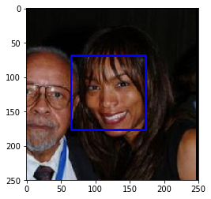
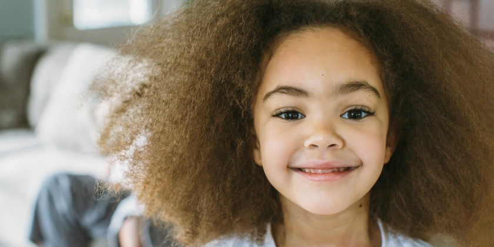
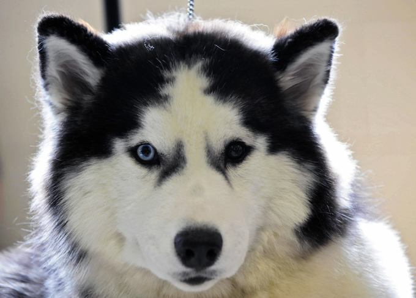
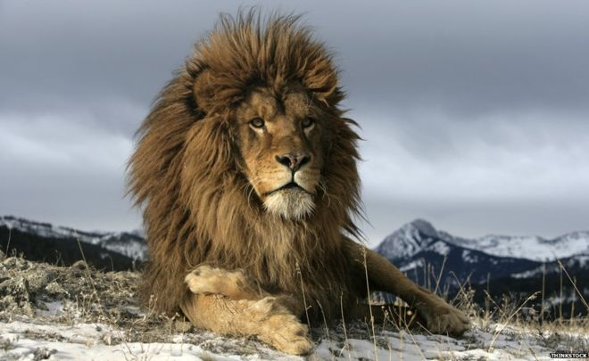
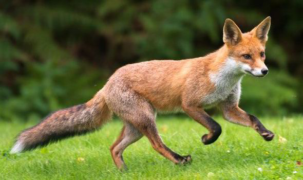
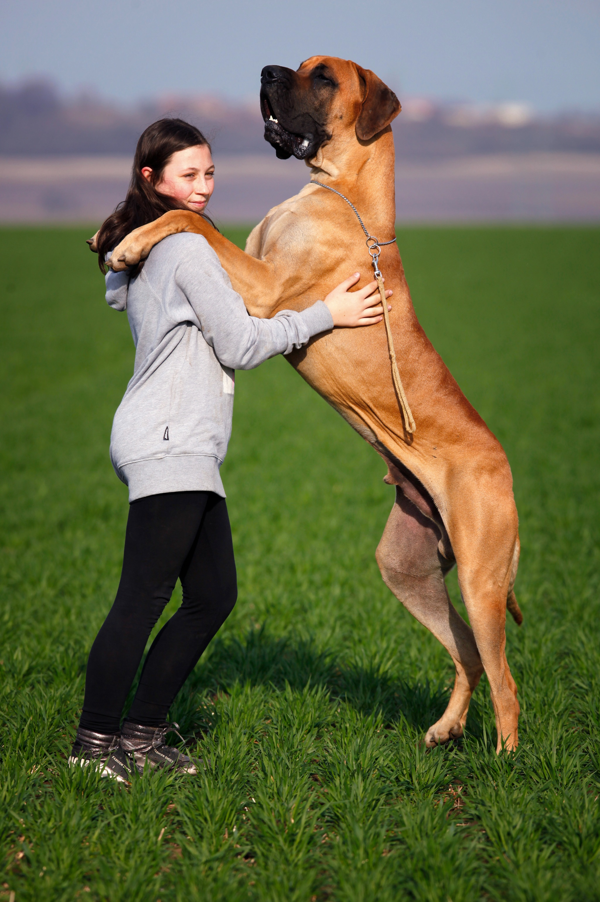
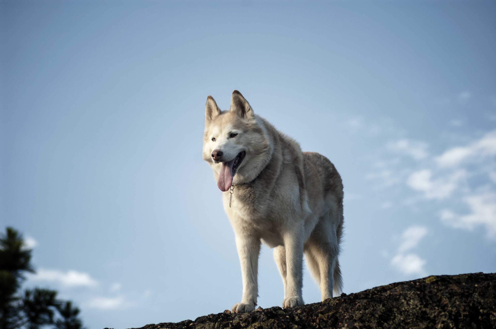
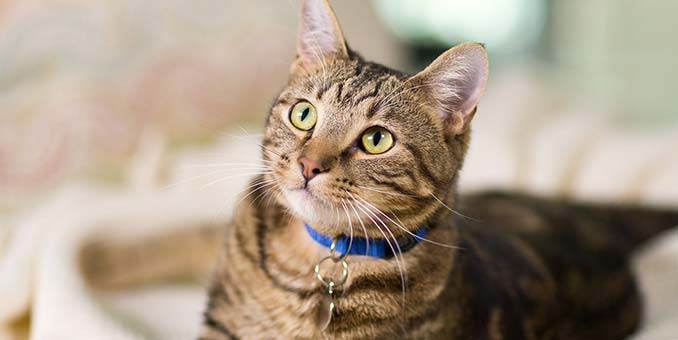
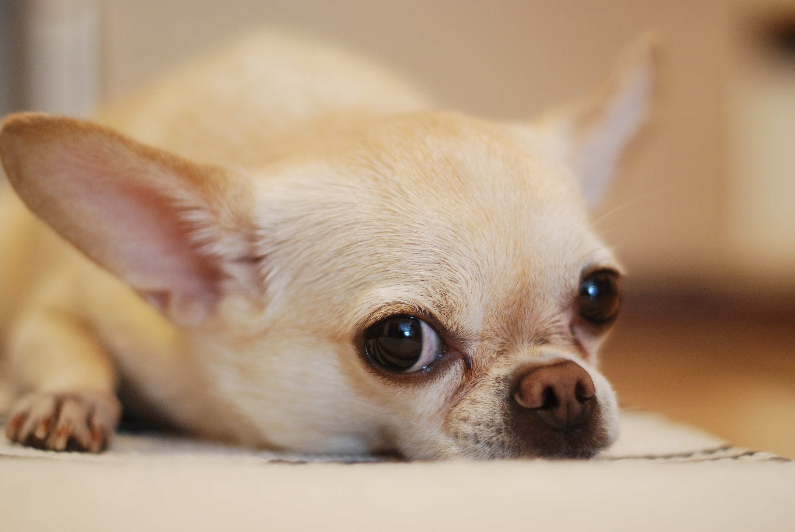

# Project: Write an Algorithm for Dog Identification

(part of the MLND Nanodegree)
---


In this notebook, we will make the first steps towards developing an algorithm that could be used as part of a mobile or web app.  At the end of this project, the code will accept any user-supplied image as input.  If a dog is detected in the image, it will provide an estimate of the dog's breed.  If a human is detected, it will provide an estimate of the dog breed that is most resembling. The image below displays potential sample output of our finished project.


In this real-world setting, you will need to piece together a series of models to perform different tasks; for instance, the algorithm that detects humans in an image will be different from the CNN that infers dog breed.  There are many points of possible failure, and no perfect algorithm exists.  Your imperfect solution will nonetheless create a fun user experience!

### The Road Ahead

We break the notebook into separate steps.  Feel free to use the links below to navigate the notebook.

* [Step 0](#step0): Import Datasets
* [Step 1](#step1): Detect Humans
* [Step 2](#step2): Detect Dogs
* [Step 3](#step3): Create a CNN to Classify Dog Breeds (from Scratch)
* [Step 4](#step4): Use a CNN to Classify Dog Breeds (using Transfer Learning)
* [Step 5](#step5): Create a CNN to Classify Dog Breeds (using Transfer Learning)
* [Step 6](#step6): Write your Algorithm
* [Step 7](#step7): Test Your Algorithm

---
<a id='step0'></a>
## Step 0: Import Datasets

### Import Dog Dataset

In the code cell below, we import a dataset of dog images.  We populate a few variables through the use of the `load_files` function from the scikit-learn library:
- `train_files`, `valid_files`, `test_files` - numpy arrays containing file paths to images
- `train_targets`, `valid_targets`, `test_targets` - numpy arrays containing onehot-encoded classification labels 
- `dog_names` - list of string-valued dog breed names for translating labels


```python
from sklearn.datasets import load_files       
from keras.utils import np_utils
import numpy as np
from glob import glob

# define function to load train, test, and validation datasets
def load_dataset(path):
    data = load_files(path)
    dog_files = np.array(data['filenames'])
    dog_targets = np_utils.to_categorical(np.array(data['target']), 133)
    return dog_files, dog_targets

# load train, test, and validation datases
train_files, train_targets = load_dataset('dogImages/train')
valid_files, valid_targets = load_dataset('dogImages/valid')
test_files, test_targets = load_dataset('dogImages/test')

# load list of dog names
dog_names = [item[20:-1] for item in sorted(glob("dogImages/train/*/"))]

# print statistics about the dataset
print('There are %d total dog categories.' % len(dog_names))
print('There are %s total dog images.\n' % len(np.hstack([train_files, valid_files, test_files])))
print('There are %d training dog images.' % len(train_files))
print('There are %d validation dog images.' % len(valid_files))
print('There are %d test dog images.'% len(test_files))
```

    There are 133 total dog categories.
    There are 8351 total dog images.
    
    There are 6680 training dog images.
    There are 835 validation dog images.
    There are 836 test dog images.
    

    Using TensorFlow backend.
    

### Import Human Dataset

In the code cell below, we import a dataset of human images, where the file paths are stored in the numpy array `human_files`.


```python
import random
random.seed(8675309)

# load filenames in shuffled human dataset
human_files = np.array(glob("lfw/*/*"))
random.shuffle(human_files)

# print statistics about the dataset
print('There are %d total human images.' % len(human_files))
```

    There are 13233 total human images.
    

---
<a id='step1'></a>
## Step 1: Detect Humans

We use OpenCV's implementation of [Haar feature-based cascade classifiers](http://docs.opencv.org/trunk/d7/d8b/tutorial_py_face_detection.html) to detect human faces in images.  OpenCV provides many pre-trained face detectors, stored as XML files on [github](https://github.com/opencv/opencv/tree/master/data/haarcascades).  We have downloaded one of these detectors and stored it in the `haarcascades` directory.

In the next code cell, we demonstrate how to use this detector to find human faces in a sample image.


```python
import cv2                
import matplotlib.pyplot as plt                        
%matplotlib inline                               

# extract pre-trained face detector
face_cascade = cv2.CascadeClassifier('haarcascades/haarcascade_frontalface_alt.xml')

# load color (BGR) image
img = cv2.imread(human_files[3])
# convert BGR image to grayscale
gray = cv2.cvtColor(img, cv2.COLOR_BGR2GRAY)

# find faces in image
faces = face_cascade.detectMultiScale(gray)

# print number of faces detected in the image
print('Number of faces detected:', len(faces))

# get bounding box for each detected face
for (x,y,w,h) in faces:
    # add bounding box to color image
    cv2.rectangle(img,(x,y),(x+w,y+h),(255,0,0),2)
    
# convert BGR image to RGB for plotting
cv_rgb = cv2.cvtColor(img, cv2.COLOR_BGR2RGB)

# display the image, along with bounding box
plt.imshow(cv_rgb)
plt.show()
```

    Number of faces detected: 1
    





Before using any of the face detectors, it is standard procedure to convert the images to grayscale.  The `detectMultiScale` function executes the classifier stored in `face_cascade` and takes the grayscale image as a parameter.  

In the above code, `faces` is a numpy array of detected faces, where each row corresponds to a detected face.  Each detected face is a 1D array with four entries that specifies the bounding box of the detected face.  The first two entries in the array (extracted in the above code as `x` and `y`) specify the horizontal and vertical positions of the top left corner of the bounding box.  The last two entries in the array (extracted here as `w` and `h`) specify the width and height of the box.

### Write a Human Face Detector

We can use this procedure to write a function that returns `True` if a human face is detected in an image and `False` otherwise.  This function, aptly named `face_detector`, takes a string-valued file path to an image as input and appears in the code block below.


```python
# returns "True" if face is detected in image stored at img_path
def face_detector(img_path):
    img = cv2.imread(img_path)
    gray = cv2.cvtColor(img, cv2.COLOR_BGR2GRAY)
    faces = face_cascade.detectMultiScale(gray)
    return len(faces) > 0
```

### (IMPLEMENTATION) Assess the Human Face Detector

__Question 1:__ Use the code cell below to test the performance of the `face_detector` function.  
- What percentage of the first 100 images in `human_files` have a detected human face?  
- What percentage of the first 100 images in `dog_files` have a detected human face? 

Ideally, we would like 100% of human images with a detected face and 0% of dog images with a detected face.  You will see that our algorithm falls short of this goal, but still gives acceptable performance.  We extract the file paths for the first 100 images from each of the datasets and store them in the numpy arrays `human_files_short` and `dog_files_short`.

__Answer:__ 

- Percent of Human faces detected in the images: 98
- Percent of Human faces detected in the images: 11


```python
human_files_short = human_files[:100]
dog_files_short = train_files[:100]
# Do NOT modify the code above this line.

## TODO: Test the performance of the face_detector algorithm 
## on the images in human_files_short and dog_files_short.
human_faces = []
for face in human_files_short:
    human_faces.append(np.int(face_detector(face)))
print ("Percent of Human faces detected in the images: %d" %np.sum(human_faces))

dog_faces = []
for face in dog_files_short:
    dog_faces.append(np.int(face_detector(face)))
print ("Percent of Dog faces detected in the images: %d" %np.sum(dog_faces))

```

    Percent of Human faces detected in the images: 98
    Percent of Dog faces detected in the images: 11
    

__Question 2:__ This algorithmic choice necessitates that we communicate to the user that we accept human images only when they provide a clear view of a face (otherwise, we risk having unneccessarily frustrated users!). In your opinion, is this a reasonable expectation to pose on the user? If not, can you think of a way to detect humans in images that does not necessitate an image with a clearly presented face?

__Answer:__

It is reasonable to ask Users to provide a clear picture of the face if the design of the final web application is such that it is intended to connect to the front camera of the user and and make predictions on selfies and not on uploaded pictures. However if the design allows users to upload their pictures, the application should be able to deal with pictures which present unclear or unnatural forms. For this case we could train a CNN on human pictures and use it to detech humans even if face is not clear.

We suggest the face detector from OpenCV as a potential way to detect human images in your algorithm, but you are free to explore other approaches, especially approaches that make use of deep learning :).  Please use the code cell below to design and test your own face detection algorithm.  If you decide to pursue this _optional_ task, report performance on each of the datasets.


```python
## (Optional) TODO: Report the performance of another  
## face detection algorithm on the LFW dataset
### Feel free to use as many code cells as needed.

```

---
<a id='step2'></a>
## Step 2: Detect Dogs

In this section, we use a pre-trained [ResNet-50](http://ethereon.github.io/netscope/#/gist/db945b393d40bfa26006) model to detect dogs in images.  Our first line of code downloads the ResNet-50 model, along with weights that have been trained on [ImageNet](http://www.image-net.org/), a very large, very popular dataset used for image classification and other vision tasks.  ImageNet contains over 10 million URLs, each linking to an image containing an object from one of [1000 categories](https://gist.github.com/yrevar/942d3a0ac09ec9e5eb3a).  Given an image, this pre-trained ResNet-50 model returns a prediction (derived from the available categories in ImageNet) for the object that is contained in the image.


```python
from keras.applications.resnet50 import ResNet50

# define ResNet50 model
ResNet50_model = ResNet50(weights='imagenet')
```

### Pre-process the Data

When using TensorFlow as backend, Keras CNNs require a 4D array (which we'll also refer to as a 4D tensor) as input, with shape

$$
(\text{nb_samples}, \text{rows}, \text{columns}, \text{channels}),
$$

where `nb_samples` corresponds to the total number of images (or samples), and `rows`, `columns`, and `channels` correspond to the number of rows, columns, and channels for each image, respectively.  

The `path_to_tensor` function below takes a string-valued file path to a color image as input and returns a 4D tensor suitable for supplying to a Keras CNN.  The function first loads the image and resizes it to a square image that is $224 \times 224$ pixels.  Next, the image is converted to an array, which is then resized to a 4D tensor.  In this case, since we are working with color images, each image has three channels.  Likewise, since we are processing a single image (or sample), the returned tensor will always have shape

$$
(1, 224, 224, 3).
$$

The `paths_to_tensor` function takes a numpy array of string-valued image paths as input and returns a 4D tensor with shape 

$$
(\text{nb_samples}, 224, 224, 3).
$$

Here, `nb_samples` is the number of samples, or number of images, in the supplied array of image paths.  It is best to think of `nb_samples` as the number of 3D tensors (where each 3D tensor corresponds to a different image) in your dataset!


```python
from keras.preprocessing import image                  
from tqdm import tqdm

def path_to_tensor(img_path):
    # loads RGB image as PIL.Image.Image type
    img = image.load_img(img_path, target_size=(224, 224))
    # convert PIL.Image.Image type to 3D tensor with shape (224, 224, 3)
    x = image.img_to_array(img)
    # convert 3D tensor to 4D tensor with shape (1, 224, 224, 3) and return 4D tensor
    return np.expand_dims(x, axis=0)

def paths_to_tensor(img_paths):
    list_of_tensors = [path_to_tensor(img_path) for img_path in tqdm(img_paths)]
    return np.vstack(list_of_tensors)
```

### Making Predictions with ResNet-50

Getting the 4D tensor ready for ResNet-50, and for any other pre-trained model in Keras, requires some additional processing.  First, the RGB image is converted to BGR by reordering the channels.  All pre-trained models have the additional normalization step that the mean pixel (expressed in RGB as $[103.939, 116.779, 123.68]$ and calculated from all pixels in all images in ImageNet) must be subtracted from every pixel in each image.  This is implemented in the imported function `preprocess_input`.  If you're curious, you can check the code for `preprocess_input` [here](https://github.com/fchollet/keras/blob/master/keras/applications/imagenet_utils.py).

Now that we have a way to format our image for supplying to ResNet-50, we are now ready to use the model to extract the predictions.  This is accomplished with the `predict` method, which returns an array whose $i$-th entry is the model's predicted probability that the image belongs to the $i$-th ImageNet category.  This is implemented in the `ResNet50_predict_labels` function below.

By taking the argmax of the predicted probability vector, we obtain an integer corresponding to the model's predicted object class, which we can identify with an object category through the use of this [dictionary](https://gist.github.com/yrevar/942d3a0ac09ec9e5eb3a). 


```python
from keras.applications.resnet50 import preprocess_input, decode_predictions

def ResNet50_predict_labels(img_path):
    # returns prediction vector for image located at img_path
    img = preprocess_input(path_to_tensor(img_path))
    return np.argmax(ResNet50_model.predict(img))
```

### Write a Dog Detector

While looking at the [dictionary](https://gist.github.com/yrevar/942d3a0ac09ec9e5eb3a), you will notice that the categories corresponding to dogs appear in an uninterrupted sequence and correspond to dictionary keys 151-268, inclusive, to include all categories from `'Chihuahua'` to `'Mexican hairless'`.  Thus, in order to check to see if an image is predicted to contain a dog by the pre-trained ResNet-50 model, we need only check if the `ResNet50_predict_labels` function above returns a value between 151 and 268 (inclusive).

We use these ideas to complete the `dog_detector` function below, which returns `True` if a dog is detected in an image (and `False` if not).


```python
### returns "True" if a dog is detected in the image stored at img_path
def dog_detector(img_path):
    prediction = ResNet50_predict_labels(img_path)
    return ((prediction <= 268) & (prediction >= 151)) 
```

### (IMPLEMENTATION) Assess the Dog Detector

__Question 3:__ Use the code cell below to test the performance of your `dog_detector` function.  
- What percentage of the images in `human_files_short` have a detected dog?  
- What percentage of the images in `dog_files_short` have a detected dog?

__Answer:__ 
- Percent of Human faces detected in the images: 2
- Percent of Dog faces detected in the images: 99


```python
### TODO: Test the performance of the dog_detector function
### on the images in human_files_short and dog_files_short.
human_images = []
for human in human_files_short:
    human_images.append(np.int(dog_detector(human)))
print ("Percent of Human faces detected in the images: %d" %np.sum(human_images))

dog_images = []
for dog in dog_files_short:
    dog_images.append(np.int(dog_detector(dog)))
print ("Percent of Dog faces detected in the images: %d" %np.sum(dog_images))
```

    Percent of Human faces detected in the images: 2
    Percent of Dog faces detected in the images: 99
    

---
<a id='step3'></a>
## Step 3: Create a CNN to Classify Dog Breeds (from Scratch)

Now that we have functions for detecting humans and dogs in images, we need a way to predict breed from images.  In this step, you will create a CNN that classifies dog breeds.  You must create your CNN _from scratch_ (so, you can't use transfer learning _yet_!), and you must attain a test accuracy of at least 1%.  In Step 5 of this notebook, you will have the opportunity to use transfer learning to create a CNN that attains greatly improved accuracy.

Be careful with adding too many trainable layers!  More parameters means longer training, which means you are more likely to need a GPU to accelerate the training process.  Thankfully, Keras provides a handy estimate of the time that each epoch is likely to take; you can extrapolate this estimate to figure out how long it will take for your algorithm to train. 

We mention that the task of assigning breed to dogs from images is considered exceptionally challenging.  To see why, consider that *even a human* would have great difficulty in distinguishing between a Brittany and a Welsh Springer Spaniel.  

Brittany | Welsh Springer Spaniel
- | - 
 | 

It is not difficult to find other dog breed pairs with minimal inter-class variation (for instance, Curly-Coated Retrievers and American Water Spaniels).  

Curly-Coated Retriever | American Water Spaniel
- | -
 | 


Likewise, recall that labradors come in yellow, chocolate, and black.  Your vision-based algorithm will have to conquer this high intra-class variation to determine how to classify all of these different shades as the same breed.  

Yellow Labrador | Chocolate Labrador | Black Labrador
- | -
 |  | 

We also mention that random chance presents an exceptionally low bar: setting aside the fact that the classes are slightly imabalanced, a random guess will provide a correct answer roughly 1 in 133 times, which corresponds to an accuracy of less than 1%.  

Remember that the practice is far ahead of the theory in deep learning.  Experiment with many different architectures, and trust your intuition.  And, of course, have fun! 

### Pre-process the Data

We rescale the images by dividing every pixel in every image by 255.


```python
from PIL import ImageFile                            
ImageFile.LOAD_TRUNCATED_IMAGES = True                 

# pre-process the data for Keras
train_tensors = paths_to_tensor(train_files).astype('float32')/255
valid_tensors = paths_to_tensor(valid_files).astype('float32')/255
test_tensors = paths_to_tensor(test_files).astype('float32')/255
```

    100%|██████████| 6680/6680 [00:56<00:00, 117.44it/s]
    100%|██████████| 835/835 [00:06<00:00, 131.62it/s]
    100%|██████████| 836/836 [00:06<00:00, 134.31it/s]
    

### (IMPLEMENTATION) Model Architecture

Create a CNN to classify dog breed.  At the end of your code cell block, summarize the layers of your model by executing the line:
    
        model.summary()

We have imported some Python modules to get you started, but feel free to import as many modules as you need.  If you end up getting stuck, here's a hint that specifies a model that trains relatively fast on CPU and attains >1% test accuracy in 5 epochs:


           
__Question 4:__ Outline the steps you took to get to your final CNN architecture and your reasoning at each step.  If you chose to use the hinted architecture above, describe why you think that CNN architecture should work well for the image classification task.

__Answer:__ 


- I decided to create a 3 or 4 layer  deep CNN(counting only the Conv2D layers for sake of ease) at first and check how it performs. Both 3 and 4 layer models overfitted the training data a lot. For example, after 20 epochs, I got training accuracy of ~90% but validation score of ~10% only. Overfitting did not reduce after using dropouts as well. Image augumentation could have helped in reducing overfitting by increasing training size but I chose to explore the CNNs with reduced depth first. Relu Activation is used as it gives faster performance without significant drop in accuracy.

- Started with a kernel size of 3x3 in a Conv2D layer. A large kernel size can overlook features and important local details whereas a small kernel size can be redundant. Generally kernel size of <5 is used. Stride and padding of 0s has been kept to preserve spatial size in the Conv layer and reduce later in the pooling layers.

- Max Pooling layers follows it and has stride of 2 and shape 2x2 to reduce the height and width of the space by 1/2. Any higher values result in worse perfomance. This step is essential to reduce dimensionality of the data.

- Dropout layers after the max pooling layers are added to prevent overfitting.

- Repeated the above configuration with increased filters in 2nd Conv2D layer to 64.

- Added a final Global Average pooling layer which reduces the model output shape to a vector and then connected it to a fully connected Dense layer.

- Final layer is a  Softmax activated fully Dense layer having 133 output nodes.

- Total Model layers: 10


```python
from keras.layers import Conv2D, MaxPooling2D, GlobalAveragePooling2D, AveragePooling2D
from keras.layers import Dropout, Flatten, Dense
from keras.models import Sequential

model = Sequential()

### TODO: Define your architecture.

model.add(Conv2D(filters=32, kernel_size=3, padding='same', activation='relu', input_shape=(224, 224, 3)))
model.add(MaxPooling2D(pool_size=(2, 2)))
model.add(Dropout(0.4))
model.add(Conv2D(filters=64, kernel_size=3, padding='same', activation='relu'))
model.add(MaxPooling2D(pool_size=(2, 2)))
model.add(Dropout(0.3))

model.add(GlobalAveragePooling2D())

model.add(Dense(512, activation='relu'))
model.add(Dropout(0.5))
model.add(Dense(133, activation='softmax'))

model.summary()

```

    _________________________________________________________________
    Layer (type)                 Output Shape              Param #   
    =================================================================
    conv2d_1 (Conv2D)            (None, 224, 224, 32)      896       
    _________________________________________________________________
    max_pooling2d_2 (MaxPooling2 (None, 112, 112, 32)      0         
    _________________________________________________________________
    dropout_1 (Dropout)          (None, 112, 112, 32)      0         
    _________________________________________________________________
    conv2d_2 (Conv2D)            (None, 112, 112, 64)      18496     
    _________________________________________________________________
    max_pooling2d_3 (MaxPooling2 (None, 56, 56, 64)        0         
    _________________________________________________________________
    dropout_2 (Dropout)          (None, 56, 56, 64)        0         
    _________________________________________________________________
    global_average_pooling2d_1 ( (None, 64)                0         
    _________________________________________________________________
    dense_1 (Dense)              (None, 512)               33280     
    _________________________________________________________________
    dropout_3 (Dropout)          (None, 512)               0         
    _________________________________________________________________
    dense_2 (Dense)              (None, 133)               68229     
    =================================================================
    Total params: 120,901
    Trainable params: 120,901
    Non-trainable params: 0
    _________________________________________________________________
    

### Compile the Model


```python
model.compile(optimizer='rmsprop', loss='categorical_crossentropy', metrics=['accuracy'])
```

### (IMPLEMENTATION) Train the Model

Train your model in the code cell below.  Use model checkpointing to save the model that attains the best validation loss.

You are welcome to [augment the training data](https://blog.keras.io/building-powerful-image-classification-models-using-very-little-data.html), but this is not a requirement. 


```python
from keras.callbacks import ModelCheckpoint  

### TODO: specify the number of epochs that you would like to use to train the model.

epochs = 20

### Do NOT modify the code below this line.

checkpointer = ModelCheckpoint(filepath='saved_models/weights.best.from_scratch.hdf5', 
                               verbose=1, save_best_only=True)

model.fit(train_tensors, train_targets, 
          validation_data=(valid_tensors, valid_targets),
          epochs=epochs, batch_size=20, callbacks=[checkpointer], verbose=1)
```

    Train on 6680 samples, validate on 835 samples
    Epoch 1/20
    6660/6680 [============================>.] - ETA: 0s - loss: 4.8835 - acc: 0.0108Epoch 00000: val_loss improved from inf to 4.86925, saving model to saved_models/weights.best.from_scratch.hdf5
    6680/6680 [==============================] - 35s - loss: 4.8836 - acc: 0.0108 - val_loss: 4.8692 - val_acc: 0.0132
    Epoch 2/20
    6660/6680 [============================>.] - ETA: 0s - loss: 4.8375 - acc: 0.0161Epoch 00001: val_loss improved from 4.86925 to 4.82702, saving model to saved_models/weights.best.from_scratch.hdf5
    6680/6680 [==============================] - 34s - loss: 4.8371 - acc: 0.0162 - val_loss: 4.8270 - val_acc: 0.0156
    Epoch 3/20
    6660/6680 [============================>.] - ETA: 0s - loss: 4.7869 - acc: 0.0173Epoch 00002: val_loss improved from 4.82702 to 4.76759, saving model to saved_models/weights.best.from_scratch.hdf5
    6680/6680 [==============================] - 34s - loss: 4.7867 - acc: 0.0172 - val_loss: 4.7676 - val_acc: 0.0168
    Epoch 4/20
    6660/6680 [============================>.] - ETA: 0s - loss: 4.7450 - acc: 0.0185Epoch 00003: val_loss improved from 4.76759 to 4.73076, saving model to saved_models/weights.best.from_scratch.hdf5
    6680/6680 [==============================] - 34s - loss: 4.7448 - acc: 0.0184 - val_loss: 4.7308 - val_acc: 0.0228
    Epoch 5/20
    6660/6680 [============================>.] - ETA: 0s - loss: 4.7094 - acc: 0.0222Epoch 00004: val_loss improved from 4.73076 to 4.70701, saving model to saved_models/weights.best.from_scratch.hdf5
    6680/6680 [==============================] - 34s - loss: 4.7094 - acc: 0.0223 - val_loss: 4.7070 - val_acc: 0.0180
    Epoch 6/20
    6660/6680 [============================>.] - ETA: 0s - loss: 4.6810 - acc: 0.0237Epoch 00005: val_loss improved from 4.70701 to 4.69602, saving model to saved_models/weights.best.from_scratch.hdf5
    6680/6680 [==============================] - 34s - loss: 4.6807 - acc: 0.0237 - val_loss: 4.6960 - val_acc: 0.0180
    Epoch 7/20
    6660/6680 [============================>.] - ETA: 0s - loss: 4.6523 - acc: 0.0264Epoch 00006: val_loss improved from 4.69602 to 4.67399, saving model to saved_models/weights.best.from_scratch.hdf5
    6680/6680 [==============================] - 34s - loss: 4.6526 - acc: 0.0263 - val_loss: 4.6740 - val_acc: 0.0240
    Epoch 8/20
    6660/6680 [============================>.] - ETA: 0s - loss: 4.6215 - acc: 0.0279Epoch 00007: val_loss improved from 4.67399 to 4.62386, saving model to saved_models/weights.best.from_scratch.hdf5
    6680/6680 [==============================] - 34s - loss: 4.6220 - acc: 0.0278 - val_loss: 4.6239 - val_acc: 0.0287
    Epoch 9/20
    6660/6680 [============================>.] - ETA: 0s - loss: 4.5867 - acc: 0.0315Epoch 00008: val_loss improved from 4.62386 to 4.61228, saving model to saved_models/weights.best.from_scratch.hdf5
    6680/6680 [==============================] - 34s - loss: 4.5865 - acc: 0.0316 - val_loss: 4.6123 - val_acc: 0.0275
    Epoch 10/20
    6660/6680 [============================>.] - ETA: 0s - loss: 4.5688 - acc: 0.0336Epoch 00009: val_loss improved from 4.61228 to 4.58152, saving model to saved_models/weights.best.from_scratch.hdf5
    6680/6680 [==============================] - 34s - loss: 4.5691 - acc: 0.0335 - val_loss: 4.5815 - val_acc: 0.0359
    Epoch 11/20
    6660/6680 [============================>.] - ETA: 0s - loss: 4.5373 - acc: 0.0342Epoch 00010: val_loss improved from 4.58152 to 4.54487, saving model to saved_models/weights.best.from_scratch.hdf5
    6680/6680 [==============================] - 34s - loss: 4.5375 - acc: 0.0344 - val_loss: 4.5449 - val_acc: 0.0383
    Epoch 12/20
    6660/6680 [============================>.] - ETA: 0s - loss: 4.5073 - acc: 0.0396Epoch 00011: val_loss improved from 4.54487 to 4.52513, saving model to saved_models/weights.best.from_scratch.hdf5
    6680/6680 [==============================] - 34s - loss: 4.5074 - acc: 0.0397 - val_loss: 4.5251 - val_acc: 0.0311
    Epoch 13/20
    6660/6680 [============================>.] - ETA: 0s - loss: 4.4766 - acc: 0.0401Epoch 00012: val_loss improved from 4.52513 to 4.51111, saving model to saved_models/weights.best.from_scratch.hdf5
    6680/6680 [==============================] - 34s - loss: 4.4775 - acc: 0.0400 - val_loss: 4.5111 - val_acc: 0.0359
    Epoch 14/20
    6660/6680 [============================>.] - ETA: 0s - loss: 4.4416 - acc: 0.0465Epoch 00013: val_loss improved from 4.51111 to 4.45791, saving model to saved_models/weights.best.from_scratch.hdf5
    6680/6680 [==============================] - 34s - loss: 4.4413 - acc: 0.0467 - val_loss: 4.4579 - val_acc: 0.0443
    Epoch 15/20
    6660/6680 [============================>.] - ETA: 0s - loss: 4.4167 - acc: 0.0517Epoch 00014: val_loss did not improve
    6680/6680 [==============================] - 34s - loss: 4.4165 - acc: 0.0516 - val_loss: 4.5227 - val_acc: 0.0443
    Epoch 16/20
    6660/6680 [============================>.] - ETA: 0s - loss: 4.3913 - acc: 0.0551Epoch 00015: val_loss improved from 4.45791 to 4.41899, saving model to saved_models/weights.best.from_scratch.hdf5
    6680/6680 [==============================] - 34s - loss: 4.3904 - acc: 0.0551 - val_loss: 4.4190 - val_acc: 0.0479
    Epoch 17/20
    6660/6680 [============================>.] - ETA: 0s - loss: 4.3615 - acc: 0.0584Epoch 00016: val_loss did not improve
    6680/6680 [==============================] - 34s - loss: 4.3600 - acc: 0.0587 - val_loss: 4.4197 - val_acc: 0.0575
    Epoch 18/20
    6660/6680 [============================>.] - ETA: 0s - loss: 4.3289 - acc: 0.0631Epoch 00017: val_loss improved from 4.41899 to 4.38432, saving model to saved_models/weights.best.from_scratch.hdf5
    6680/6680 [==============================] - 34s - loss: 4.3280 - acc: 0.0632 - val_loss: 4.3843 - val_acc: 0.0455
    Epoch 19/20
    6660/6680 [============================>.] - ETA: 0s - loss: 4.2910 - acc: 0.0670Epoch 00018: val_loss improved from 4.38432 to 4.37915, saving model to saved_models/weights.best.from_scratch.hdf5
    6680/6680 [==============================] - 34s - loss: 4.2917 - acc: 0.0668 - val_loss: 4.3792 - val_acc: 0.0503
    Epoch 20/20
    6660/6680 [============================>.] - ETA: 0s - loss: 4.2628 - acc: 0.0691Epoch 00019: val_loss improved from 4.37915 to 4.36245, saving model to saved_models/weights.best.from_scratch.hdf5
    6680/6680 [==============================] - 34s - loss: 4.2634 - acc: 0.0689 - val_loss: 4.3624 - val_acc: 0.0539
    


    <keras.callbacks.History at 0x7f3950799518>


### Load the Model with the Best Validation Loss


```python
model.load_weights('saved_models/weights.best.from_scratch.hdf5')
```

### Test the Model

Try out your model on the test dataset of dog images.  Ensure that your test accuracy is greater than 1%.


```python
# get index of predicted dog breed for each image in test set
dog_breed_predictions = [np.argmax(model.predict(np.expand_dims(tensor, axis=0))) for tensor in test_tensors]

# report test accuracy
test_accuracy = 100*np.sum(np.array(dog_breed_predictions)==np.argmax(test_targets, axis=1))/len(dog_breed_predictions)
print('Test accuracy: %.4f%%' % test_accuracy)
```

    Test accuracy: 5.5024%
    

---
<a id='step4'></a>
## Step 4: Use a CNN to Classify Dog Breeds

To reduce training time without sacrificing accuracy, we show you how to train a CNN using transfer learning.  In the following step, you will get a chance to use transfer learning to train your own CNN.

### Obtain Bottleneck Features


```python
bottleneck_features = np.load('bottleneck_features/DogVGG16Data.npz')
train_VGG16 = bottleneck_features['train']
valid_VGG16 = bottleneck_features['valid']
test_VGG16 = bottleneck_features['test']
```

### Model Architecture

The model uses the the pre-trained VGG-16 model as a fixed feature extractor, where the last convolutional output of VGG-16 is fed as input to our model.  We only add a global average pooling layer and a fully connected layer, where the latter contains one node for each dog category and is equipped with a softmax.


```python
VGG16_model = Sequential()
VGG16_model.add(GlobalAveragePooling2D(input_shape=train_VGG16.shape[1:]))
VGG16_model.add(Dense(133, activation='softmax'))

VGG16_model.summary()
```

    _________________________________________________________________
    Layer (type)                 Output Shape              Param #   
    =================================================================
    global_average_pooling2d_2 ( (None, 512)               0         
    _________________________________________________________________
    dense_3 (Dense)              (None, 133)               68229     
    =================================================================
    Total params: 68,229
    Trainable params: 68,229
    Non-trainable params: 0
    _________________________________________________________________
    

### Compile the Model


```python
VGG16_model.compile(loss='categorical_crossentropy', optimizer='rmsprop', metrics=['accuracy'])
```

### Train the Model


```python
checkpointer = ModelCheckpoint(filepath='saved_models/weights.best.VGG16.hdf5', 
                               verbose=1, save_best_only=True)

VGG16_model.fit(train_VGG16, train_targets, 
          validation_data=(valid_VGG16, valid_targets),
          epochs=20, batch_size=20, callbacks=[checkpointer], verbose=1)
```

    Train on 6680 samples, validate on 835 samples
    Epoch 1/20
    6560/6680 [============================>.] - ETA: 0s - loss: 12.8343 - acc: 0.1180Epoch 00000: val_loss improved from inf to 11.56900, saving model to saved_models/weights.best.VGG16.hdf5
    6680/6680 [==============================] - 2s - loss: 12.7981 - acc: 0.1201 - val_loss: 11.5690 - val_acc: 0.2012
    Epoch 2/20
    6500/6680 [============================>.] - ETA: 0s - loss: 11.0890 - acc: 0.2460Epoch 00001: val_loss improved from 11.56900 to 11.03564, saving model to saved_models/weights.best.VGG16.hdf5
    6680/6680 [==============================] - 1s - loss: 11.0705 - acc: 0.2481 - val_loss: 11.0356 - val_acc: 0.2635
    Epoch 3/20
    6500/6680 [============================>.] - ETA: 0s - loss: 10.6810 - acc: 0.2952Epoch 00002: val_loss improved from 11.03564 to 10.93598, saving model to saved_models/weights.best.VGG16.hdf5
    6680/6680 [==============================] - 1s - loss: 10.6708 - acc: 0.2961 - val_loss: 10.9360 - val_acc: 0.2707
    Epoch 4/20
    6620/6680 [============================>.] - ETA: 0s - loss: 10.5155 - acc: 0.3183Epoch 00003: val_loss improved from 10.93598 to 10.84723, saving model to saved_models/weights.best.VGG16.hdf5
    6680/6680 [==============================] - 1s - loss: 10.5071 - acc: 0.3186 - val_loss: 10.8472 - val_acc: 0.2814
    Epoch 5/20
    6500/6680 [============================>.] - ETA: 0s - loss: 10.4254 - acc: 0.3294Epoch 00004: val_loss improved from 10.84723 to 10.63904, saving model to saved_models/weights.best.VGG16.hdf5
    6680/6680 [==============================] - 1s - loss: 10.3966 - acc: 0.3308 - val_loss: 10.6390 - val_acc: 0.2898
    Epoch 6/20
    6660/6680 [============================>.] - ETA: 0s - loss: 10.1046 - acc: 0.3456Epoch 00005: val_loss improved from 10.63904 to 10.43454, saving model to saved_models/weights.best.VGG16.hdf5
    6680/6680 [==============================] - 1s - loss: 10.1033 - acc: 0.3458 - val_loss: 10.4345 - val_acc: 0.3066
    Epoch 7/20
    6620/6680 [============================>.] - ETA: 0s - loss: 9.8838 - acc: 0.3647Epoch 00006: val_loss improved from 10.43454 to 10.17976, saving model to saved_models/weights.best.VGG16.hdf5
    6680/6680 [==============================] - 1s - loss: 9.8900 - acc: 0.3641 - val_loss: 10.1798 - val_acc: 0.3198
    Epoch 8/20
    6580/6680 [============================>.] - ETA: 0s - loss: 9.7350 - acc: 0.3805Epoch 00007: val_loss did not improve
    6680/6680 [==============================] - 1s - loss: 9.7326 - acc: 0.3808 - val_loss: 10.2163 - val_acc: 0.3222
    Epoch 9/20
    6600/6680 [============================>.] - ETA: 0s - loss: 9.6470 - acc: 0.3874Epoch 00008: val_loss improved from 10.17976 to 10.09184, saving model to saved_models/weights.best.VGG16.hdf5
    6680/6680 [==============================] - 1s - loss: 9.6565 - acc: 0.3867 - val_loss: 10.0918 - val_acc: 0.3269
    Epoch 10/20
    6640/6680 [============================>.] - ETA: 0s - loss: 9.5601 - acc: 0.3913Epoch 00009: val_loss improved from 10.09184 to 10.02787, saving model to saved_models/weights.best.VGG16.hdf5
    6680/6680 [==============================] - 1s - loss: 9.5682 - acc: 0.3907 - val_loss: 10.0279 - val_acc: 0.3281
    Epoch 11/20
    6540/6680 [============================>.] - ETA: 0s - loss: 9.3750 - acc: 0.4031Epoch 00010: val_loss improved from 10.02787 to 9.93959, saving model to saved_models/weights.best.VGG16.hdf5
    6680/6680 [==============================] - 1s - loss: 9.3961 - acc: 0.4013 - val_loss: 9.9396 - val_acc: 0.3281
    Epoch 12/20
    6620/6680 [============================>.] - ETA: 0s - loss: 9.2435 - acc: 0.4062Epoch 00011: val_loss improved from 9.93959 to 9.63342, saving model to saved_models/weights.best.VGG16.hdf5
    6680/6680 [==============================] - 1s - loss: 9.2462 - acc: 0.4060 - val_loss: 9.6334 - val_acc: 0.3557
    Epoch 13/20
    6500/6680 [============================>.] - ETA: 0s - loss: 9.0670 - acc: 0.4222Epoch 00012: val_loss improved from 9.63342 to 9.62016, saving model to saved_models/weights.best.VGG16.hdf5
    6680/6680 [==============================] - 1s - loss: 9.1007 - acc: 0.4201 - val_loss: 9.6202 - val_acc: 0.3509
    Epoch 14/20
    6640/6680 [============================>.] - ETA: 0s - loss: 9.0512 - acc: 0.4268Epoch 00013: val_loss improved from 9.62016 to 9.61016, saving model to saved_models/weights.best.VGG16.hdf5
    6680/6680 [==============================] - 1s - loss: 9.0477 - acc: 0.4271 - val_loss: 9.6102 - val_acc: 0.3485
    Epoch 15/20
    6500/6680 [============================>.] - ETA: 0s - loss: 8.9943 - acc: 0.4331Epoch 00014: val_loss improved from 9.61016 to 9.53150, saving model to saved_models/weights.best.VGG16.hdf5
    6680/6680 [==============================] - 1s - loss: 8.9954 - acc: 0.4329 - val_loss: 9.5315 - val_acc: 0.3617
    Epoch 16/20
    6520/6680 [============================>.] - ETA: 0s - loss: 8.8575 - acc: 0.4396Epoch 00015: val_loss improved from 9.53150 to 9.40460, saving model to saved_models/weights.best.VGG16.hdf5
    6680/6680 [==============================] - 1s - loss: 8.8606 - acc: 0.4394 - val_loss: 9.4046 - val_acc: 0.3569
    Epoch 17/20
    6660/6680 [============================>.] - ETA: 0s - loss: 8.7860 - acc: 0.4471Epoch 00016: val_loss improved from 9.40460 to 9.38109, saving model to saved_models/weights.best.VGG16.hdf5
    6680/6680 [==============================] - 1s - loss: 8.7911 - acc: 0.4469 - val_loss: 9.3811 - val_acc: 0.3605
    Epoch 18/20
    6640/6680 [============================>.] - ETA: 0s - loss: 8.7320 - acc: 0.4477Epoch 00017: val_loss improved from 9.38109 to 9.30830, saving model to saved_models/weights.best.VGG16.hdf5
    6680/6680 [==============================] - 1s - loss: 8.7242 - acc: 0.4481 - val_loss: 9.3083 - val_acc: 0.3557
    Epoch 19/20
    6620/6680 [============================>.] - ETA: 0s - loss: 8.5677 - acc: 0.4551Epoch 00018: val_loss improved from 9.30830 to 9.14790, saving model to saved_models/weights.best.VGG16.hdf5
    6680/6680 [==============================] - 1s - loss: 8.5629 - acc: 0.4554 - val_loss: 9.1479 - val_acc: 0.3784
    Epoch 20/20
    6520/6680 [============================>.] - ETA: 0s - loss: 8.5107 - acc: 0.4644Epoch 00019: val_loss improved from 9.14790 to 9.12238, saving model to saved_models/weights.best.VGG16.hdf5
    6680/6680 [==============================] - 1s - loss: 8.5138 - acc: 0.4642 - val_loss: 9.1224 - val_acc: 0.3844
    


    <keras.callbacks.History at 0x7f3926714470>


### Load the Model with the Best Validation Loss


```python
VGG16_model.load_weights('saved_models/weights.best.VGG16.hdf5')
```

### Test the Model

Now, we can use the CNN to test how well it identifies breed within our test dataset of dog images.  We print the test accuracy below.


```python
# get index of predicted dog breed for each image in test set
VGG16_predictions = [np.argmax(VGG16_model.predict(np.expand_dims(feature, axis=0))) for feature in test_VGG16]

# report test accuracy
test_accuracy = 100*np.sum(np.array(VGG16_predictions)==np.argmax(test_targets, axis=1))/len(VGG16_predictions)
print('Test accuracy: %.4f%%' % test_accuracy)
```

    Test accuracy: 38.1579%
    

### Predict Dog Breed with the Model


```python
from extract_bottleneck_features import *

def VGG16_predict_breed(img_path):
    # extract bottleneck features
    bottleneck_feature = extract_VGG16(path_to_tensor(img_path))
    # obtain predicted vector
    predicted_vector = VGG16_model.predict(bottleneck_feature)
    # return dog breed that is predicted by the model
    return dog_names[np.argmax(predicted_vector)]
```

---
<a id='step5'></a>
## Step 5: Create a CNN to Classify Dog Breeds (using Transfer Learning)

You will now use transfer learning to create a CNN that can identify dog breed from images.  Your CNN must attain at least 60% accuracy on the test set.

In Step 4, we used transfer learning to create a CNN using VGG-16 bottleneck features.  In this section, you must use the bottleneck features from a different pre-trained model.  To make things easier for you, we have pre-computed the features for all of the networks that are currently available in Keras:
- [VGG-19](https://s3-us-west-1.amazonaws.com/udacity-aind/dog-project/DogVGG19Data.npz) bottleneck features
- [ResNet-50](https://s3-us-west-1.amazonaws.com/udacity-aind/dog-project/DogResnet50Data.npz) bottleneck features
- [Inception](https://s3-us-west-1.amazonaws.com/udacity-aind/dog-project/DogInceptionV3Data.npz) bottleneck features
- [Xception](https://s3-us-west-1.amazonaws.com/udacity-aind/dog-project/DogXceptionData.npz) bottleneck features

The files are encoded as such:

    Dog{network}Data.npz
    
where `{network}`, in the above filename, can be one of `VGG19`, `Resnet50`, `InceptionV3`, or `Xception`.  Pick one of the above architectures, download the corresponding bottleneck features, and store the downloaded file in the `bottleneck_features/` folder in the repository.

### (IMPLEMENTATION) Obtain Bottleneck Features

In the code block below, extract the bottleneck features corresponding to the train, test, and validation sets by running the following:

    bottleneck_features = np.load('bottleneck_features/Dog{network}Data.npz')
    train_{network} = bottleneck_features['train']
    valid_{network} = bottleneck_features['valid']
    test_{network} = bottleneck_features['test']


```python
### TODO: Obtain bottleneck features from another pre-trained CNN.
bottleneck_features = np.load('bottleneck_features/DogXceptionData.npz')
train_Xception = bottleneck_features['train']
valid_Xception = bottleneck_features['valid']
test_Xception = bottleneck_features['test']
```

### (IMPLEMENTATION) Model Architecture

Create a CNN to classify dog breed.  At the end of your code cell block, summarize the layers of your model by executing the line:
    
        <your model's name>.summary()
   
__Question 5:__ Outline the steps you took to get to your final CNN architecture and your reasoning at each step.  Describe why you think the architecture is suitable for the current problem.


__Answer:__ 
    
- To check the performance of a pre-trained model, I decided to simple add a global  average pooling layer to reduce output space to a vector and connected this with a softmax activated Dense layer with output shape of 133 i.e. the number of classes we want to predict.

- This architecture gets an accuracy of ~84%. Adding further layers was dropped as the test accuracy did not improve much after adding more dense layers.


```python
### TODO: Define your architecture.
Xception_model = Sequential()

Xception_model.add(GlobalAveragePooling2D(input_shape=train_Xception.shape[1:]))

Xception_model.add(Dense(133, activation='softmax'))

Xception_model.summary()
```

    _________________________________________________________________
    Layer (type)                 Output Shape              Param #   
    =================================================================
    global_average_pooling2d_3 ( (None, 2048)              0         
    _________________________________________________________________
    dense_4 (Dense)              (None, 133)               272517    
    =================================================================
    Total params: 272,517
    Trainable params: 272,517
    Non-trainable params: 0
    _________________________________________________________________
    

### (IMPLEMENTATION) Compile the Model


```python
### TODO: Compile the model.
Xception_model.compile(loss='categorical_crossentropy', optimizer='rmsprop', metrics=['accuracy'])
```

### (IMPLEMENTATION) Train the Model

Train your model in the code cell below.  Use model checkpointing to save the model that attains the best validation loss.  

You are welcome to [augment the training data](https://blog.keras.io/building-powerful-image-classification-models-using-very-little-data.html), but this is not a requirement. 


```python
### TODO: Train the model.

checkpointer = ModelCheckpoint(filepath='saved_models/weights.best.Xception.hdf5', 
                               verbose=1, save_best_only=True)

Xception_model.fit(train_Xception, train_targets, 
          validation_data=(valid_Xception, valid_targets),
          epochs=20, batch_size=20, callbacks=[checkpointer], verbose=1)
```

    Train on 6680 samples, validate on 835 samples
    Epoch 1/20
    6620/6680 [============================>.] - ETA: 0s - loss: 1.0623 - acc: 0.7369Epoch 00000: val_loss improved from inf to 0.52620, saving model to saved_models/weights.best.Xception.hdf5
    6680/6680 [==============================] - 4s - loss: 1.0599 - acc: 0.7373 - val_loss: 0.5262 - val_acc: 0.8204
    Epoch 2/20
    6640/6680 [============================>.] - ETA: 0s - loss: 0.3956 - acc: 0.8739Epoch 00001: val_loss improved from 0.52620 to 0.49277, saving model to saved_models/weights.best.Xception.hdf5
    6680/6680 [==============================] - 3s - loss: 0.3973 - acc: 0.8735 - val_loss: 0.4928 - val_acc: 0.8371
    Epoch 3/20
    6600/6680 [============================>.] - ETA: 0s - loss: 0.3200 - acc: 0.8998Epoch 00002: val_loss did not improve
    6680/6680 [==============================] - 3s - loss: 0.3199 - acc: 0.8999 - val_loss: 0.5035 - val_acc: 0.8491
    Epoch 4/20
    6620/6680 [============================>.] - ETA: 0s - loss: 0.2745 - acc: 0.9133Epoch 00003: val_loss did not improve
    6680/6680 [==============================] - 3s - loss: 0.2764 - acc: 0.9129 - val_loss: 0.5083 - val_acc: 0.8467
    Epoch 5/20
    6660/6680 [============================>.] - ETA: 0s - loss: 0.2452 - acc: 0.9243Epoch 00004: val_loss did not improve
    6680/6680 [==============================] - 3s - loss: 0.2455 - acc: 0.9241 - val_loss: 0.5083 - val_acc: 0.8479
    Epoch 6/20
    6620/6680 [============================>.] - ETA: 0s - loss: 0.2153 - acc: 0.9341Epoch 00005: val_loss did not improve
    6680/6680 [==============================] - 3s - loss: 0.2145 - acc: 0.9343 - val_loss: 0.5225 - val_acc: 0.8599
    Epoch 7/20
    6660/6680 [============================>.] - ETA: 0s - loss: 0.1933 - acc: 0.9423Epoch 00006: val_loss did not improve
    6680/6680 [==============================] - 3s - loss: 0.1935 - acc: 0.9424 - val_loss: 0.5463 - val_acc: 0.8515
    Epoch 8/20
    6640/6680 [============================>.] - ETA: 0s - loss: 0.1783 - acc: 0.9432Epoch 00007: val_loss did not improve
    6680/6680 [==============================] - 3s - loss: 0.1782 - acc: 0.9431 - val_loss: 0.5519 - val_acc: 0.8659
    Epoch 9/20
    6640/6680 [============================>.] - ETA: 0s - loss: 0.1618 - acc: 0.9503Epoch 00008: val_loss did not improve
    6680/6680 [==============================] - 3s - loss: 0.1615 - acc: 0.9503 - val_loss: 0.5321 - val_acc: 0.8659
    Epoch 10/20
    6640/6680 [============================>.] - ETA: 0s - loss: 0.1490 - acc: 0.9559Epoch 00009: val_loss did not improve
    6680/6680 [==============================] - 3s - loss: 0.1492 - acc: 0.9560 - val_loss: 0.5886 - val_acc: 0.8527
    Epoch 11/20
    6580/6680 [============================>.] - ETA: 0s - loss: 0.1393 - acc: 0.9567Epoch 00010: val_loss did not improve
    6680/6680 [==============================] - 3s - loss: 0.1387 - acc: 0.9564 - val_loss: 0.5942 - val_acc: 0.8695
    Epoch 12/20
    6600/6680 [============================>.] - ETA: 0s - loss: 0.1268 - acc: 0.9597Epoch 00011: val_loss did not improve
    6680/6680 [==============================] - 3s - loss: 0.1266 - acc: 0.9600 - val_loss: 0.5919 - val_acc: 0.8599
    Epoch 13/20
    6660/6680 [============================>.] - ETA: 0s - loss: 0.1196 - acc: 0.9652Epoch 00012: val_loss did not improve
    6680/6680 [==============================] - 3s - loss: 0.1193 - acc: 0.9653 - val_loss: 0.6241 - val_acc: 0.8575
    Epoch 14/20
    6660/6680 [============================>.] - ETA: 0s - loss: 0.1088 - acc: 0.9686Epoch 00013: val_loss did not improve
    6680/6680 [==============================] - 3s - loss: 0.1086 - acc: 0.9687 - val_loss: 0.6346 - val_acc: 0.8611
    Epoch 15/20
    6660/6680 [============================>.] - ETA: 0s - loss: 0.1011 - acc: 0.9718Epoch 00014: val_loss did not improve
    6680/6680 [==============================] - 3s - loss: 0.1010 - acc: 0.9717 - val_loss: 0.6318 - val_acc: 0.8539
    Epoch 16/20
    6560/6680 [============================>.] - ETA: 0s - loss: 0.0953 - acc: 0.9739Epoch 00015: val_loss did not improve
    6680/6680 [==============================] - 3s - loss: 0.0942 - acc: 0.9744 - val_loss: 0.6430 - val_acc: 0.8527
    Epoch 17/20
    6660/6680 [============================>.] - ETA: 0s - loss: 0.0872 - acc: 0.9743Epoch 00016: val_loss did not improve
    6680/6680 [==============================] - 3s - loss: 0.0878 - acc: 0.9741 - val_loss: 0.6549 - val_acc: 0.8659
    Epoch 18/20
    6620/6680 [============================>.] - ETA: 0s - loss: 0.0807 - acc: 0.9748Epoch 00017: val_loss did not improve
    6680/6680 [==============================] - 3s - loss: 0.0820 - acc: 0.9746 - val_loss: 0.6485 - val_acc: 0.8575
    Epoch 19/20
    6580/6680 [============================>.] - ETA: 0s - loss: 0.0753 - acc: 0.9780Epoch 00018: val_loss did not improve
    6680/6680 [==============================] - 3s - loss: 0.0775 - acc: 0.9775 - val_loss: 0.6718 - val_acc: 0.8551
    Epoch 20/20
    6560/6680 [============================>.] - ETA: 0s - loss: 0.0737 - acc: 0.9788Epoch 00019: val_loss did not improve
    6680/6680 [==============================] - 3s - loss: 0.0743 - acc: 0.9784 - val_loss: 0.6611 - val_acc: 0.8551
    


    <keras.callbacks.History at 0x7f391f7006d8>


### (IMPLEMENTATION) Load the Model with the Best Validation Loss


```python
### TODO: Load the model weights with the best validation loss.

Xception_model.load_weights('saved_models/weights.best.Xception.hdf5')
```

### (IMPLEMENTATION) Test the Model

Try out your model on the test dataset of dog images. Ensure that your test accuracy is greater than 60%.


```python
### TODO: Calculate classification accuracy on the test dataset.

# get index of predicted dog breed for each image in test set
Xception_predictions = [np.argmax(Xception_model.predict(np.expand_dims(feature, axis=0))) for feature in test_Xception]

# report test accuracy
test_accuracy = 100*np.sum(np.array(Xception_predictions)==np.argmax(test_targets, axis=1))/len(Xception_predictions)
print('Test accuracy: %.4f%%' % test_accuracy)
```

    Test accuracy: 83.8517%
    

### (IMPLEMENTATION) Predict Dog Breed with the Model

Write a function that takes an image path as input and returns the dog breed (`Affenpinscher`, `Afghan_hound`, etc) that is predicted by your model.  

Similar to the analogous function in Step 5, your function should have three steps:
1. Extract the bottleneck features corresponding to the chosen CNN model.
2. Supply the bottleneck features as input to the model to return the predicted vector.  Note that the argmax of this prediction vector gives the index of the predicted dog breed.
3. Use the `dog_names` array defined in Step 0 of this notebook to return the corresponding breed.

The functions to extract the bottleneck features can be found in `extract_bottleneck_features.py`, and they have been imported in an earlier code cell.  To obtain the bottleneck features corresponding to your chosen CNN architecture, you need to use the function

    extract_{network}
    
where `{network}`, in the above filename, should be one of `VGG19`, `Resnet50`, `InceptionV3`, or `Xception`.


```python
### TODO: Write a function that takes a path to an image as input
### and returns the dog breed that is predicted by the model.

from extract_bottleneck_features import extract_Xception

def guess_breed(img_path):
    bottleneck_features = extract_Xception(path_to_tensor(img_path))
    predict_vector = Xception_model.predict(bottleneck_features)
    return dog_names[np.argmax(predict_vector)]
```

---
<a id='step6'></a>
## Step 6: Write your Algorithm

Write an algorithm that accepts a file path to an image and first determines whether the image contains a human, dog, or neither.  Then,
- if a __dog__ is detected in the image, return the predicted breed.
- if a __human__ is detected in the image, return the resembling dog breed.
- if __neither__ is detected in the image, provide output that indicates an error.

You are welcome to write your own functions for detecting humans and dogs in images, but feel free to use the `face_detector` and `dog_detector` functions developed above.  You are __required__ to use your CNN from Step 5 to predict dog breed.  

Some sample output for our algorithm is provided below, but feel free to design your own user experience!


### (IMPLEMENTATION) Write your Algorithm


```python
#if a dog is detected in the image, return the predicted breed.
#if a human is detected in the image, return the resembling dog breed.
#if neither is detected in the image, provide output that indicates an error.
### TODO: Write your algorithm.
### Feel free to use as many code cells as needed.

from IPython.display import Image, display
def image_display(i):
    return display(Image(filename=i, width=300, height=300))

def image_detector(img_path):
    print("------------------------------------------")
    
    if face_detector(img_path):
        print ("Hello human!")
        print("you look like a ...")
        image_display(i)
        return (print(guess_breed(img_path)))
    
    elif dog_detector(img_path):
        print ("Hello dog!")
        print("your detected breed is ...")
        image_display(i)
        return (print(guess_breed(img_path)))

    else:
        print ("We did not detect a human or dog?")
        image_display(i)
        return (print ("Please try again with a new image"))  
```

---
<a id='step7'></a>
## Step 7: Test Your Algorithm

In this section, you will take your new algorithm for a spin!  What kind of dog does the algorithm think that __you__ look like?  If you have a dog, does it predict your dog's breed accurately?  If you have a cat, does it mistakenly think that your cat is a dog?

### (IMPLEMENTATION) Test Your Algorithm on Sample Images!

Test your algorithm at least six images on your computer.  Feel free to use any images you like.  Use at least two human and two dog images.  

__Question 6:__ Is the output better than you expected :) ?  Or worse :( ?  Provide at least three possible points of improvement for your algorithm.

__Answer:__ 

- The alogrithm is very good in identifying objects that are not dogs or humans. For example the pictures of cat, lion and fox are predicted as others. But, a picture of a stray dog was predicted as other. We can improve the output to detect the dog but print that the breed could not be detected.  
- As we know that our algorithm is guaranteed to fail in case of mixbreds or mutts. We can improve on this front to make top 3 predictions of breeds detected.
- The algorithm can detect humans with faces visible but most of the human images are getting predicted as Dachsund. This behaviour is surprising. Also, A dog got predicted as human. This can be improved to avoid bad results as this.
- The algorithm could also detects dogs' breed correctly in most cases. When there are both dogs and humans, currently only human prediction is made. We can improve this to include both humans and dog prediction.


```python
## TODO: Execute your algorithm from Step 6 on
## at least 6 images on your computer.
## Feel free to use as many code cells as needed.
test_images = np.array(glob("test_images/*"))
for i in test_images:
    image_detector(i)
```

    ------------------------------------------
    Hello human!
    you look like a ...
    


    Dachshund
    ------------------------------------------
    We did not detect a human or dog?
    


    Please try again with a new image
    ------------------------------------------
    Hello human!
    you look like a ...
    





    Portuguese_water_dog
    ------------------------------------------
    Hello human!
    you look like a ...
    





    Alaskan_malamute
    ------------------------------------------
    We did not detect a human or dog?
    





    Please try again with a new image
    ------------------------------------------
    We did not detect a human or dog?
    





    Please try again with a new image
    ------------------------------------------
    Hello human!
    you look like a ...
    


    Dachshund
    ------------------------------------------
    Hello human!
    you look like a ...
    


    Dachshund
    ------------------------------------------
    Hello human!
    you look like a ...
    





    Anatolian_shepherd_dog
    ------------------------------------------
    We did not detect a human or dog?
    





    Please try again with a new image
    ------------------------------------------
    We did not detect a human or dog?
    





    Please try again with a new image
    ------------------------------------------
    Hello dog!
    your detected breed is ...
    





    Chihuahua
    ------------------------------------------
    Hello human!
    you look like a ...
    


    Dachshund
    ------------------------------------------
    Hello dog!
    your detected breed is ...
    


    Akita
    ------------------------------------------
    Hello dog!
    your detected breed is ...
    


    American_eskimo_dog
    
