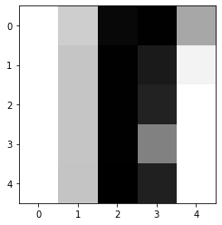
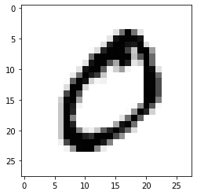

<a href="https://colab.research.google.com/github/sankirnajoshi/intro-to-dl/blob/master/week2/v2/mnist_with_keras.ipynb" target="_parent"></a>

# MNIST digits classification with Keras

We don't expect you to code anything here because you've already solved it with TensorFlow.

But you can appreciate how simpler it is with Keras.

We'll be happy if you play around with the architecture though, there're some tips at the end.


```python
! shred -u setup_google_colab.py
! wget https://raw.githubusercontent.com/hse-aml/intro-to-dl/master/setup_google_colab.py -O setup_google_colab.py
import setup_google_colab
# please, uncomment the week you're working on
# setup_google_colab.setup_week1()
setup_google_colab.setup_week2()
# setup_google_colab.setup_week3()
# setup_google_colab.setup_week4()
# setup_google_colab.setup_week5()
# setup_google_colab.setup_week6()

# If you're using the old version of the course (check a path of notebook on Coursera, you'll see v1 or v2),
# use setup_week2_old().
```

    shred: setup_google_colab.py: failed to open for writing: No such file or directory
    --2019-12-01 01:15:17--  https://raw.githubusercontent.com/hse-aml/intro-to-dl/master/setup_google_colab.py
    Resolving raw.githubusercontent.com (raw.githubusercontent.com)... 151.101.0.133, 151.101.64.133, 151.101.128.133, ...
    Connecting to raw.githubusercontent.com (raw.githubusercontent.com)|151.101.0.133|:443... connected.
    HTTP request sent, awaiting response... 200 OK
    Length: 3636 (3.6K) [text/plain]
    Saving to: ‘setup_google_colab.py’
    
    setup_google_colab. 100%[===================>]   3.55K  --.-KB/s    in 0s      
    
    2019-12-01 01:15:17 (101 MB/s) - ‘setup_google_colab.py’ saved [3636/3636]
    
    **************************************************
    inception_v3_weights_tf_dim_ordering_tf_kernels_notop.h5
    **************************************************
    cifar-10-batches-py.tar.gz
    **************************************************
    mnist.npz
    


```python
import numpy as np
from sklearn.metrics import accuracy_score
from matplotlib import pyplot as plt
%matplotlib inline
import tensorflow as tf
print("We're using TF", tf.__version__)
import keras
print("We are using Keras", keras.__version__)

import sys
sys.path.append("../..")
import keras_utils
from keras_utils import reset_tf_session
```


<p style="color: red;">
The default version of TensorFlow in Colab will soon switch to TensorFlow 2.x.<br>
We recommend you <a href="https://www.tensorflow.org/guide/migrate" target="_blank">upgrade</a> now 
or ensure your notebook will continue to use TensorFlow 1.x via the <code>%tensorflow_version 1.x</code> magic:
<a href="https://colab.research.google.com/notebooks/tensorflow_version.ipynb" target="_blank">more info</a>.</p>


    We're using TF 1.15.0
    

    Using TensorFlow backend.
    

    We are using Keras 2.0.6
    

# Look at the data

In this task we have 50000 28x28 images of digits from 0 to 9.
We will train a classifier on this data.


```python
import preprocessed_mnist
X_train, y_train, X_val, y_val, X_test, y_test = preprocessed_mnist.load_dataset()
```

    Downloading data from https://s3.amazonaws.com/img-datasets/mnist.npz
    10682368/11490434 [==========================>...] - ETA: 0s


```python
# X contains rgb values divided by 255
print("X_train [shape %s] sample patch:\n" % (str(X_train.shape)), X_train[1, 15:20, 5:10])
print("A closeup of a sample patch:")
plt.imshow(X_train[1, 15:20, 5:10], cmap="Greys")
plt.show()
print("And the whole sample:")
plt.imshow(X_train[1], cmap="Greys")
plt.show()
print("y_train [shape %s] 10 samples:\n" % (str(y_train.shape)), y_train[:10])
```

    X_train [shape (50000, 28, 28)] sample patch:
     [[0.         0.29803922 0.96470588 0.98823529 0.43921569]
     [0.         0.33333333 0.98823529 0.90196078 0.09803922]
     [0.         0.33333333 0.98823529 0.8745098  0.        ]
     [0.         0.33333333 0.98823529 0.56862745 0.        ]
     [0.         0.3372549  0.99215686 0.88235294 0.        ]]
    A closeup of a sample patch:
    





    And the whole sample:
    





    y_train [shape (50000,)] 10 samples:
     [5 0 4 1 9 2 1 3 1 4]
    


```python
# flatten images
X_train_flat = X_train.reshape((X_train.shape[0], -1))
print(X_train_flat.shape)

X_val_flat = X_val.reshape((X_val.shape[0], -1))
print(X_val_flat.shape)
```

    (50000, 784)
    (10000, 784)
    


```python
# one-hot encode the target
y_train_oh = keras.utils.to_categorical(y_train, 10)
y_val_oh = keras.utils.to_categorical(y_val, 10)

print(y_train_oh.shape)
print(y_train_oh[:3], y_train[:3])
```

    (50000, 10)
    [[0. 0. 0. 0. 0. 1. 0. 0. 0. 0.]
     [1. 0. 0. 0. 0. 0. 0. 0. 0. 0.]
     [0. 0. 0. 0. 1. 0. 0. 0. 0. 0.]] [5 0 4]
    


```python
# building a model with keras
from keras.layers import Dense, Activation
from keras.models import Sequential

# we still need to clear a graph though
s = reset_tf_session()

model = Sequential()  # it is a feed-forward network without loops like in RNN
model.add(Dense(256, input_shape=(784,)))  # the first layer must specify the input shape (replacing placeholders)
model.add(Activation('sigmoid'))
model.add(Dense(256))
model.add(Activation('sigmoid'))
model.add(Dense(10))
model.add(Activation('softmax'))
```

    WARNING:tensorflow:From /content/keras_utils.py:68: The name tf.get_default_session is deprecated. Please use tf.compat.v1.get_default_session instead.
    
    WARNING:tensorflow:From /usr/local/lib/python3.6/dist-packages/keras/backend/tensorflow_backend.py:79: The name tf.reset_default_graph is deprecated. Please use tf.compat.v1.reset_default_graph instead.
    
    WARNING:tensorflow:From /usr/local/lib/python3.6/dist-packages/keras/backend/tensorflow_backend.py:82: The name tf.placeholder is deprecated. Please use tf.compat.v1.placeholder instead.
    
    WARNING:tensorflow:From /usr/local/lib/python3.6/dist-packages/keras/backend/tensorflow_backend.py:84: The name tf.get_default_graph is deprecated. Please use tf.compat.v1.get_default_graph instead.
    
    WARNING:tensorflow:From /content/keras_utils.py:75: The name tf.ConfigProto is deprecated. Please use tf.compat.v1.ConfigProto instead.
    
    WARNING:tensorflow:From /content/keras_utils.py:77: The name tf.InteractiveSession is deprecated. Please use tf.compat.v1.InteractiveSession instead.
    
    WARNING:tensorflow:From /usr/local/lib/python3.6/dist-packages/keras/backend/tensorflow_backend.py:3535: The name tf.random_uniform is deprecated. Please use tf.random.uniform instead.
    
    


```python
# you can look at all layers and parameter count
model.summary()
```

    _________________________________________________________________
    Layer (type)                 Output Shape              Param #   
    =================================================================
    dense_1 (Dense)              (None, 256)               200960    
    _________________________________________________________________
    activation_1 (Activation)    (None, 256)               0         
    _________________________________________________________________
    dense_2 (Dense)              (None, 256)               65792     
    _________________________________________________________________
    activation_2 (Activation)    (None, 256)               0         
    _________________________________________________________________
    dense_3 (Dense)              (None, 10)                2570      
    _________________________________________________________________
    activation_3 (Activation)    (None, 10)                0         
    =================================================================
    Total params: 269,322
    Trainable params: 269,322
    Non-trainable params: 0
    _________________________________________________________________
    


```python
# now we "compile" the model specifying the loss and optimizer
model.compile(
    loss='categorical_crossentropy', # this is our cross-entropy
    optimizer='adam',
    metrics=['accuracy']  # report accuracy during training
)
```

    WARNING:tensorflow:From /usr/local/lib/python3.6/dist-packages/keras/optimizers.py:697: The name tf.train.Optimizer is deprecated. Please use tf.compat.v1.train.Optimizer instead.
    
    WARNING:tensorflow:From /usr/local/lib/python3.6/dist-packages/keras/backend/tensorflow_backend.py:2745: calling reduce_sum_v1 (from tensorflow.python.ops.math_ops) with keep_dims is deprecated and will be removed in a future version.
    Instructions for updating:
    keep_dims is deprecated, use keepdims instead
    WARNING:tensorflow:From /usr/local/lib/python3.6/dist-packages/keras/backend/tensorflow_backend.py:2749: The name tf.log is deprecated. Please use tf.math.log instead.
    
    


```python
# and now we can fit the model with model.fit()
# and we don't have to write loops and batching manually as in TensorFlow
model.fit(
    X_train_flat, 
    y_train_oh,
    batch_size=512, 
    epochs=40,
    validation_data=(X_val_flat, y_val_oh),
    callbacks=[keras_utils.TqdmProgressCallback()],
    verbose=1
)
```

    WARNING:tensorflow:From /usr/local/lib/python3.6/dist-packages/keras/backend/tensorflow_backend.py:2289: The name tf.Session is deprecated. Please use tf.compat.v1.Session instead.
    
    WARNING:tensorflow:From /usr/local/lib/python3.6/dist-packages/tensorflow_core/python/ops/math_grad.py:1424: where (from tensorflow.python.ops.array_ops) is deprecated and will be removed in a future version.
    Instructions for updating:
    Use tf.where in 2.0, which has the same broadcast rule as np.where
    WARNING:tensorflow:From /usr/local/lib/python3.6/dist-packages/keras/backend/tensorflow_backend.py:879: The name tf.assign_add is deprecated. Please use tf.compat.v1.assign_add instead.
    
    WARNING:tensorflow:From /usr/local/lib/python3.6/dist-packages/keras/backend/tensorflow_backend.py:602: calling Constant.__init__ (from tensorflow.python.ops.init_ops) with dtype is deprecated and will be removed in a future version.
    Instructions for updating:
    Call initializer instance with the dtype argument instead of passing it to the constructor
    WARNING:tensorflow:From /usr/local/lib/python3.6/dist-packages/keras/backend/tensorflow_backend.py:866: The name tf.assign is deprecated. Please use tf.compat.v1.assign instead.
    
    Train on 50000 samples, validate on 10000 samples
    
    Epoch 1/40
    Epoch 1/40
    WARNING:tensorflow:From /usr/local/lib/python3.6/dist-packages/keras/backend/tensorflow_backend.py:333: The name tf.global_variables is deprecated. Please use tf.compat.v1.global_variables instead.
    
    WARNING:tensorflow:From /usr/local/lib/python3.6/dist-packages/keras/backend/tensorflow_backend.py:341: The name tf.variables_initializer is deprecated. Please use tf.compat.v1.variables_initializer instead.
    
    48128/50000 [===========================>..] - ETA: 0s - loss: 1.2100 - acc: 0.6981**
    loss: 1.1818; acc: 0.7053; val_loss: 0.4504; val_acc: 0.8901
    50000/50000 [==============================] - 3s - loss: 1.1839 - acc: 0.7047 - val_loss: 0.4504 - val_acc: 0.8901
    
    Epoch 2/40
    Epoch 2/40
    48128/50000 [===========================>..] - ETA: 0s - loss: 0.3822 - acc: 0.8978**
    loss: 0.3799; acc: 0.8981; val_loss: 0.2907; val_acc: 0.9174
    50000/50000 [==============================] - 0s - loss: 0.3802 - acc: 0.8980 - val_loss: 0.2907 - val_acc: 0.9174
    
    Epoch 3/40
    Epoch 3/40
    49152/50000 [============================>.] - ETA: 0s - loss: 0.2895 - acc: 0.9171*
    loss: 0.2896; acc: 0.9171; val_loss: 0.2441; val_acc: 0.9301
    50000/50000 [==============================] - 0s - loss: 0.2896 - acc: 0.9170 - val_loss: 0.2441 - val_acc: 0.9301
    
    Epoch 4/40
    Epoch 4/40
    49152/50000 [============================>.] - ETA: 0s - loss: 0.2473 - acc: 0.9281*
    loss: 0.2472; acc: 0.9280; val_loss: 0.2168; val_acc: 0.9383
    50000/50000 [==============================] - 0s - loss: 0.2473 - acc: 0.9280 - val_loss: 0.2168 - val_acc: 0.9383
    
    Epoch 5/40
    Epoch 5/40
    46080/50000 [==========================>...] - ETA: 0s - loss: 0.2181 - acc: 0.9356****
    loss: 0.2183; acc: 0.9357; val_loss: 0.1936; val_acc: 0.9463
    50000/50000 [==============================] - 0s - loss: 0.2184 - acc: 0.9357 - val_loss: 0.1936 - val_acc: 0.9463
    
    Epoch 6/40
    Epoch 6/40
    48640/50000 [============================>.] - ETA: 0s - loss: 0.1944 - acc: 0.9427**
    loss: 0.1940; acc: 0.9428; val_loss: 0.1802; val_acc: 0.9496
    50000/50000 [==============================] - 0s - loss: 0.1941 - acc: 0.9428 - val_loss: 0.1802 - val_acc: 0.9496
    
    Epoch 7/40
    Epoch 7/40
    49152/50000 [============================>.] - ETA: 0s - loss: 0.1739 - acc: 0.9490*
    loss: 0.1736; acc: 0.9491; val_loss: 0.1639; val_acc: 0.9546
    50000/50000 [==============================] - 0s - loss: 0.1736 - acc: 0.9491 - val_loss: 0.1639 - val_acc: 0.9546
    
    Epoch 8/40
    Epoch 8/40
    46080/50000 [==========================>...] - ETA: 0s - loss: 0.1549 - acc: 0.9541****
    loss: 0.1560; acc: 0.9540; val_loss: 0.1528; val_acc: 0.9551
    50000/50000 [==============================] - 0s - loss: 0.1556 - acc: 0.9541 - val_loss: 0.1528 - val_acc: 0.9551
    
    Epoch 9/40
    Epoch 9/40
    45568/50000 [==========================>...] - ETA: 0s - loss: 0.1417 - acc: 0.9585*****
    loss: 0.1407; acc: 0.9587; val_loss: 0.1390; val_acc: 0.9601
    50000/50000 [==============================] - 0s - loss: 0.1405 - acc: 0.9587 - val_loss: 0.1390 - val_acc: 0.9601
    
    Epoch 10/40
    Epoch 10/40
    49152/50000 [============================>.] - ETA: 0s - loss: 0.1280 - acc: 0.9625*
    loss: 0.1280; acc: 0.9626; val_loss: 0.1321; val_acc: 0.9618
    50000/50000 [==============================] - 0s - loss: 0.1280 - acc: 0.9626 - val_loss: 0.1321 - val_acc: 0.9618
    
    Epoch 11/40
    Epoch 11/40
    47104/50000 [===========================>..] - ETA: 0s - loss: 0.1160 - acc: 0.9668***
    loss: 0.1157; acc: 0.9667; val_loss: 0.1243; val_acc: 0.9641
    50000/50000 [==============================] - 0s - loss: 0.1157 - acc: 0.9667 - val_loss: 0.1243 - val_acc: 0.9641
    
    Epoch 12/40
    Epoch 12/40
    48640/50000 [============================>.] - ETA: 0s - loss: 0.1069 - acc: 0.9692**
    loss: 0.1067; acc: 0.9693; val_loss: 0.1165; val_acc: 0.9665
    50000/50000 [==============================] - 0s - loss: 0.1067 - acc: 0.9693 - val_loss: 0.1165 - val_acc: 0.9665
    
    Epoch 13/40
    Epoch 13/40
    49664/50000 [============================>.] - ETA: 0s - loss: 0.0958 - acc: 0.9721*
    loss: 0.0956; acc: 0.9721; val_loss: 0.1100; val_acc: 0.9678
    50000/50000 [==============================] - 0s - loss: 0.0957 - acc: 0.9721 - val_loss: 0.1100 - val_acc: 0.9678
    
    Epoch 14/40
    Epoch 14/40
    49664/50000 [============================>.] - ETA: 0s - loss: 0.0876 - acc: 0.9751*
    loss: 0.0877; acc: 0.9750; val_loss: 0.1103; val_acc: 0.9685
    50000/50000 [==============================] - 0s - loss: 0.0877 - acc: 0.9751 - val_loss: 0.1103 - val_acc: 0.9685
    
    Epoch 15/40
    Epoch 15/40
    49152/50000 [============================>.] - ETA: 0s - loss: 0.0798 - acc: 0.9770*
    loss: 0.0799; acc: 0.9770; val_loss: 0.1010; val_acc: 0.9700
    50000/50000 [==============================] - 0s - loss: 0.0798 - acc: 0.9770 - val_loss: 0.1010 - val_acc: 0.9700
    
    Epoch 16/40
    Epoch 16/40
    46080/50000 [==========================>...] - ETA: 0s - loss: 0.0718 - acc: 0.9796****
    loss: 0.0718; acc: 0.9795; val_loss: 0.0994; val_acc: 0.9704
    50000/50000 [==============================] - 0s - loss: 0.0718 - acc: 0.9795 - val_loss: 0.0994 - val_acc: 0.9704
    
    Epoch 17/40
    Epoch 17/40
    49152/50000 [============================>.] - ETA: 0s - loss: 0.0670 - acc: 0.9808*
    loss: 0.0669; acc: 0.9808; val_loss: 0.0952; val_acc: 0.9715
    50000/50000 [==============================] - 0s - loss: 0.0669 - acc: 0.9808 - val_loss: 0.0952 - val_acc: 0.9715
    
    Epoch 18/40
    Epoch 18/40
    49664/50000 [============================>.] - ETA: 0s - loss: 0.0602 - acc: 0.9830*
    loss: 0.0602; acc: 0.9830; val_loss: 0.0919; val_acc: 0.9719
    50000/50000 [==============================] - 0s - loss: 0.0602 - acc: 0.9830 - val_loss: 0.0919 - val_acc: 0.9719
    
    Epoch 19/40
    Epoch 19/40
    49664/50000 [============================>.] - ETA: 0s - loss: 0.0542 - acc: 0.9843*
    loss: 0.0540; acc: 0.9845; val_loss: 0.0890; val_acc: 0.9734
    50000/50000 [==============================] - 0s - loss: 0.0541 - acc: 0.9844 - val_loss: 0.0890 - val_acc: 0.9734
    
    Epoch 20/40
    Epoch 20/40
    45056/50000 [==========================>...] - ETA: 0s - loss: 0.0491 - acc: 0.9863*****
    loss: 0.0497; acc: 0.9862; val_loss: 0.0916; val_acc: 0.9710
    50000/50000 [==============================] - 0s - loss: 0.0496 - acc: 0.9862 - val_loss: 0.0916 - val_acc: 0.9710
    
    Epoch 21/40
    Epoch 21/40
    47104/50000 [===========================>..] - ETA: 0s - loss: 0.0451 - acc: 0.9878***
    loss: 0.0450; acc: 0.9878; val_loss: 0.0823; val_acc: 0.9756
    50000/50000 [==============================] - 0s - loss: 0.0450 - acc: 0.9877 - val_loss: 0.0823 - val_acc: 0.9756
    
    Epoch 22/40
    Epoch 22/40
    45568/50000 [==========================>...] - ETA: 0s - loss: 0.0398 - acc: 0.9896*****
    loss: 0.0401; acc: 0.9895; val_loss: 0.0845; val_acc: 0.9749
    50000/50000 [==============================] - 0s - loss: 0.0402 - acc: 0.9895 - val_loss: 0.0845 - val_acc: 0.9749
    
    Epoch 23/40
    Epoch 23/40
    48640/50000 [============================>.] - ETA: 0s - loss: 0.0369 - acc: 0.9904**
    loss: 0.0366; acc: 0.9906; val_loss: 0.0832; val_acc: 0.9738
    50000/50000 [==============================] - 0s - loss: 0.0367 - acc: 0.9906 - val_loss: 0.0832 - val_acc: 0.9738
    
    Epoch 24/40
    Epoch 24/40
    47104/50000 [===========================>..] - ETA: 0s - loss: 0.0342 - acc: 0.9912***
    loss: 0.0342; acc: 0.9911; val_loss: 0.0815; val_acc: 0.9763
    50000/50000 [==============================] - 0s - loss: 0.0342 - acc: 0.9912 - val_loss: 0.0815 - val_acc: 0.9763
    
    Epoch 25/40
    Epoch 25/40
    46080/50000 [==========================>...] - ETA: 0s - loss: 0.0297 - acc: 0.9930****
    loss: 0.0298; acc: 0.9929; val_loss: 0.0775; val_acc: 0.9759
    50000/50000 [==============================] - 0s - loss: 0.0298 - acc: 0.9930 - val_loss: 0.0775 - val_acc: 0.9759
    
    Epoch 26/40
    Epoch 26/40
    46080/50000 [==========================>...] - ETA: 0s - loss: 0.0271 - acc: 0.9940****
    loss: 0.0274; acc: 0.9940; val_loss: 0.0801; val_acc: 0.9751
    50000/50000 [==============================] - 0s - loss: 0.0274 - acc: 0.9940 - val_loss: 0.0801 - val_acc: 0.9751
    
    Epoch 27/40
    Epoch 27/40
    46080/50000 [==========================>...] - ETA: 0s - loss: 0.0245 - acc: 0.9947****
    loss: 0.0245; acc: 0.9946; val_loss: 0.0790; val_acc: 0.9766
    50000/50000 [==============================] - 0s - loss: 0.0245 - acc: 0.9946 - val_loss: 0.0790 - val_acc: 0.9766
    
    Epoch 28/40
    Epoch 28/40
    45568/50000 [==========================>...] - ETA: 0s - loss: 0.0225 - acc: 0.9954*****
    loss: 0.0223; acc: 0.9955; val_loss: 0.0770; val_acc: 0.9766
    50000/50000 [==============================] - 0s - loss: 0.0223 - acc: 0.9955 - val_loss: 0.0770 - val_acc: 0.9766
    
    Epoch 29/40
    Epoch 29/40
    49152/50000 [============================>.] - ETA: 0s - loss: 0.0199 - acc: 0.9961*
    loss: 0.0198; acc: 0.9961; val_loss: 0.0775; val_acc: 0.9779
    50000/50000 [==============================] - 0s - loss: 0.0199 - acc: 0.9961 - val_loss: 0.0775 - val_acc: 0.9779
    
    Epoch 30/40
    Epoch 30/40
    45568/50000 [==========================>...] - ETA: 0s - loss: 0.0171 - acc: 0.9971*****
    loss: 0.0173; acc: 0.9971; val_loss: 0.0776; val_acc: 0.9782
    50000/50000 [==============================] - 0s - loss: 0.0173 - acc: 0.9971 - val_loss: 0.0776 - val_acc: 0.9782
    
    Epoch 31/40
    Epoch 31/40
    48640/50000 [============================>.] - ETA: 0s - loss: 0.0161 - acc: 0.9971**
    loss: 0.0163; acc: 0.9970; val_loss: 0.0737; val_acc: 0.9780
    50000/50000 [==============================] - 0s - loss: 0.0162 - acc: 0.9970 - val_loss: 0.0737 - val_acc: 0.9780
    
    Epoch 32/40
    Epoch 32/40
    46080/50000 [==========================>...] - ETA: 0s - loss: 0.0146 - acc: 0.9975****
    loss: 0.0144; acc: 0.9976; val_loss: 0.0743; val_acc: 0.9787
    50000/50000 [==============================] - 0s - loss: 0.0143 - acc: 0.9976 - val_loss: 0.0743 - val_acc: 0.9787
    
    Epoch 33/40
    Epoch 33/40
    49664/50000 [============================>.] - ETA: 0s - loss: 0.0131 - acc: 0.9979*
    loss: 0.0131; acc: 0.9980; val_loss: 0.0775; val_acc: 0.9780
    50000/50000 [==============================] - 0s - loss: 0.0131 - acc: 0.9980 - val_loss: 0.0775 - val_acc: 0.9780
    
    Epoch 34/40
    Epoch 34/40
    48128/50000 [===========================>..] - ETA: 0s - loss: 0.0119 - acc: 0.9983**
    loss: 0.0118; acc: 0.9984; val_loss: 0.0740; val_acc: 0.9787
    50000/50000 [==============================] - 0s - loss: 0.0118 - acc: 0.9984 - val_loss: 0.0740 - val_acc: 0.9787
    
    Epoch 35/40
    Epoch 35/40
    49664/50000 [============================>.] - ETA: 0s - loss: 0.0105 - acc: 0.9985*
    loss: 0.0105; acc: 0.9985; val_loss: 0.0741; val_acc: 0.9785
    50000/50000 [==============================] - 0s - loss: 0.0105 - acc: 0.9985 - val_loss: 0.0741 - val_acc: 0.9785
    
    Epoch 36/40
    Epoch 36/40
    49152/50000 [============================>.] - ETA: 0s - loss: 0.0097 - acc: 0.9987*
    loss: 0.0097; acc: 0.9987; val_loss: 0.0767; val_acc: 0.9778
    50000/50000 [==============================] - 0s - loss: 0.0097 - acc: 0.9987 - val_loss: 0.0767 - val_acc: 0.9778
    
    Epoch 37/40
    Epoch 37/40
    47104/50000 [===========================>..] - ETA: 0s - loss: 0.0083 - acc: 0.9990***
    loss: 0.0083; acc: 0.9990; val_loss: 0.0754; val_acc: 0.9796
    50000/50000 [==============================] - 0s - loss: 0.0084 - acc: 0.9990 - val_loss: 0.0754 - val_acc: 0.9796
    
    Epoch 38/40
    Epoch 38/40
    46080/50000 [==========================>...] - ETA: 0s - loss: 0.0074 - acc: 0.9993****
    loss: 0.0075; acc: 0.9992; val_loss: 0.0760; val_acc: 0.9787
    50000/50000 [==============================] - 0s - loss: 0.0075 - acc: 0.9992 - val_loss: 0.0760 - val_acc: 0.9787
    
    Epoch 39/40
    Epoch 39/40
    46592/50000 [==========================>...] - ETA: 0s - loss: 0.0067 - acc: 0.9995****
    loss: 0.0066; acc: 0.9995; val_loss: 0.0763; val_acc: 0.9781
    50000/50000 [==============================] - 0s - loss: 0.0066 - acc: 0.9995 - val_loss: 0.0763 - val_acc: 0.9781
    
    Epoch 40/40
    Epoch 40/40
    46080/50000 [==========================>...] - ETA: 0s - loss: 0.0058 - acc: 0.9995****
    loss: 0.0059; acc: 0.9995; val_loss: 0.0755; val_acc: 0.9792
    50000/50000 [==============================] - 0s - loss: 0.0059 - acc: 0.9995 - val_loss: 0.0755 - val_acc: 0.9792
    


    <keras.callbacks.History at 0x7f4c85f87b70>


# Here're the notes for those who want to play around here

Here are some tips on what you could do:

 * __Network size__
   * More neurons, 
   * More layers, ([docs](https://keras.io/))

   * Other nonlinearities in the hidden layers
     * tanh, relu, leaky relu, etc
   * Larger networks may take more epochs to train, so don't discard your net just because it could didn't beat the baseline in 5 epochs.


 * __Early Stopping__
   * Training for 100 epochs regardless of anything is probably a bad idea.
   * Some networks converge over 5 epochs, others - over 500.
   * Way to go: stop when validation score is 10 iterations past maximum
     

 * __Faster optimization__
   * rmsprop, nesterov_momentum, adam, adagrad and so on.
     * Converge faster and sometimes reach better optima
     * It might make sense to tweak learning rate/momentum, other learning parameters, batch size and number of epochs


 * __Regularize__ to prevent overfitting
   * Add some L2 weight norm to the loss function, theano will do the rest
     * Can be done manually or via - https://keras.io/regularizers/
   
   
 * __Data augmemntation__ - getting 5x as large dataset for free is a great deal
   * https://keras.io/preprocessing/image/
   * Zoom-in+slice = move
   * Rotate+zoom(to remove black stripes)
   * any other perturbations
   * Simple way to do that (if you have PIL/Image): 
     * ```from scipy.misc import imrotate,imresize```
     * and a few slicing
   * Stay realistic. There's usually no point in flipping dogs upside down as that is not the way you usually see them.


```python

```
