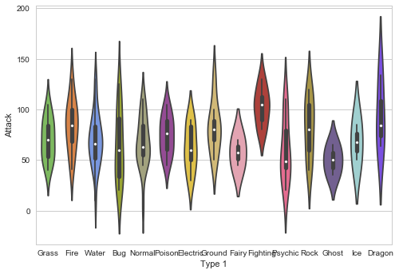
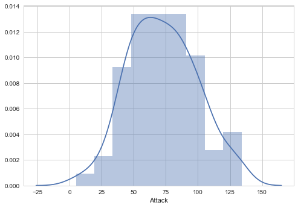

**The Ultimate Python Seaborn Tutorial: Gotta Catch ‘Em All**

This is the notebook implementation of the <b>Seaborn Tutorial</b> available on https://elitedatascience.com/python-seaborn-tutorial for getting a hands on experience on Seaborn.

Note: Only the code part is included in here. For explanations, please visit above link.


```python
# Pandas for managing datasets
import pandas as pd
```


```python
# Matplotlib for additional customization
from matplotlib import pyplot as plt
%matplotlib inline
```


```python
# Seaborn for plotting and styling
import seaborn as sns
```


```python
# Read dataset
df = pd.read_csv('Pokemon.csv', index_col=0)
```

**Tip:** The argument  <i>index_col=0</i> simply means we'll treat the first column of the dataset as the ID column.


```python
# Display first 5 observations
df.head()
```


<div>
<table border="1" class="dataframe">
  <thead>
    <tr style="text-align: right;">
      <th></th>
      <th>Name</th>
      <th>Type 1</th>
      <th>Type 2</th>
      <th>Total</th>
      <th>HP</th>
      <th>Attack</th>
      <th>Defense</th>
      <th>Sp. Atk</th>
      <th>Sp. Def</th>
      <th>Speed</th>
      <th>Stage</th>
      <th>Legendary</th>
    </tr>
    <tr>
      <th>#</th>
      <th></th>
      <th></th>
      <th></th>
      <th></th>
      <th></th>
      <th></th>
      <th></th>
      <th></th>
      <th></th>
      <th></th>
      <th></th>
      <th></th>
    </tr>
  </thead>
  <tbody>
    <tr>
      <th>1</th>
      <td>Bulbasaur</td>
      <td>Grass</td>
      <td>Poison</td>
      <td>318</td>
      <td>45</td>
      <td>49</td>
      <td>49</td>
      <td>65</td>
      <td>65</td>
      <td>45</td>
      <td>1</td>
      <td>False</td>
    </tr>
    <tr>
      <th>2</th>
      <td>Ivysaur</td>
      <td>Grass</td>
      <td>Poison</td>
      <td>405</td>
      <td>60</td>
      <td>62</td>
      <td>63</td>
      <td>80</td>
      <td>80</td>
      <td>60</td>
      <td>2</td>
      <td>False</td>
    </tr>
    <tr>
      <th>3</th>
      <td>Venusaur</td>
      <td>Grass</td>
      <td>Poison</td>
      <td>525</td>
      <td>80</td>
      <td>82</td>
      <td>83</td>
      <td>100</td>
      <td>100</td>
      <td>80</td>
      <td>3</td>
      <td>False</td>
    </tr>
    <tr>
      <th>4</th>
      <td>Charmander</td>
      <td>Fire</td>
      <td>NaN</td>
      <td>309</td>
      <td>39</td>
      <td>52</td>
      <td>43</td>
      <td>60</td>
      <td>50</td>
      <td>65</td>
      <td>1</td>
      <td>False</td>
    </tr>
    <tr>
      <th>5</th>
      <td>Charmeleon</td>
      <td>Fire</td>
      <td>NaN</td>
      <td>405</td>
      <td>58</td>
      <td>64</td>
      <td>58</td>
      <td>80</td>
      <td>65</td>
      <td>80</td>
      <td>2</td>
      <td>False</td>
    </tr>
  </tbody>
</table>
</div>


```python
#df[df['Total']== df['Total'].max()]
#df[df['Legendary'] == True]
#df.Legendary.dtype
```


```python
df.shape
#So there are all 151 Pokemons in this dataset.
```


    (151, 12)


```python
# Recommended way
sns.lmplot(x='Attack', y='Defense', data=df, aspect=1,size=4.5)
# Alternative way
# sns.lmplot(x=df.Attack, y=df.Defense)
```


    <seaborn.axisgrid.FacetGrid at 0xe49db70>


The arguments size and aspect gives size in inches and aspect ratio. Default is size=5(does not fit properly) and aspect = 1.


```python
# Scatterplot arguments
sns.lmplot(x='Attack', y='Defense', data=df,
           fit_reg=False, # No regression line
           hue='Stage')   # Color by evolution stage
```


    <seaborn.axisgrid.FacetGrid at 0xe54c9e8>


- Then, we'll set hue='Stage' to color our points by the Pokémon's evolution stage. 
- This hue argument is very useful because it allows you to express a <b>third dimension</b> of information using color.


```python
# Plot using Seaborn
sns.lmplot(x='Attack', y='Defense', data=df,
           fit_reg=False, 
           hue='Stage')
 
# Tweak using Matplotlib
plt.ylim(0, None)
plt.xlim(0, None)
```


    (0, 142.25647612435475)


```python
# Boxplot
sns.boxplot(data=df)
```


    <matplotlib.axes._subplots.AxesSubplot at 0xee73dd8>


```python
# Pre-format DataFrame
stats_df = df.drop(['Total', 'Stage', 'Legendary'], axis=1)
 
# New boxplot using stats_df
sns.boxplot(data=stats_df)
```


    <matplotlib.axes._subplots.AxesSubplot at 0x10aea1d0>


```python
# Set theme
sns.set_style('whitegrid')
 
# Violin plot
sns.violinplot(x='Type 1', y='Attack', data=df)
```


    <matplotlib.axes._subplots.AxesSubplot at 0x12111e10>


```python
pkmn_type_colors = ['#78C850',  # Grass
                    '#F08030',  # Fire
                    '#6890F0',  # Water
                    '#A8B820',  # Bug
                    '#A8A878',  # Normal
                    '#A040A0',  # Poison
                    '#F8D030',  # Electric
                    '#E0C068',  # Ground
                    '#EE99AC',  # Fairy
                    '#C03028',  # Fighting
                    '#F85888',  # Psychic
                    '#B8A038',  # Rock
                    '#705898',  # Ghost
                    '#98D8D8',  # Ice
                    '#7038F8',  # Dragon
                   ]
```


```python
sns.violinplot(x='Type 1', y='Attack', data=df,palette=pkmn_type_colors)
```


    <matplotlib.axes._subplots.AxesSubplot at 0x12562ef0>





```python
# Swarm plot with Pokemon color palette
sns.swarmplot(x='Type 1', y='Attack', data=df, 
              palette=pkmn_type_colors)
```


    <matplotlib.axes._subplots.AxesSubplot at 0x135fc748>


```python
# Set figure size with matplotlib
plt.figure(figsize=(20,15))
 
# Create plot
sns.violinplot(x='Type 1',
               y='Attack', 
               data=df, 
               inner=None, # Remove the bars inside the violins
               palette=pkmn_type_colors)
 
sns.swarmplot(x='Type 1', 
              y='Attack', 
              data=df, 
              color='k', # Make points black
              alpha=0.7) # and slightly transparent
 
# Set title with matplotlib
plt.title('Attack by Type')
```


    <matplotlib.text.Text at 0x1329f940>


```python
# Melt DataFrame
melted_df = pd.melt(stats_df, 
                    id_vars=["Name", "Type 1", "Type 2"], # Variables to keep
                    var_name="Stat") # Name of melted variable
melted_df.head()
```


<div>
<table border="1" class="dataframe">
  <thead>
    <tr style="text-align: right;">
      <th></th>
      <th>Name</th>
      <th>Type 1</th>
      <th>Type 2</th>
      <th>Stat</th>
      <th>value</th>
    </tr>
  </thead>
  <tbody>
    <tr>
      <th>0</th>
      <td>Bulbasaur</td>
      <td>Grass</td>
      <td>Poison</td>
      <td>HP</td>
      <td>45</td>
    </tr>
    <tr>
      <th>1</th>
      <td>Ivysaur</td>
      <td>Grass</td>
      <td>Poison</td>
      <td>HP</td>
      <td>60</td>
    </tr>
    <tr>
      <th>2</th>
      <td>Venusaur</td>
      <td>Grass</td>
      <td>Poison</td>
      <td>HP</td>
      <td>80</td>
    </tr>
    <tr>
      <th>3</th>
      <td>Charmander</td>
      <td>Fire</td>
      <td>NaN</td>
      <td>HP</td>
      <td>39</td>
    </tr>
    <tr>
      <th>4</th>
      <td>Charmeleon</td>
      <td>Fire</td>
      <td>NaN</td>
      <td>HP</td>
      <td>58</td>
    </tr>
  </tbody>
</table>
</div>


```python
# Swarmplot with melted_df
plt.figure(figsize=(10,6))
sns.swarmplot(x='Stat', y='value', data=melted_df, 
              hue='Type 1')
# Without this legend comes on the plot.
plt.legend(bbox_to_anchor=(1.05, 1), loc=2, borderaxespad=0.,)
```


    <matplotlib.legend.Legend at 0x173e6c50>


```python
# 1. Enlarge the plot
plt.figure(figsize=(10,6))
 
sns.swarmplot(x='Stat', 
              y='value', 
              data=melted_df, 
              hue='Type 1', 
              split=True, # 2. Separate points by hue
              palette=pkmn_type_colors) # 3. Use Pokemon palette
 
# 4. Adjust the y-axis
plt.ylim(0, 260)
 
# 5. Place legend to the right
plt.legend(bbox_to_anchor=(1, 1), loc=2)
```


    <matplotlib.legend.Legend at 0x160bce80>


```python
# Calculate correlations
corr = stats_df.corr()
 
# Heatmap
sns.heatmap(corr)
```


    <matplotlib.axes._subplots.AxesSubplot at 0x17a54a90>


```python
# Distribution Plot (a.k.a. Histogram)
sns.distplot(df.Attack)
```


    <matplotlib.axes._subplots.AxesSubplot at 0x17ac7518>





```python
# Count Plot (a.k.a. Bar Plot)
sns.countplot(x='Type 1', data=df, palette=pkmn_type_colors)
 
# Rotate x-labels
plt.xticks(rotation=-45)
```


    (array([ 0,  1,  2,  3,  4,  5,  6,  7,  8,  9, 10, 11, 12, 13, 14]),
     <a list of 15 Text xticklabel objects>)


```python
# Factor Plot
g = sns.factorplot(x='Type 1', 
                   y='Attack', 
                   data=df, 
                   col='Stage',  # Separate by stage
                   kind='swarm') # Swarmplot
 
# Rotate x-axis labels
g.set_xticklabels(rotation=-45)
 
# Doesn't work because only rotates last plot
# plt.xticks(rotation=-45)
```


    <seaborn.axisgrid.FacetGrid at 0x18385198>


```python
# Density Plot
sns.kdeplot(df.Attack, df.Defense)
```


    <matplotlib.axes._subplots.AxesSubplot at 0x18d640f0>


```python
#Density overlayed on scatter
sns.lmplot(x='Attack', y='Defense', data=df, fit_reg=False,aspect=1, size=10)
sns.kdeplot(df.Attack,df.Defense)
plt.ylim(0,180)
```


    (0, 180)


```python
# Joint Distribution Plot
sns.jointplot(x='Attack', y='Defense', data=df)
```


    <seaborn.axisgrid.JointGrid at 0x1e928710>


```python
# Joint Distribution Plot
sns.jointplot(x='Attack', y='Defense', data=df, kind='hex')
```


    <seaborn.axisgrid.JointGrid at 0x1ee687f0>


```python

```


```python

```


```python

```


```python

```


```python

```


```python

```


```python

```


```python

```


```python

```


```python

```


```python

```
