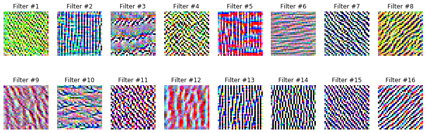

<a href="https://colab.research.google.com/github/sankirnajoshi/intro-to-dl/blob/master/week3/week3_task1_first_cnn_cifar10_clean.ipynb" target="_parent"></a>

# Your first CNN on CIFAR-10

In this task you will: 
* define your first CNN architecture for CIFAR-10 dataset
* train it from scratch
* visualize learnt filters

CIFAR-10 dataset contains 32x32 color images from 10 classes: __airplane, automobile, bird, cat, deer, dog, frog, horse, ship, truck__:


# Import stuff


```python
! shred -u setup_google_colab.py
! wget https://raw.githubusercontent.com/hse-aml/intro-to-dl/master/setup_google_colab.py -O setup_google_colab.py
import setup_google_colab
# please, uncomment the week you're working on
# setup_google_colab.setup_week1()
# setup_google_colab.setup_week2()
setup_google_colab.setup_week3()
# setup_google_colab.setup_week4()
# setup_google_colab.setup_week5()
# setup_google_colab.setup_week6()

# If you're using the old version of the course (check a path of notebook on Coursera, you'll see v1 or v2),
# use setup_week2_old().
```

    shred: setup_google_colab.py: failed to open for writing: No such file or directory
    --2019-11-11 04:01:51--  https://raw.githubusercontent.com/hse-aml/intro-to-dl/master/setup_google_colab.py
    Resolving raw.githubusercontent.com (raw.githubusercontent.com)... 151.101.0.133, 151.101.64.133, 151.101.128.133, ...
    Connecting to raw.githubusercontent.com (raw.githubusercontent.com)|151.101.0.133|:443... connected.
    HTTP request sent, awaiting response... 200 OK
    Length: 3792 (3.7K) [text/plain]
    Saving to: ‘setup_google_colab.py’
    
    setup_google_colab. 100%[===================>]   3.70K  --.-KB/s    in 0s      
    
    2019-11-11 04:01:56 (97.5 MB/s) - ‘setup_google_colab.py’ saved [3792/3792]
    
    **************************************************
    102flowers.tgz
    **************************************************
    imagelabels.mat
    **************************************************
    inception_v3_weights_tf_dim_ordering_tf_kernels_notop.h5
    **************************************************
    cifar-10-batches-py.tar.gz
    **************************************************
    mnist.npz
    


```python
import sys
sys.path.append("..")
import grading
import download_utils
```


```python
# !!! remember to clear session/graph if you rebuild your graph to avoid out-of-memory errors !!!
```


```python
download_utils.link_all_keras_resources()
```


```python
import tensorflow as tf
import keras
from keras import backend as K
import numpy as np
%matplotlib inline
import matplotlib.pyplot as plt
print(tf.__version__)
print(keras.__version__)
import grading_utils
import keras_utils
from keras_utils import reset_tf_session
```


<p style="color: red;">
The default version of TensorFlow in Colab will soon switch to TensorFlow 2.x.<br>
We recommend you <a href="https://www.tensorflow.org/guide/migrate" target="_blank">upgrade</a> now 
or ensure your notebook will continue to use TensorFlow 1.x via the <code>%tensorflow_version 1.x</code> magic:
<a href="https://colab.research.google.com/notebooks/tensorflow_version.ipynb" target="_blank">more info</a>.</p>


    Using TensorFlow backend.
    

    1.15.0
    2.0.6
    

# Fill in your Coursera token and email
To successfully submit your answers to our grader, please fill in your Coursera submission token and email


```python
grader = grading.Grader(assignment_key="s1B1I5DuEeeyLAqI7dCYkg", 
                        all_parts=["7W4tu", "nQOsg", "96eco"])
```


```python
# token expires every 30 min
COURSERA_TOKEN = "pe88eYtPM1CNQsTp"
COURSERA_EMAIL = "sankirna1292@gmail.com"
```

# Load dataset


```python
from keras.datasets import cifar10
(x_train, y_train), (x_test, y_test) = cifar10.load_data()
```


```python
print("Train samples:", x_train.shape, y_train.shape)
print("Test samples:", x_test.shape, y_test.shape)
```

    Train samples: (50000, 32, 32, 3) (50000, 1)
    Test samples: (10000, 32, 32, 3) (10000, 1)
    


```python
NUM_CLASSES = 10
cifar10_classes = ["airplane", "automobile", "bird", "cat", "deer", 
                   "dog", "frog", "horse", "ship", "truck"]
```


```python
# show random images from train
cols = 8
rows = 2
fig = plt.figure(figsize=(2 * cols - 1, 2.5 * rows - 1))
for i in range(cols):
    for j in range(rows):
        random_index = np.random.randint(0, len(y_train))
        ax = fig.add_subplot(rows, cols, i * rows + j + 1)
        ax.grid('off')
        ax.axis('off')
        ax.imshow(x_train[random_index, :])
        ax.set_title(cifar10_classes[y_train[random_index, 0]])
plt.show()
```


# Prepare data

We need to normalize inputs like this: $$x_{norm} = \frac{x}{255} - 0.5$$

We need to convert class labels to one-hot encoded vectors. Use __keras.utils.to_categorical__.


```python
# normalize inputs
x_train2 = (x_train/255)-0.5  ### YOUR CODE HERE
x_test2 = (x_test/255)-0.5 ### YOUR CODE HERE

# convert class labels to one-hot encoded, should have shape (?, NUM_CLASSES)
y_train2 = keras.utils.to_categorical(y_train, 10) ### YOUR CODE HERE
y_test2 =  keras.utils.to_categorical(y_test, 10) ### YOUR CODE HERE
```

# Define CNN architecture


```python
# import necessary building blocks
from keras.models import Sequential
from keras.layers import Conv2D, MaxPooling2D, Flatten, Dense, Activation, Dropout
from keras.layers.advanced_activations import LeakyReLU
```

Convolutional networks are built from several types of layers:
- [Conv2D](https://keras.io/layers/convolutional/#conv2d) - performs convolution:
    - **filters**: number of output channels; 
    - **kernel_size**: an integer or tuple/list of 2 integers, specifying the width and height of the 2D convolution window;
    - **padding**: padding="same" adds zero padding to the input, so that the output has the same width and height, padding='valid' performs convolution only in locations where kernel and the input fully overlap;
    - **activation**: "relu", "tanh", etc.
    - **input_shape**: shape of input.
- [MaxPooling2D](https://keras.io/layers/pooling/#maxpooling2d) - performs 2D max pooling.
- [Flatten](https://keras.io/layers/core/#flatten) - flattens the input, does not affect the batch size.
- [Dense](https://keras.io/layers/core/#dense) - fully-connected layer.
- [Activation](https://keras.io/layers/core/#activation) - applies an activation function.
- [LeakyReLU](https://keras.io/layers/advanced-activations/#leakyrelu) - applies leaky relu activation.
- [Dropout](https://keras.io/layers/core/#dropout) - applies dropout.

You need to define a model which takes __(None, 32, 32, 3)__ input and predicts __(None, 10)__ output with probabilities for all classes. __None__ in shapes stands for batch dimension.

Simple feed-forward networks in Keras can be defined in the following way:

```python
model = Sequential()  # start feed-forward model definition
model.add(Conv2D(..., input_shape=(32, 32, 3)))  # first layer needs to define "input_shape"

...  # here comes a bunch of convolutional, pooling and dropout layers

model.add(Dense(NUM_CLASSES))  # the last layer with neuron for each class
model.add(Activation("softmax"))  # output probabilities
```

Stack __4__ convolutional layers with kernel size __(3, 3)__ with growing number of filters __(16, 32, 32, 64)__, use "same" padding.

Add __2x2__ pooling layer after every 2 convolutional layers (conv-conv-pool scheme).

Use __LeakyReLU__ activation with recommended parameter __0.1__ for all layers that need it (after convolutional and dense layers):
```python
model.add(LeakyReLU(0.1))
```

Add a dense layer with __256__ neurons and a second dense layer with __10__ neurons for classes. Remember to use __Flatten__ layer before first dense layer to reshape input volume into a flat vector!

Add __Dropout__ after every pooling layer (__0.25__) and between dense layers (__0.5__).


```python
def make_model():
    """
    Define your model architecture here.
    Returns `Sequential` model.
    """
    model = Sequential()
        ### YOUR CODE HERE
    model.add(Conv2D(filters=(16),kernel_size=(3,3),padding='same',input_shape =(32,32,3)))
    model.add(LeakyReLU(0.1))
    model.add(Conv2D(filters=(32),kernel_size=(3,3),padding='same'))
    model.add(LeakyReLU(0.1))
    model.add(MaxPooling2D(pool_size=(2,2)))
    model.add(Dropout(0.25))
    model.add(Conv2D(filters=(32),kernel_size=(3,3),padding='same'))
    model.add(LeakyReLU(0.1))
    model.add(Conv2D(filters=(64),kernel_size=(3,3),padding='same'))
    model.add(LeakyReLU(0.1))
    model.add(MaxPooling2D(pool_size=(2,2)))
    model.add(Dropout(0.25))
    model.add(Flatten())
    model.add(Dense(256))
    model.add(Dropout(0.5))
    model.add(Dense(10))
    model.add(Activation("softmax"))
    return model
```


```python
# describe model
s = reset_tf_session()  # clear default graph
model = make_model()
model.summary()
```

    _________________________________________________________________
    Layer (type)                 Output Shape              Param #   
    =================================================================
    conv2d_1 (Conv2D)            (None, 32, 32, 16)        448       
    _________________________________________________________________
    leaky_re_lu_1 (LeakyReLU)    (None, 32, 32, 16)        0         
    _________________________________________________________________
    conv2d_2 (Conv2D)            (None, 32, 32, 32)        4640      
    _________________________________________________________________
    leaky_re_lu_2 (LeakyReLU)    (None, 32, 32, 32)        0         
    _________________________________________________________________
    max_pooling2d_1 (MaxPooling2 (None, 16, 16, 32)        0         
    _________________________________________________________________
    dropout_1 (Dropout)          (None, 16, 16, 32)        0         
    _________________________________________________________________
    conv2d_3 (Conv2D)            (None, 16, 16, 32)        9248      
    _________________________________________________________________
    leaky_re_lu_3 (LeakyReLU)    (None, 16, 16, 32)        0         
    _________________________________________________________________
    conv2d_4 (Conv2D)            (None, 16, 16, 64)        18496     
    _________________________________________________________________
    leaky_re_lu_4 (LeakyReLU)    (None, 16, 16, 64)        0         
    _________________________________________________________________
    max_pooling2d_2 (MaxPooling2 (None, 8, 8, 64)          0         
    _________________________________________________________________
    dropout_2 (Dropout)          (None, 8, 8, 64)          0         
    _________________________________________________________________
    flatten_1 (Flatten)          (None, 4096)              0         
    _________________________________________________________________
    dense_1 (Dense)              (None, 256)               1048832   
    _________________________________________________________________
    dropout_3 (Dropout)          (None, 256)               0         
    _________________________________________________________________
    dense_2 (Dense)              (None, 10)                2570      
    _________________________________________________________________
    activation_1 (Activation)    (None, 10)                0         
    =================================================================
    Total params: 1,084,234
    Trainable params: 1,084,234
    Non-trainable params: 0
    _________________________________________________________________
    


```python
## GRADED PART, DO NOT CHANGE!
# Number of model parameters
grader.set_answer("7W4tu", grading_utils.model_total_params(model))
```


```python
# you can make submission with answers so far to check yourself at this stage
grader.submit(COURSERA_EMAIL, COURSERA_TOKEN)
```

    Submitted to Coursera platform. See results on assignment page!
    

# Train model

Training of your model can take approx. 4-8 minutes per epoch.

During training you should observe the decrease in reported loss on training and validation.

If the loss on training is not decreasing with epochs you should revise your model definition and learning rate.


```python
INIT_LR = 5e-3  # initial learning rate
BATCH_SIZE = 32
EPOCHS = 10

s = reset_tf_session()  # clear default graph
# don't call K.set_learning_phase() !!! (otherwise will enable dropout in train/test simultaneously)
model = make_model()  # define our model

# prepare model for fitting (loss, optimizer, etc)
model.compile(
    loss='categorical_crossentropy',  # we train 10-way classification
    optimizer=keras.optimizers.adamax(lr=INIT_LR),  # for SGD
    metrics=['accuracy']  # report accuracy during training
)

# scheduler of learning rate (decay with epochs)
def lr_scheduler(epoch):
    return INIT_LR * 0.9 ** epoch

# callback for printing of actual learning rate used by optimizer
class LrHistory(keras.callbacks.Callback):
    def on_epoch_begin(self, epoch, logs={}):
        print("Learning rate:", K.get_value(model.optimizer.lr))
```

Training takes approximately **1.5 hours**. You're aiming for ~0.80 validation accuracy.


```python
# we will save model checkpoints to continue training in case of kernel death
model_filename = 'cifar.{0:03d}.hdf5'
last_finished_epoch = None

#### uncomment below to continue training from model checkpoint
#### fill `last_finished_epoch` with your latest finished epoch
# from keras.models import load_model
# s = reset_tf_session()
# last_finished_epoch = 7
# model = load_model(model_filename.format(last_finished_epoch))
```


```python
# fit model
model.fit(
    x_train2, y_train2,  # prepared data
    batch_size=BATCH_SIZE,
    epochs=EPOCHS,
    callbacks=[keras.callbacks.LearningRateScheduler(lr_scheduler), 
               LrHistory(), 
               keras_utils.TqdmProgressCallback(),
               keras_utils.ModelSaveCallback(model_filename)],
    validation_data=(x_test2, y_test2),
    shuffle=True,
    verbose=0,
    initial_epoch=last_finished_epoch or 0
)
```

    Learning rate: 0.005
    
    Epoch 1/10
    **************************************************
    loss: 1.3592; acc: 0.5119; val_loss: 1.0612; val_acc: 0.6328
    Model saved in cifar.000.hdf5
    Learning rate: 0.0045
    
    Epoch 2/10
    **************************************************
    loss: 0.9629; acc: 0.6608; val_loss: 0.9237; val_acc: 0.6789
    Model saved in cifar.001.hdf5
    Learning rate: 0.00405
    
    Epoch 3/10
    **************************************************
    loss: 0.8431; acc: 0.7051; val_loss: 0.8129; val_acc: 0.7209
    Model saved in cifar.002.hdf5
    Learning rate: 0.003645
    
    Epoch 4/10
    **************************************************
    loss: 0.7706; acc: 0.7312; val_loss: 0.7313; val_acc: 0.7516
    Model saved in cifar.003.hdf5
    Learning rate: 0.0032805
    
    Epoch 5/10
    **************************************************
    loss: 0.7121; acc: 0.7512; val_loss: 0.6919; val_acc: 0.7615
    Model saved in cifar.004.hdf5
    Learning rate: 0.00295245
    
    Epoch 6/10
    **************************************************
    loss: 0.6690; acc: 0.7678; val_loss: 0.6692; val_acc: 0.7718
    Model saved in cifar.005.hdf5
    Learning rate: 0.002657205
    
    Epoch 7/10
    **************************************************
    loss: 0.6334; acc: 0.7808; val_loss: 0.6590; val_acc: 0.7749
    Model saved in cifar.006.hdf5
    Learning rate: 0.0023914846
    
    Epoch 8/10
    **************************************************
    loss: 0.6009; acc: 0.7898; val_loss: 0.6328; val_acc: 0.7870
    Model saved in cifar.007.hdf5
    Learning rate: 0.002152336
    
    Epoch 9/10
    **************************************************
    loss: 0.5724; acc: 0.8033; val_loss: 0.6331; val_acc: 0.7854
    Model saved in cifar.008.hdf5
    Learning rate: 0.0019371024
    
    Epoch 10/10
    **************************************************
    loss: 0.5514; acc: 0.8085; val_loss: 0.6321; val_acc: 0.7832
    Model saved in cifar.009.hdf5
    


    <keras.callbacks.History at 0x7fa1605ada58>


```python
# save weights to file
model.save_weights("weights.h5")
```


```python
# load weights from file (can call without model.fit)
model.load_weights("weights.h5")
```

# Evaluate model


```python
# make test predictions
y_pred_test = model.predict_proba(x_test2)
y_pred_test_classes = np.argmax(y_pred_test, axis=1)
y_pred_test_max_probas = np.max(y_pred_test, axis=1)
```

     9504/10000 [===========================>..] - ETA: 0s


```python
# confusion matrix and accuracy
from sklearn.metrics import confusion_matrix, accuracy_score
plt.figure(figsize=(7, 6))
plt.title('Confusion matrix', fontsize=16)
plt.imshow(confusion_matrix(y_test, y_pred_test_classes))
plt.xticks(np.arange(10), cifar10_classes, rotation=45, fontsize=12)
plt.yticks(np.arange(10), cifar10_classes, fontsize=12)
plt.colorbar()
plt.show()
print("Test accuracy:", accuracy_score(y_test, y_pred_test_classes))
```


    Test accuracy: 0.7832
    


```python
## GRADED PART, DO NOT CHANGE!
# Accuracy on validation data
grader.set_answer("nQOsg", accuracy_score(y_test, y_pred_test_classes))
```


```python
# you can make submission with answers so far to check yourself at this stage
grader.submit(COURSERA_EMAIL, COURSERA_TOKEN)
```

    Submitted to Coursera platform. See results on assignment page!
    


```python
# inspect preditions
cols = 8
rows = 2
fig = plt.figure(figsize=(2 * cols - 1, 3 * rows - 1))
for i in range(cols):
    for j in range(rows):
        random_index = np.random.randint(0, len(y_test))
        ax = fig.add_subplot(rows, cols, i * rows + j + 1)
        ax.grid('off')
        ax.axis('off')
        ax.imshow(x_test[random_index, :])
        pred_label = cifar10_classes[y_pred_test_classes[random_index]]
        pred_proba = y_pred_test_max_probas[random_index]
        true_label = cifar10_classes[y_test[random_index, 0]]
        ax.set_title("pred: {}\nscore: {:.3}\ntrue: {}".format(
               pred_label, pred_proba, true_label
        ))
plt.show()
```


# Visualize maximum stimuli

We want to find input images that provide maximum activations for particular layers of our network. 

We will find those maximum stimuli via gradient ascent in image space.

For that task we load our model weights, calculate the layer output gradient with respect to image input and shift input image in that direction.


```python
s = reset_tf_session()  # clear default graph
K.set_learning_phase(0)  # disable dropout
model = make_model()
model.load_weights("weights.h5")  # that were saved after model.fit
```


```python
# all weights we have
model.summary()
```

    _________________________________________________________________
    Layer (type)                 Output Shape              Param #   
    =================================================================
    conv2d_1 (Conv2D)            (None, 32, 32, 16)        448       
    _________________________________________________________________
    leaky_re_lu_1 (LeakyReLU)    (None, 32, 32, 16)        0         
    _________________________________________________________________
    conv2d_2 (Conv2D)            (None, 32, 32, 32)        4640      
    _________________________________________________________________
    leaky_re_lu_2 (LeakyReLU)    (None, 32, 32, 32)        0         
    _________________________________________________________________
    max_pooling2d_1 (MaxPooling2 (None, 16, 16, 32)        0         
    _________________________________________________________________
    dropout_1 (Dropout)          (None, 16, 16, 32)        0         
    _________________________________________________________________
    conv2d_3 (Conv2D)            (None, 16, 16, 32)        9248      
    _________________________________________________________________
    leaky_re_lu_3 (LeakyReLU)    (None, 16, 16, 32)        0         
    _________________________________________________________________
    conv2d_4 (Conv2D)            (None, 16, 16, 64)        18496     
    _________________________________________________________________
    leaky_re_lu_4 (LeakyReLU)    (None, 16, 16, 64)        0         
    _________________________________________________________________
    max_pooling2d_2 (MaxPooling2 (None, 8, 8, 64)          0         
    _________________________________________________________________
    dropout_2 (Dropout)          (None, 8, 8, 64)          0         
    _________________________________________________________________
    flatten_1 (Flatten)          (None, 4096)              0         
    _________________________________________________________________
    dense_1 (Dense)              (None, 256)               1048832   
    _________________________________________________________________
    dropout_3 (Dropout)          (None, 256)               0         
    _________________________________________________________________
    dense_2 (Dense)              (None, 10)                2570      
    _________________________________________________________________
    activation_1 (Activation)    (None, 10)                0         
    =================================================================
    Total params: 1,084,234
    Trainable params: 1,084,234
    Non-trainable params: 0
    _________________________________________________________________
    


```python
def find_maximum_stimuli(layer_name, is_conv, filter_index, model, iterations=20, step=1., verbose=True):
    
    def image_values_to_rgb(x):
        # normalize x: center on 0 (np.mean(x_train2)), ensure std is 0.25 (np.std(x_train2))
        # so that it looks like a normalized image input for our network
        x = (x - np.mean(x_train2))/(np.std(x_train2)) ### YOUR CODE HERE
        # do reverse normalization to RGB values: x = (x_norm + 0.5) * 255
        x = (x + 0.5)*255 ### YOUR CODE HERE
    
        # clip values to [0, 255] and convert to bytes
        x = np.clip(x, 0, 255).astype('uint8')
        return x

    # this is the placeholder for the input image
    input_img = model.input
    img_width, img_height = input_img.shape.as_list()[1:3]
    
    # find the layer output by name
    layer_output = list(filter(lambda x: x.name == layer_name, model.layers))[0].output

    # we build a loss function that maximizes the activation
    # of the filter_index filter of the layer considered
    if is_conv:
        # mean over feature map values for convolutional layer
        loss = K.mean(layer_output[:, :, :, filter_index])
    else:
        loss = K.mean(layer_output[:, filter_index])

    # we compute the gradient of the loss wrt input image
    grads = K.gradients(loss, input_img)[0]  # [0] because of the batch dimension!

    # normalization trick: we normalize the gradient
    grads = grads / (K.sqrt(K.sum(K.square(grads))) + 1e-10)

    # this function returns the loss and grads given the input picture
    iterate = K.function([input_img], [loss, grads])

    # we start from a gray image with some random noise
    input_img_data = np.random.random((1, img_width, img_height, 3))
    input_img_data = (input_img_data - 0.5) * (0.1 if is_conv else 0.001)

    # we run gradient ascent
    for i in range(iterations):
        loss_value, grads_value = iterate([input_img_data])
        input_img_data += grads_value * step
        if verbose:
            print('Current loss value:', loss_value)

    # decode the resulting input image
    img = image_values_to_rgb(input_img_data[0])
    
    return img, loss_value
```


```python
# sample maximum stimuli
def plot_filters_stimuli(layer_name, is_conv, model, iterations=20, step=1., verbose=False):
    cols = 8
    rows = 2
    filter_index = 0
    max_filter_index = list(filter(lambda x: x.name == layer_name, model.layers))[0].output.shape.as_list()[-1] - 1
    fig = plt.figure(figsize=(2 * cols - 1, 3 * rows - 1))
    for i in range(cols):
        for j in range(rows):
            if filter_index <= max_filter_index:
                ax = fig.add_subplot(rows, cols, i * rows + j + 1)
                ax.grid('off')
                ax.axis('off')
                loss = -1e20
                while loss < 0 and filter_index <= max_filter_index:
                    stimuli, loss = find_maximum_stimuli(layer_name, is_conv, filter_index, model,
                                                         iterations, step, verbose=verbose)
                    filter_index += 1
                if loss > 0:
                    ax.imshow(stimuli)
                    ax.set_title("Filter #{}".format(filter_index))
    plt.show()
```


```python
# maximum stimuli for convolutional neurons
conv_activation_layers = []
for layer in model.layers:
    if isinstance(layer, LeakyReLU):
        prev_layer = layer.inbound_nodes[0].inbound_layers[0]
        if isinstance(prev_layer, Conv2D):
            conv_activation_layers.append(layer)

for layer in conv_activation_layers:
    print(layer.name)
    plot_filters_stimuli(layer_name=layer.name, is_conv=True, model=model)
```

    leaky_re_lu_1
    


    leaky_re_lu_2
    


    leaky_re_lu_3
    





    leaky_re_lu_4
    


```python
# maximum stimuli for last dense layer
last_dense_layer = list(filter(lambda x: isinstance(x, Dense), model.layers))[-1]
plot_filters_stimuli(layer_name=last_dense_layer.name, is_conv=False, 
                     iterations=200, step=0.1, model=model)
```


```python
def maximum_stimuli_test_for_grader():
    layer = list(filter(lambda x: isinstance(x, Dense), model.layers))[-1]
    output_index = 7
    stimuli, loss = find_maximum_stimuli(
        layer_name=layer.name, 
        is_conv=False, 
        filter_index=output_index,
        model=model,
        verbose=False
    )
    return model.predict_proba(stimuli[np.newaxis, :])[0, output_index]
```


```python
## GRADED PART, DO NOT CHANGE!
# Maximum stimuli test
grader.set_answer("96eco", maximum_stimuli_test_for_grader())
```

    1/1 [==============================] - 0s
    


```python
# you can make submission with answers so far to check yourself at this stage
grader.submit(COURSERA_EMAIL, COURSERA_TOKEN)
```

    Submitted to Coursera platform. See results on assignment page!
    

That's it! Congratulations!

What you've done:
- defined CNN architecture
- trained your model
- evaluated your model
- visualised learnt filters


```python

```
